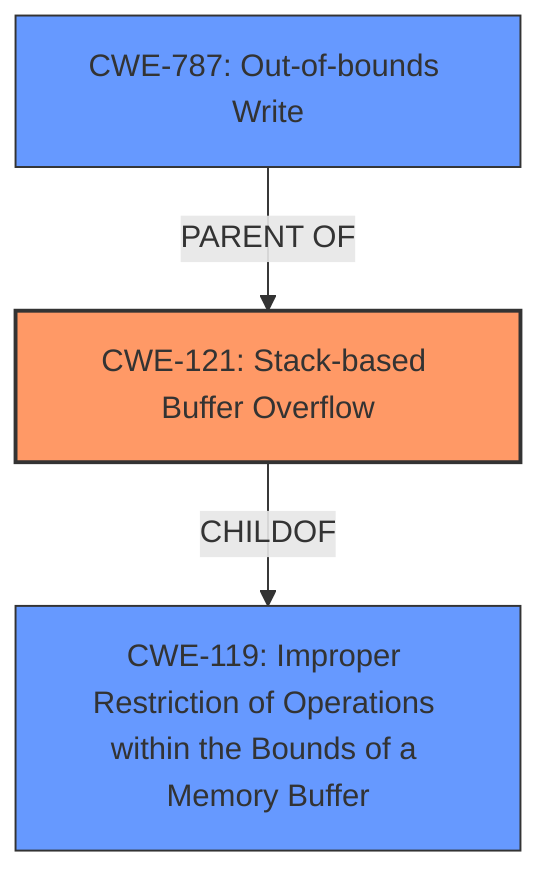

# Analysis Report for CVE-2024-52028

# Vulnerability Analysis Report: CVE-2024-52028

## Description

Netgear R7000P v1.3.3.154 was discovered to contain a **stack overflow** via the pptp_user_netmask parameter at wiz_pptp.cgi. This vulnerability allows attackers to cause a Denial of Service (DoS) via a crafted POST request.

## Vulnerability Description Key Phrases

- **Weakness:** stack overflow
- **Impact:** Denial of Service (DoS)
- **Vector:** crafted POST request
- **Attacker:** attackers
- **Product:** Netgear R7000P
- **Version:** v1.3.3.154
- **Component:** wiz_pptp.cgi

## Analysis (with Relationship Data)

# Summary
| CWE ID  | CWE Name                                                                          | Confidence | CWE Abstraction Level | CWE Vulnerability Mapping Label | CWE-Vulnerability Mapping Notes |
| :------- | :--------------------------------------------------------------------------------- | :--------- | :---------------------- | :------------------------------ | :------------------------------ |
| CWE-121 | Stack-based Buffer Overflow                                                          | 0.9        | Variant                 | Primary                         | Allowed                       |
| CWE-119 | Improper Restriction of Operations within the Bounds of a Memory Buffer             | 0.6        | Class                   | Secondary                       | Allowed                       |
| CWE-787 | Out-of-bounds Write                                                                | 0.5        | Base                    | Secondary                       | Allowed                       |

## Evidence and Confidence

*   **Confidence Score:** 0.8
*   **Evidence Strength:** MEDIUM

## Relationship Analysis
The primary weakness is CWE-121, Stack-based Buffer Overflow, which is a variant of CWE-119, Improper Restriction of Operations within the Bounds of a Memory Buffer. CWE-787, Out-of-bounds Write, is also considered as it describes the nature of the overflow.



## Vulnerability Chain
The vulnerability chain starts with the **stack overflow** (CWE-121) due to an improperly sized buffer, leading to an out-of-bounds write (CWE-787) and ultimately resulting in a Denial of Service (DoS).

## Summary of Analysis
The vulnerability description clearly states a **stack overflow** condition, making CWE-121 the most appropriate primary CWE. The retriever results also list CWE-121 as the top combined result. CWE-119 is a broader category encompassing buffer overflows, while CWE-787 describes the mechanics of writing outside the intended buffer bounds. The final decision leans towards CWE-121 as the most specific and relevant CWE based on the provided evidence.

Relevant CWE Information:

# Enhanced Context (25 CWEs)
The following CWEs were identified as potentially relevant to this vulnerability:

## CWE-121: Stack-based Buffer Overflow
**Abstraction Level**: Variant
**Similarity Score**: 0.72
**Source**: dense

**Description**:
A stack-based buffer overflow condition is a condition where the buffer being overwritten is allocated on the stack (i.e., is a local variable or, rarely, a parameter to a function).

**Mapping Guidance**:
- Usage: Allowed
- Rationale: This CWE entry is at the Variant level of abstraction, which is a preferred level of abstraction for mapping to the root causes of vulnerabilities.

## CWE-787: Out-of-bounds Write
**Abstraction Level**: base
**Similarity Score**: 2.28
**Source**: graph

**Description**:
CWE-787: Out-of-bounds Write

**Mapping Guidance**:
- Usage: Allowed
- Rationale: This CWE entry is at the Base level of abstraction, which is a preferred level of abstraction for mapping to the root causes of vulnerabilities.

**Relationships**:
- CANFOLLOW -> CWE-825
- CANFOLLOW -> CWE-824
- CANFOLLOW -> CWE-823
- CANFOLLOW -> CWE-822
- PARENTOF -> CWE-124

## CWE-119: Improper Restriction of Operations within the Bounds of a Memory Buffer
**Abstraction Level**: Class
**Similarity Score**: N/A
**Source**: N/A

**Description**:
The software performs an operation that attempts to read or write data to a memory buffer, but it does not properly restrict the operation within the bounds of that buffer.

**Mapping Guidance**:
- Usage: N/A
- Rationale: N/A

**Relationships**:
- PARENTOF -> CWE-120
- PARENTOF -> CWE-122
- PARENTOF -> CWE-123
- PARENTOF -> CWE-124
- PARENTOF -> CWE-125
- PARENTOF -> CWE-126
- PARENTOF -> CWE-127
- PARENTOF -> CWE-128
- PARENTOF -> CWE-129
- PARENTOF -> CWE-130
- PARENTOF -> CWE-131
- PARENTOF -> CWE-132
- PARENTOF -> CWE-133
- PARENTOF -> CWE-134
- PARENTOF -> CWE-135
- PARENTOF -> CWE-136
- PARENTOF -> CWE-137
- PARENTOF -> CWE-138
- PARENTOF -> CWE-139
- PARENTOF -> CWE-140
- PARENTOF -> CWE-141
- PARENTOF -> CWE-142
- PARENTOF -> CWE-143
- PARENTOF -> CWE-144
- PARENTOF -> CWE-145
- PARENTOF -> CWE-146
- PARENTOF -> CWE-147
- PARENTOF -> CWE-148
- PARENTOF -> CWE-149
- PARENTOF -> CWE-150
- PARENTOF -> CWE-151
- PARENTOF -> CWE-152
- PARENTOF -> CWE-153
- PARENTOF -> CWE-154
- PARENTOF -> CWE-155
- PARENTOF -> CWE-156
- PARENTOF -> CWE-157
- PARENTOF -> CWE-158
- PARENTOF -> CWE-159
- PARENTOF -> CWE-160
- PARENTOF -> CWE-161
- PARENTOF -> CWE-162
- PARENTOF -> CWE-163
- PARENTOF -> CWE-164
- PARENTOF -> CWE-165
- PARENTOF -> CWE-166
- PARENTOF -> CWE-167
- PARENTOF -> CWE-168
- PARENTOF -> CWE-169
- PARENTOF -> CWE-170
- PARENTOF -> CWE-171
- PARENTOF -> CWE-172
- PARENTOF -> CWE-173
- PARENTOF -> CWE-174
- PARENTOF -> CWE-175
- PARENTOF -> CWE-176
- PARENTOF -> CWE-177
- PARENTOF -> CWE-178
- PARENTOF -> CWE-179
- PARENTOF -> CWE-180
- PARENTOF -> CWE-181
- PARENTOF -> CWE-182
- PARENTOF -> CWE-183
- PARENTOF -> CWE-184
- PARENTOF -> CWE-185
- PARENTOF -> CWE-186
- PARENTOF -> CWE-187
- PARENTOF -> CWE-188
- PARENTOF -> CWE-189
- PARENTOF -> CWE-190
- PARENTOF -> CWE-191
- PARENTOF -> CWE-192
- PARENTOF -> CWE-193
- PARENTOF -> CWE-194
- PARENTOF -> CWE-195
- PARENTOF -> CWE-196
- PARENTOF -> CWE-197
- PARENTOF -> CWE-198
- PARENTOF -> CWE-199
- PARENTOF -> CWE-200
- PARENTOF -> CWE-201
- PARENTOF -> CWE-202
- PARENTOF -> CWE-203
- PARENTOF -> CWE-204
- PARENTOF -> CWE-205
- PARENTOF -> CWE-206
- PARENTOF -> CWE-207
- PARENTOF -> CWE-208
- PARENTOF -> CWE-209
- PARENTOF -> CWE-210
- PARENTOF -> CWE-211
- PARENTOF -> CWE-212
- PARENTOF -> CWE-213
- PARENTOF -> CWE-214
- PARENTOF


## CWE Relationship Analysis

Current CWEs represent these abstraction levels: .


### Vulnerability Chain Analysis

**Chain starting from CWE-125:**
- 125 (Out-of-bounds Read) - ROOT


**Chain starting from CWE-180:**
- 180 (Incorrect Behavior Order: Validate Before Canonicalize) - ROOT


### CWE Relationship Diagram

```mermaid
graph TD
    classDef primary fill:#f96,stroke:#333,stroke-width:2px
    classDef secondary fill:#69f,stroke:#333
    classDef tertiary fill:#9e9,stroke:#333
```


*Report generated on 2025-07-13 21:04:23*
