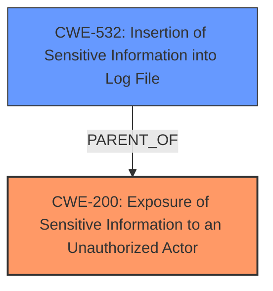

# Raw Analyzer Response for CVE-2024-52282

# Summary
| CWE ID | CWE Name | Confidence | CWE Abstraction Level | CWE Vulnerability Mapping Label | CWE-Vulnerability Mapping Notes |
|---|---|---|---|---|---|
| CWE-200 | Exposure of Sensitive Information to an Unauthorized Actor | 0.9 | Class | Primary CWE | Discouraged: Commonly misused to represent the loss of confidentiality, but confidentiality loss is a technical impact - not a root cause error. |
| CWE-532 | Insertion of Sensitive Information into Log File | 0.7 | Base | Secondary Candidate | Allowed |

## Evidence and Confidence

*   **Confidence Score:** 0.8
*   **Evidence Strength:** HIGH

## Relationship Analysis

The primary CWE identified is CWE-200 [Exposure of Sensitive Information to an Unauthorized Actor], which is a Class-level CWE. While it's discouraged as a primary mapping due to its high-level nature, the vulnerability description explicitly mentions "**Exposure of Sensitive Information to an Unauthorized Actor** vulnerability".

CWE-532 [Insertion of Sensitive Information into Log File] is a Base-level CWE and is considered as a secondary candidate, as the vulnerability description mentions that the sensitive information also "leaks into auditing logs when the audit level is set to equal or above 2".

## Vulnerability Chain

The vulnerability chain starts with Applications installed via Rancher Manager Apps Catalog store their Helm values directly into the `Apps` Custom Resource Definition, leading to users with `GET` access being able to read sensitive information. This same information is also written to audit logs.

Root Cause: Applications installed via Rancher Manager Apps Catalog store their Helm values directly into the `Apps` Custom Resource Definition.

Weakness: Exposure of sensitive information to unauthorized actors (CWE-200).

Impact: Users with GET access can read sensitive information. Sensitive information is also written to audit logs (CWE-532).

## Summary of Analysis

The vulnerability description explicitly mentions "**Exposure of Sensitive Information to an Unauthorized Actor** vulnerability", which aligns directly with CWE-200. The retriever results also list CWE-200 as a potential candidate.

The github.com_d0fa27fb_20250624_135756.html (stripped) extract says: "Users with `GET` access to the `Apps` Custom Resource Definition can read sensitive information in the Apps’ values. Also leaks to auditing logs when audit level is 2 or above."

While CWE-200 is discouraged as a primary mapping, its direct mention in the vulnerability description, combined with the evidence of sensitive information exposure, justifies its selection. CWE-532 is chosen to reflect the additional leakage of sensitive information into log files.

Relevant CWE Information:
# Enhanced Context (25 CWEs)
The following CWEs were identified as potentially relevant to this vulnerability:

CWE-497: Exposure of Sensitive System Information to an Unauthorized Control Sphere
Abstraction Level: Base
Similarity Score: 0.75

CWE-267: Privilege Defined With Unsafe Actions
Abstraction Level: Base
Similarity Score: 0.74

CWE-212: Improper Removal of Sensitive Information Before Storage or Transfer
Abstraction Level: Base
Similarity Score: 0.74

CWE-200: Exposure of Sensitive Information to an Unauthorized Actor
Abstraction Level: Class
Similarity Score: 0.74

CWE-538: Insertion of Sensitive Information into Externally-Accessible File or Directory
Abstraction Level: Base
Similarity Score: 0.73

CWE-285: Improper Authorization
Abstraction Level: Class
Similarity Score: 0.72

CWE-532: Insertion of Sensitive Information into Log File
Abstraction Level: Base
Similarity Score: 0.72

CWE-918: Server-Side Request Forgery (SSRF)
Abstraction Level: Base
Similarity Score: 0.72

CWE-319: Cleartext Transmission of Sensitive Information
Abstraction Level: Base
Similarity Score: 0.72

CWE-201: Insertion of Sensitive Information Into Sent Data
Abstraction Level: Base
Similarity Score: 0.71

CWE-532: Insertion of Sensitive Information into Log File
Abstraction Level: Base
Similarity Score: 901.75

CWE-22: Improper Limitation of a Pathname to a Restricted Directory ('Path Traversal')
Abstraction Level: Base
Similarity Score: 887.00

CWE-285: Improper Authorization
Abstraction Level: Class
Similarity Score: 885.18

CWE-639: Authorization Bypass Through User-Controlled Key
Abstraction Level: Base
Similarity Score: 872.85

CWE-863: Incorrect Authorization
Abstraction Level: Class
Similarity Score: 872.46

CWE-1272: Sensitive Information Uncleared Before Debug/Power State Transition
Abstraction Level: base
Similarity Score: 4.33

CWE-212: Improper Removal of Sensitive Information Before Storage or Transfer
Abstraction Level: Base
Similarity Score: 2.90

CWE-201: Insertion of Sensitive Information Into Sent Data
Abstraction Level: Base
Similarity Score: 2.88

CWE-226: Sensitive Information in Resource Not Removed Before Reuse
Abstraction Level: base
Similarity Score: 2.87

CWE-22: Improper Limitation of a Pathname to a Restricted Directory ('Path Traversal')
Abstraction Level: base
Similarity Score: 2.40

CWE-73: External Control of File Name or Path
Abstraction Level: base
Similarity Score: 2.21

CWE-202: Exposure of Sensitive Information Through Data Queries
Abstraction Level: base
Similarity Score: 2.05

CWE-499: Serializable Class Containing Sensitive Data
Abstraction Level: variant
Similarity Score: 2.04

CWE-498: Cloneable Class Containing Sensitive Information
Abstraction Level: variant
Similarity Score: 2.04

CWE-200: Exposure of Sensitive Information to an Unauthorized Actor
Abstraction Level: Class
Similarity Score: 1.83

CWEs Considered but Not Used:

*   CWE-285 [Improper Authorization]: While authorization issues might be indirectly involved, the core **weakness** is the exposure of sensitive information, not the authorization mechanism itself.
*   CWE-319 [Cleartext Transmission of Sensitive Information]: This doesn't apply as the information is not necessarily transmitted in cleartext but is accessible due to storage and access control issues.
*   CWE-201 [Insertion of Sensitive Information Into Sent Data]: This is not a direct fit as the sensitive information is not necessarily being *sent* but is being exposed due to the storage mechanism.