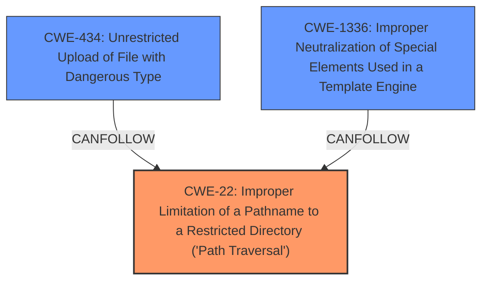

# Enhanced Analysis for CVE-2024-52291

# Summary
| CWE ID | CWE Name | Confidence | CWE Abstraction Level | CWE Vulnerability Mapping Label | CWE-Vulnerability Mapping Notes |
|---|---|---|---|---|---|
| CWE-22 | Improper Limitation of a Pathname to a Restricted Directory ('Path Traversal') | 0.9 | Base | Primary | Allowed |
| CWE-434 | Unrestricted Upload of File with Dangerous Type | 0.7 | Base | Secondary | Allowed |
| CWE-1336 | Improper Neutralization of Special Elements Used in a Template Engine | 0.6 | Base | Secondary | Allowed |

## Evidence and Confidence

*   **Confidence Score:** 0.8
*   **Evidence Strength:** HIGH

## Relationship Analysis
The primary weakness is **CWE-22** which stems from the **improper** limitation of a pathname, leading to path traversal. **CWE-434** is a secondary weakness, because the path traversal allows for unrestricted upload of dangerous file types. **CWE-1336** may be present due to the potential for SSTI, which involves improper neutralization of special elements used in a template engine.



## Vulnerability Chain
The vulnerability chain starts with an **improper** path traversal (**CWE-22**), which allows for unrestricted upload of dangerous file types (**CWE-434**). This can potentially lead to server-side template injection (**CWE-1336**) and remote code execution (RCE).
  - The **Primary CWE** is **CWE-22** as the improper path validation is the root cause that leads to the other weaknesses.

## Summary of Analysis
The assessment is heavily based on the vulnerability description and the CVE reference link content summary. The root cause is the insufficient sanitization of the file path due to the **double file// scheme**, allowing an attacker to bypass local file system validation. This leads to file overwriting through malicious uploads, unauthorized access to sensitive files, and potential RCE via SSTI payloads.

The selection of **CWE-22** as the primary CWE is justified because the vulnerability stems from the **improper** limitation of a pathname to a restricted directory. The use of the **double file// scheme** bypasses the intended path validation, allowing the attacker to specify arbitrary local file system locations. This aligns directly with the description of **CWE-22**.

**CWE-434** is included as a secondary CWE because the path traversal allows for the unrestricted upload of dangerous file types, which can lead to further exploitation.

**CWE-1336** is included as a possible secondary CWE because the vulnerability description mentions the potential for SSTI, which involves improper neutralization of special elements used in a template engine. However, the evidence for SSTI is not as strong, so the confidence in this mapping is lower.

Other CWEs Considered but Not Used:
*   **CWE-425 (Direct Request ('Forced Browsing'))**: While the vulnerability involves unauthorized access, it's primarily due to path traversal, not **missing** authorization checks.
*   **CWE-41 (Improper Resolution of Path Equivalence)**: While related to path manipulation, the **double file// scheme** is more directly related to traversing outside the intended directory.
*   **CWE-79 (Improper Neutralization of Input During Web Page Generation ('Cross-site Scripting'))**: Not relevant as the vulnerability isn't related to XSS.
*   **CWE-472 (External Control of Assumed-Immutable Web Parameter)**: Not relevant as the vulnerability isn't related to modification of assumed-immutable web parameters.
*   **CWE-178 (Improper Handling of Case Sensitivity)**: Not relevant as the vulnerability isn't related to case sensitivity.
*   **CWE-552 (Files or Directories Accessible to External Parties)**: While a consequence, the root cause is the path traversal, not directly making files accessible.
*   **CWE-116 (Improper Encoding or Escaping of Output)**: Not relevant as the vulnerability isn't related to encoding or escaping of output.
*   **CWE-184 (Incomplete List of Disallowed Inputs)**: Not relevant as the vulnerability isn't related to a list of disallowed inputs.


## CWE Relationship Analysis

Current CWEs represent these abstraction levels: .


### Vulnerability Chain Analysis

**Chain starting from CWE-116:**
- 116 (Improper Encoding or Escaping of Output) - ROOT


**Chain starting from CWE-41:**
- 41 (Improper Resolution of Path Equivalence) - ROOT


### CWE Relationship Diagram

```mermaid
graph TD
    classDef primary fill:#f96,stroke:#333,stroke-width:2px
    classDef secondary fill:#69f,stroke:#333
    classDef tertiary fill:#9e9,stroke:#333
```