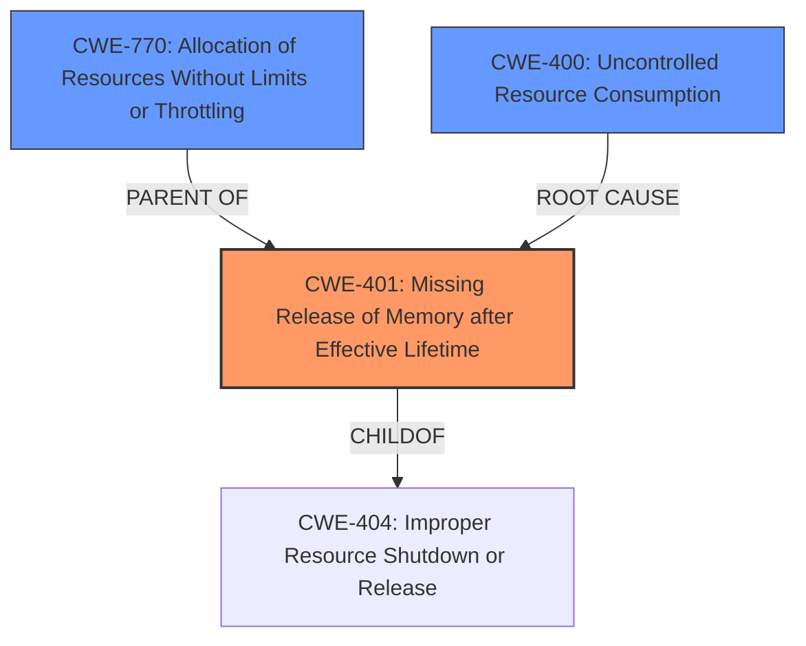

# Analysis for CVE-2024-52303

# Summary
| CWE ID | CWE Name | Confidence | CWE Abstraction Level | CWE Vulnerability Mapping Label | CWE-Vulnerability Mapping Notes |
|---|---|---|---|---|---|
| CWE-401 | Missing Release of Memory after Effective Lifetime | 0.9 | Variant | Primary | Allowed |
| CWE-770 | Allocation of Resources Without Limits or Throttling | 0.7 | Base | Secondary | Allowed |
| CWE-400 | Uncontrolled Resource Consumption | 0.6 | Class | Secondary | Discouraged |

## Evidence and Confidence

*   **Confidence Score:** 0.8
*   **Evidence Strength:** HIGH

## Relationship Analysis
The primary weakness is the **missing release of memory**, represented by CWE-401. This is a variant of the more general class CWE-404 Improper Resource Shutdown or Release. CWE-401 can be caused by **allocation of resources without limits**, CWE-770, which is also relevant. The ultimate impact is **uncontrolled resource consumption**, CWE-400.

## Vulnerability Chain
The vulnerability chain begins with the dynamic creation of `MatchInfoError` handlers for each request, leading to the **uncontrolled allocation of resources** (cache entries). This, in turn, results in a **missing release of memory**, ultimately causing **uncontrolled resource consumption** and a denial-of-service.

## Summary of Analysis
The primary CWE is CWE-401 Missing Release of Memory after Effective Lifetime, as the core issue is the **memory leak** due to the cache not being properly managed. The vulnerability description explicitly mentions a memory leak, and the reference link content summary highlights that the middleware cache grows indefinitely. CWE-770 is a contributing factor, as the cache grows without any limits. CWE-400 describes the impact, which is **uncontrolled resource consumption**, but is discouraged as a primary mapping.

The evidence supporting CWE-401 is the "Vulnerability Description Key Phrases" which has "**weakness:** **memory leak**". The "CVE Reference Links Content Summary" states "**Uncontrolled Resource Consumption (CWE-772):** The vulnerability is a memory leak, which falls under the category of uncontrolled resource consumption." This supports the memory leak as the primary issue.

I considered other CWEs, such as CWE-789 (Memory Allocation with Excessive Size Value), but this is not the core issue, as the problem is not the size of the allocation but the failure to release the memory. CWE-772 (Missing Release of Resource after Effective Lifetime) was also considered, but CWE-401 is a more specific variant of this.

The selected CWEs are at the optimal level of specificity, as they accurately represent the root cause and contributing factors to the vulnerability.

Relevant CWE Information:

# Enhanced Context (25 CWEs)
The following CWEs were identified as potentially relevant to this vulnerability:

## CWE-789: Memory Allocation with Excessive Size Value
**Abstraction Level**: Variant
**Similarity Score**: 0.71
**Source**: dense

**Description**:
The product allocates memory based on an untrusted, large size value, but it does not ensure that the size is within expected limits, allowing arbitrary amounts of memory to be allocated.

**Mapping Guidance**:
- Usage: Allowed
- Rationale: This CWE entry is at the Variant level of abstraction, which is a preferred level of abstraction for mapping to the root causes of vulnerabilities.

## CWE-401: Missing Release of Memory after Effective Lifetime
**Abstraction Level**: Variant
**Similarity Score**: 0.71
**Source**: dense

**Description**:
The product does not sufficiently track and release allocated memory after it has been used, which slowly consumes remaining memory.

**Mapping Guidance**:
- Usage: Allowed
- Rationale: This CWE entry is at the Variant level of abstraction, which is a preferred level of abstraction for mapping to the root causes of vulnerabilities.

**Technical Explanation:**
The vulnerability in `aiohttp` arises from a **memory leak** within the middleware handling of `MatchInfoError` responses. Specifically, the `_build_middlewares` function, responsible for constructing middleware pipelines, caches the generated pipelines even when a `MatchInfoError` occurs. Because the `MatchInfoError` handlers are built dynamically for each request, this results in a new unique cache entry for each error. Over time, this leads to an uncontrolled growth of the cache and the **failure to release allocated memory**, aligning perfectly with CWE-401.

**Security Implications:**
The security implication of this vulnerability is a denial-of-service (DoS). An attacker can exploit this weakness by sending numerous requests that trigger `MatchInfoError` responses, causing the server's memory resources to be exhausted. This makes the server unavailable to legitimate users.

**Parent-Child Relationships:**
CWE-401 is a variant of CWE-404 (Improper Resource Shutdown or Release), providing a more specific description of the memory management issue.

**Chain Patterns:**
The vulnerability chain starts with the dynamic generation of error handlers, leading to an allocation of memory that is never released, and culminating in resource exhaustion (DoS).

**MITRE Mapping Guidance:**
The MITRE mapping guidance for CWE-401 allows its usage.

**Confidence:** 0.9

## CWE-770: Allocation of Resources Without Limits or Throttling

**Technical Explanation:**
The vulnerability involves the allocation of cache entries for middleware pipelines without any limits or throttling. Each unique `MatchInfoError` leads to a new cache entry, and there is no mechanism to prevent the cache from growing indefinitely. This aligns with CWE-770, which describes the **allocation of resources without limits**.

**Security Implications:**
The lack of limits on resource allocation allows an attacker to exhaust server resources, leading to a denial-of-service (DoS).

**Parent-Child Relationships:**
CWE-770 is a parent of CWE-789 (Memory Allocation with Excessive Size Value), but the excessive size is not the primary issue here, but the **unlimited allocation**.

**MITRE Mapping Guidance:**
The MITRE mapping guidance for CWE-770 allows its usage.

**Confidence:** 0.7

## CWE-400: Uncontrolled Resource Consumption

**Technical Explanation:**
The consequence of the memory leak and the **unlimited allocation of resources** is that the server's memory resources are exhausted. This perfectly matches CWE-400 - Uncontrolled Resource Consumption.

**Security Implications:**
The main implication is Denial of Service

**MITRE Mapping Guidance:**
The MITRE mapping guidance for CWE-400 discourages its usage because it is a level-1 Class (i.e., a child of a Pillar).

**Confidence:** 0.6