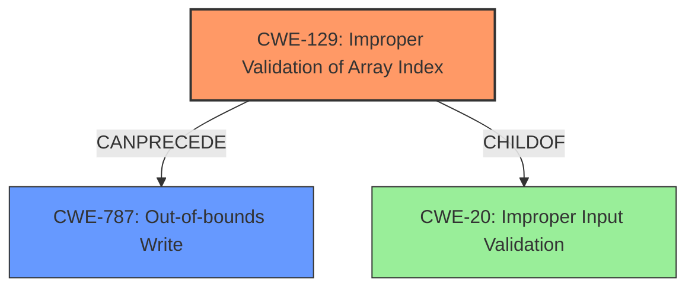

# Analysis Report for CVE-2024-52333

# Vulnerability Analysis Report: CVE-2024-52333

## Description

An **improper array index validation** vulnerability exists in the determineMinMax functionality of OFFIS DCMTK 3.6.8. A specially crafted DICOM file can lead to an **out-of-bounds write**. An attacker can provide a malicious file to trigger this vulnerability.

## Vulnerability Description Key Phrases

- **Rootcause:** improper array index validation
- **Weakness:** out-of-bounds write
- **Vector:** specially crafted DICOM file
- **Product:** OFFIS DCMTK
- **Version:** 3.6.8
- **Component:** determineMinMax functionality

## Analysis (with Relationship Data)

# Summary
| CWE ID | CWE Name | Confidence | CWE Abstraction Level | CWE Vulnerability Mapping Label | CWE-Vulnerability Mapping Notes |
|---|---|---|---|---|---|
| CWE-129 | Improper Validation of Array Index | 0.9 | Variant | Allowed | Primary CWE: The root cause is **improper array index validation** which directly aligns with CWE-129. |
| CWE-787 | Out-of-bounds Write | 0.8 | Base | Allowed | Secondary CWE: The **out-of-bounds write** is a direct result of the improper validation. |

## Evidence and Confidence

*   **Confidence Score:** 0.85
*   **Evidence Strength:** HIGH

## Relationship Analysis
The primary relationship is that CWE-129 [CWE-129: Improper Validation of Array Index] is a prerequisite for CWE-787 [CWE-787: Out-of-bounds Write]. The **improper validation** allows the program to proceed with an array index that is outside the bounds of the allocated memory, which then leads to the **out-of-bounds write**. CWE-129 is a Variant of higher-level Class CWE-20 [CWE-20: Improper Input Validation], while CWE-787 is a Base level CWE.



## Vulnerability Chain
The vulnerability chain starts with:
1.  **Improper Array Index Validation (CWE-129)**: The root cause where the application fails to properly validate the array index.
2.  **Out-of-bounds Write (CWE-787)**: Which is a direct result of the **improper validation** and leads to memory corruption.

## Summary of Analysis
The analysis is based on the provided evidence, particularly:
*   The vulnerability description which mentions an **improper array index validation** leading to an **out-of-bounds write**.
*   The CVE Reference Links Content Summary states that the root cause is missing checks on the value corresponding to `*p` against the size allocated for the pointer `q` which leads to a heap-buffer-overflow.

Based on this evidence, CWE-129 [CWE-129: Improper Validation of Array Index] is selected as the primary CWE because it is the root cause. CWE-787 [CWE-787: Out-of-bounds Write] is selected as a secondary CWE because it is the direct result of the **improper validation**. Both are at appropriate levels of abstraction (Variant and Base, respectively).

Other considered CWEs:
*   CWE-119 [CWE-119: Improper Restriction of Operations within the Bounds of a Memory Buffer]: While relevant, it is a higher-level class and less specific than CWE-787 [CWE-787: Out-of-bounds Write]. The description for CWE-119 discourages its use when lower-level CWEs are available.
*   CWE-125 [CWE-125: Out-of-bounds Read]: Not applicable because the vulnerability involves writing, not reading, out of bounds.
*   CWE-190 [CWE-190: Integer Overflow or Wraparound]: While an integer overflow could potentially contribute to an **improper array index**, the description doesn't explicitly mention it.
*   CWE-1285 [CWE-1285: Improper Validation of Specified Index, Position, or Offset in Input]: Similar to CWE-129 [CWE-129: Improper Validation of Array Index], but CWE-129 [CWE-129: Improper Validation of Array Index] is more specific to arrays.
*   CWE-1284 [CWE-1284: Improper Validation of Specified Quantity in Input]: This is a more general case of **improper validation** related to quantity, not specific to array indices.
*   CWE-122 [CWE-122: Heap-based Buffer Overflow]: This is a type of buffer overflow and while it is mentioned in the summary, the root cause is the array index.
*   CWE-131 [CWE-131: Incorrect Calculation of Buffer Size]: The issue is not with the buffer size calculation but with how array indices are validated.
* CWE-824 [CWE-824: Access of Uninitialized Pointer]: There is no uninitialized pointer present.
* CWE-193 [CWE-193: Off-by-one Error]: Not applicable because the vulnerability involves a general **improper validation** of an array index, not specifically an off-by-one error.


## CWE Relationship Analysis

Current CWEs represent these abstraction levels: .


### Vulnerability Chain Analysis

**Chain starting from CWE-1284:**
- 1284 (Improper Validation of Specified Quantity in Input) - ROOT


**Chain starting from CWE-125:**
- 125 (Out-of-bounds Read) - ROOT


### CWE Relationship Diagram

```mermaid
graph TD
    classDef primary fill:#f96,stroke:#333,stroke-width:2px
    classDef secondary fill:#69f,stroke:#333
    classDef tertiary fill:#9e9,stroke:#333
```


*Report generated on 2025-07-13 21:12:23*
