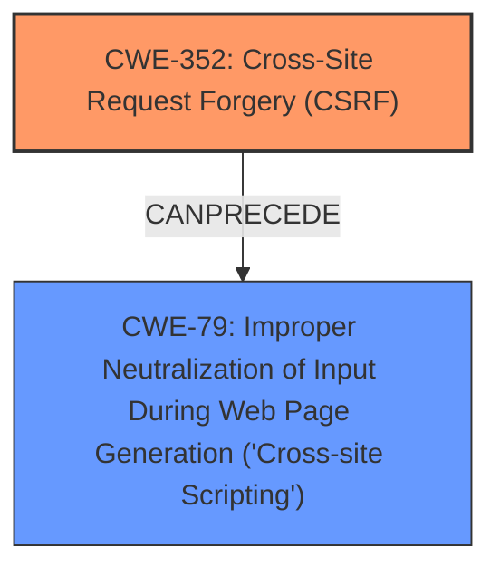

# Enhanced Analysis for CVE-2024-52421

# Summary
| CWE ID | CWE Name | Confidence | CWE Abstraction Level | CWE Vulnerability Mapping Label | CWE-Vulnerability Mapping Notes |
|---|---|---|---|---|---|
| CWE-352 | Cross-Site Request Forgery (CSRF) | 0.9 | Compound | Primary | Allowed |
| CWE-79 | Improper Neutralization of Input During Web Page Generation ('Cross-site Scripting') | 0.8 | Base | Secondary | Allowed |

## Evidence and Confidence

*   **Confidence Score:** 0.85
*   **Evidence Strength:** HIGH

## Relationship Analysis
The primary weakness is the **lack of CSRF protection**, which allows an attacker to trick a user into performing actions they did not intend. This can lead to the injection of malicious scripts, resulting in Stored **XSS**. The relationship is that the **lack of CSRF protection** (CWE-352) enables the **XSS** vulnerability (CWE-79).



## Vulnerability Chain
The vulnerability chain starts with the **lack of CSRF protection** (CWE-352), which allows an attacker to inject malicious input. This input is then improperly handled during web page generation, leading to Stored **XSS** (CWE-79).

## Summary of Analysis
The primary root cause is the **lack of CSRF protection**, which is classified as CWE-352. This allows for the injection of malicious scripts. The injected scripts are then not properly neutralized, leading to Stored **XSS**, which is classified as CWE-79.

The vulnerability description states: "Cross-Site Request Forgery (CSRF) vulnerability in wp-buy WP Popup Window Maker allows Stored **XSS**." This clearly indicates that the **lack of CSRF protection** is the primary issue that enables the **XSS** vulnerability.

CWE-352 is selected because the description explicitly mentions a Cross-Site Request Forgery (CSRF) vulnerability. CWE-79 is selected because the CSRF vulnerability allows for stored **XSS**.

The other CWEs from the **Complete CWE Specifications** were considered but not used:

*   CWE-434: Unrestricted Upload of File with Dangerous Type - Not relevant because the vulnerability doesn't involve file uploads.
*   CWE-116: Improper Encoding or Escaping of Output - While **XSS** often involves this, CWE-79 is more specific.
*   CWE-862: Missing Authorization - While CSRF could be seen as related to authorization, CWE-352 is a more direct fit.
*   CWE-89: Improper Neutralization of Special Elements used in an SQL Command ('SQL Injection') - Not relevant as the vulnerability involves **XSS**, not SQL Injection.
*   CWE-647: Use of Non-Canonical URL Paths for Authorization Decisions - Not relevant as the vulnerability doesn't involve non-canonical URL paths.

The selected CWEs are at the optimal level of specificity because they directly address the root cause (**lack of CSRF protection**) and the resulting weakness (Stored **XSS**).


## CWE Relationship Analysis

Current CWEs represent these abstraction levels: .


### Vulnerability Chain Analysis

**Chain starting from CWE-89:**
- 89 (Improper Neutralization of Special Elements used in an SQL Command ('SQL Injection')) - ROOT


**Chain starting from CWE-116:**
- 116 (Improper Encoding or Escaping of Output) - ROOT


### CWE Relationship Diagram

```mermaid
graph TD
    classDef primary fill:#f96,stroke:#333,stroke-width:2px
    classDef secondary fill:#69f,stroke:#333
    classDef tertiary fill:#9e9,stroke:#333
```