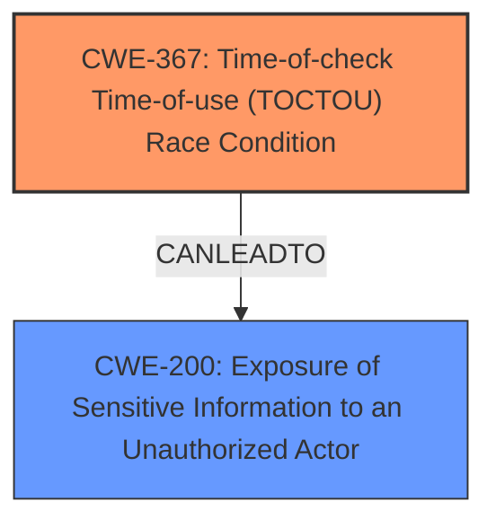

# Analysis Report for CVE-2024-52506

# Vulnerability Analysis Report: CVE-2024-52506

## Description

Graylog is a free and open log management platform. The reporting functionality in Graylog allows the creation and scheduling of reports which contain dashboard widgets displaying individual log messages or metrics aggregated from fields of multiple log messages. This functionality, as included in Graylog 6.1.0 & 6.1.1, is vulnerable to **information leakage** triggered by **multiple concurrent report rendering requests** from authorized users. When multiple report renderings are requested at the same start time, the headless browser instance used to render the PDF will be reused. Depending on the timing, either a check for the browser instance freshness hits, resulting in an error instead of the report being returned, or one of the concurrent report rendering requests wins and this report is returned for all report rendering requests that do not return an error. This might lead to one user getting the report of a different user, potentially leaking indexed log messages or aggregated data that this user normally has no access to. This problem is fixed in Graylog 6.1.2. There is no known workaround besides disabling the reporting functionality.

## Vulnerability Description Key Phrases

- **Rootcause:** multiple concurrent report rendering requests
- **Weakness:** information leakage
- **Impact:** one user getting the report of a different user
- **Attacker:** authorized users
- **Product:** Graylog
- **Version:** 6.1.0 & 6.1.1
- **Component:** reporting functionality

## Analysis (with Relationship Data)

# Summary
| CWE ID | CWE Name | Confidence | CWE Abstraction Level | CWE Vulnerability Mapping Label | CWE-Vulnerability Mapping Notes |
|---|---|---|---|---|---|
| CWE-367 | Time-of-check Time-of-use (TOCTOU) Race Condition | 0.8 | Base | Allowed | Primary CWE - Root Cause |
| CWE-200 | Exposure of Sensitive Information to an Unauthorized Actor | 0.7 | Class | Discouraged | Secondary CWE - Impact |

## Evidence and Confidence

*   **Confidence Score:** 0.75
*   **Evidence Strength:** MEDIUM

## Relationship Analysis
The primary CWE selected is CWE-367 (Time-of-check Time-of-use (TOCTOU) Race Condition), which is a Base level CWE. The secondary CWE selected is CWE-200 (Exposure of Sensitive Information to an Unauthorized Actor), which is a Class level CWE. CWE-367 can lead to CWE-200 as the race condition results in unintended information exposure.



## Vulnerability Chain
The vulnerability chain begins with **multiple concurrent report rendering requests**, leading to a **Time-of-check Time-of-use (TOCTOU) Race Condition** (CWE-367) when checking the browser instance freshness. The race condition allows one user to receive a report generated for another user, resulting in **information leakage** and **Exposure of Sensitive Information to an Unauthorized Actor** (CWE-200).

## Summary of Analysis
The primary weakness is a race condition that occurs when multiple concurrent report rendering requests are made. This race condition can cause one user to receive a report generated for another user, leading to information exposure.

The selection of CWE-367 is based on the evidence: "**multiple concurrent report rendering requests** from authorized users. When multiple report renderings are requested at the same start time, the headless browser instance used to render the PDF will be reused. Depending on the timing, either a check for the browser instance freshness hits, resulting in an error instead of the report being returned, or one of the concurrent report rendering requests wins". This directly points to a time-of-check time-of-use issue where the state of the browser instance changes between the check and its use.

CWE-200 is included as a secondary weakness because the end result is that "one user getting the report of a different user, potentially leaking indexed log messages or aggregated data that this user normally has no access to", which is an exposure of sensitive information.

The retriever results listed CWE-367 as a candidate. The graph relationships for CWE-367 show that it can precede CWE-609 (Double-Checked Locking) or other synchronization issues, which further supports the selection of CWE-367 given that concurrent requests are involved.

Other CWEs Considered:

*   CWE-79 (Improper Neutralization of Input During Web Page Generation ('Cross-site Scripting')): This CWE was considered but deemed not applicable because the vulnerability does not involve improper neutralization of input.
*   CWE-209 (Generation of Error Message Containing Sensitive Information): This CWE was considered but deemed not applicable because the vulnerability's primary issue is not the generation of error messages containing sensitive information.
*   CWE-201 (Insertion of Sensitive Information Into Sent Data): While information is being sent to an unauthorized actor, the root cause is not the insertion of sensitive information, but rather the race condition leading to the wrong report being sent.
*   CWE-667 (Improper Locking): Although the concurrent nature of the requests suggests a locking issue, CWE-367 more accurately captures the TOCTOU aspect of the vulnerability.

Relevant CWE Information:

# Enhanced Context (25 CWEs)
The following CWEs were identified as potentially relevant to this vulnerability:

## CWE-209: Generation of Error Message Containing Sensitive Information
**Abstraction Level**: Base
**Similarity Score**: 0.74
**Source**: dense

**Description**:
The product generates an error message that includes sensitive information about its environment, users, or associated data.

**Mapping Guidance**:
- Usage: Allowed
- Rationale: This CWE entry is at the Base level of abstraction, which is a preferred level of abstraction for mapping to the root causes of vulnerabilities.


## CWE-212: Improper Removal of Sensitive Information Before Storage or Transfer
**Abstraction Level**: Base
**Similarity Score**: 0.73
**Source**: dense

**Description**:
The product stores, transfers, or shares a resource that contains sensitive information, but it does not properly remove that information before the product makes the resource available to unauthorized actors.

**Mapping Guidance**:
- Usage: Allowed
- Rationale: This CWE entry is at the Base level of abstraction, which is a preferred level of abstraction for mapping to the root causes of vulnerabilities.


## CWE-201: Insertion of Sensitive Information Into Sent Data
**Abstraction Level**: Base
**Similarity Score**: 0.72
**Source**: dense

**Description**:
The code transmits data to another actor, but a portion of the data includes sensitive information that should not be accessible to that actor.

**Mapping Guidance**:
- Usage: Allowed
- Rationale: This CWE entry is at the Base level of abstraction, which is a preferred level of abstraction for mapping to the root causes of vulnerabilities.


## CWE-346: Origin Validation Error
**Abstraction Level**: Class
**Similarity Score**: 0.72
**Source**: dense

**Description**:
The product does not properly verify that the source of data or communication is valid.

**Mapping Guidance**:
- Usage: Allowed-with-Review
- Rationale: This CWE entry is a Class and might have Base-level children that would be more appropriate


## CWE-941: Incorrectly Specified Destination in a Communication Channel
**Abstraction Level**: Base
**Similarity Score**: 0.72
**Source**: dense

**Description**:
The product creates a communication channel to initiate an outgoing request to an actor, but it does not correctly specify the intended destination for that actor.

**Mapping Guidance**:
- Usage: Allowed
- Rationale: This CWE entry is at the Base level of abstraction, which is a preferred level of abstraction for mapping to the root causes of vulnerabilities.


## CWE-497: Exposure of Sensitive System Information to an Unauthorized Control Sphere
**Abstraction Level**: Base
**Similarity Score**: 0.72
**Source**: dense

**Description**:
The product does not properly prevent sensitive system-level information from being accessed by unauthorized actors who do not have the same level of access to the underlying system as the product does.

**Mapping Guidance**:
- Usage: Allowed
- Rationale: This CWE entry is at the Base level of abstraction, which is a preferred level of abstraction for mapping to the root causes of vulnerabilities.


## CWE-918: Server-Side Request Forgery (SSRF)
**Abstraction Level**: Base
**Similarity Score**: 0.71
**Source**: dense

**Description**:
The web server receives a URL or similar request from an upstream component and retrieves the contents of this URL, but it does not sufficiently ensure that the request is being sent to the expected destination.

**Mapping Guidance**:
- Usage: Allowed
- Rationale: This CWE entry is at the Base level of abstraction, which is a preferred level of abstraction for mapping to the root causes of vulnerabilities.


## CWE-923: Improper Restriction of Communication Channel to Intended Endpoints
**Abstraction Level**: Class
**Similarity Score**: 0.71
**Source**: dense

**Description**:
The product establishes a communication channel to (or from) an endpoint for privileged or protected operations, but it does not properly ensure that it is communicating with the correct endpoint.

**Mapping Guidance**:
- Usage: Allowed-with-Review
- Rationale: This CWE entry is a Class and might have Base-level children that would be more appropriate


## CWE-204: Observable Response Discrepancy
**Abstraction Level**: Base
**Similarity Score**: 0.71
**Source**: dense

**Description**:
The product provides different responses to incoming requests in a way that reveals internal state information to an unauthorized actor outside of the intended control sphere.

**Mapping Guidance**:
- Usage: Allowed
- Rationale: This CWE entry is at the Base level of abstraction, which is a preferred level of abstraction for mapping to the root causes of vulnerabilities.


## CWE-116: Improper Encoding or Escaping of Output
**Abstraction Level**: Class
**Similarity Score**: 0.71
**Source**: dense

**Description**:
The product prepares a structured message for communication with another component, but encoding or escaping of the data is either missing or done incorrectly. As a result, the intended structure of the message


## CWE Relationship Analysis

Current CWEs represent these abstraction levels: .


### Vulnerability Chain Analysis

**Chain starting from CWE-116:**
- 116 (Improper Encoding or Escaping of Output) - ROOT


**Chain starting from CWE-346:**
- 346 (Origin Validation Error) - ROOT


### CWE Relationship Diagram

```mermaid
graph TD
    classDef primary fill:#f96,stroke:#333,stroke-width:2px
    classDef secondary fill:#69f,stroke:#333
    classDef tertiary fill:#9e9,stroke:#333
```


*Report generated on 2025-07-13 21:17:36*
