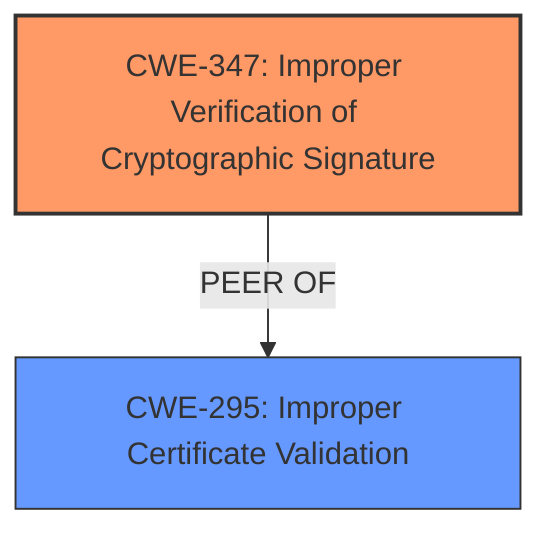

# Analysis Report for CVE-2024-52510

# Vulnerability Analysis Report: CVE-2024-52510

## Description

The Nextcloud Desktop Client is a tool to synchronize files from Nextcloud Server with your computer. The Desktop client did not stop with an error but allowed **by-passing the signature validation**, if a manipulated server sends an empty initial signature. It is recommended that the Nextcloud Desktop client is upgraded to 3.14.2 or later.

## Vulnerability Description Key Phrases

- **Rootcause:** by-passing the signature validation
- **Vector:** manipulated server sends an empty initial signature
- **Product:** Nextcloud Desktop Client
- **Version:** before 3.14.2

## Analysis (with Relationship Data)

# Summary

| CWE ID   | CWE Name                                                                                      | Confidence | CWE Abstraction Level | CWE Vulnerability Mapping Label | CWE-Vulnerability Mapping Notes |
| :-------- | :-------------------------------------------------------------------------------------------- | :--------- | :---------------------- | :------------------------------ | :------------------------------ |
| CWE-347   | Improper Verification of Cryptographic Signature                                            | 0.95      | Base                    | Primary                         | Allowed                         |
| CWE-295   | Improper Certificate Validation                                                               | 0.75      | Base                    | Secondary                       | Allowed                         |

## Evidence and Confidence

*   **Confidence Score:** 0.85
*   **Evidence Strength:** HIGH

## Relationship Analysis

The primary CWE identified is CWE-347 [Improper Verification of Cryptographic Signature], which is a **Base** level CWE. The secondary CWE identified is CWE-295 [Improper Certificate Validation], which is also a **Base** level CWE. Both CWEs are related to cryptographic issues. There are no direct parent-child relationships between them, but they share a peer relationship in the context of security vulnerabilities related to trust and verification. The abstraction levels influenced the selection by focusing on the root cause of the vulnerability rather than a broader class.



## Vulnerability Chain

The vulnerability chain starts with the Nextcloud Desktop Client's failure to properly validate the signature, specifically the handling of an empty initial signature from a manipulated server. This **improper verification** (CWE-347) leads to a bypass of signature validation, potentially resulting in unauthorized access to encrypted data. The chain can be summarized as:

1.  **Root Cause:** CWE-347 [Improper Verification of Cryptographic Signature] - The client **does not properly** verify the cryptographic signature.
2.  **Impact:** Bypassing signature validation, leading to the potential compromise of data confidentiality and integrity.

## Summary of Analysis

The initial analysis focused on the **by-passing of the signature validation** due to the client not stopping with an error when receiving an empty initial signature. This aligns strongly with CWE-347 [Improper Verification of Cryptographic Signature], as the root cause is the **improper handling** of cryptographic signatures. The "CVE Reference Links Content Summary" further supports this, stating that the client "failed to check if the received signature was empty before attempting to process it." The relationship analysis highlights the connection between signature verification and certificate validation, making CWE-295 [Improper Certificate Validation] a relevant secondary consideration. The selected CWEs are at the optimal level of specificity, as they directly address the weakness in the cryptographic signature verification process. The decision is primarily based on the provided evidence, with high confidence.
CWE-99 [Improper Control of Resource Identifiers ('Resource Injection')], CWE-427 [Uncontrolled Search Path Element], CWE-923 [Improper Restriction of Communication Channel to Intended Endpoints], CWE-209 [Generation of Error Message Containing Sensitive Information], CWE-789 [Memory Allocation with Excessive Size Value], CWE-1390 [Weak Authentication], CWE-603 [Use of Client-Side Authentication], and CWE-322 [Key Exchange without Entity Authentication] were considered but deemed less relevant as they do not directly address the core issue of **improper signature validation**.
# Enhanced Context (25 CWEs)
The following CWEs were identified as potentially relevant to this vulnerability:

## CWE-295: Improper Certificate Validation
**Abstraction Level**: Base
**Similarity Score**: 0.72
**Source**: dense

**Description**:
The product does not validate, or incorrectly validates, a certificate.

**Mapping Guidance**:
- Usage: Allowed
- Rationale: This CWE entry is at the Base level of abstraction, which is a preferred level of abstraction for mapping to the root causes of vulnerabilities.


## CWE-347: Improper Verification of Cryptographic Signature
**Abstraction Level**: Base
**Similarity Score**: 0.70
**Source**: dense

**Description**:
The product does not verify, or incorrectly verifies, the cryptographic signature for data.

**Mapping Guidance**:
- Usage: Allowed
- Rationale: This CWE entry is at the Base level of abstraction, which is a preferred level of abstraction for mapping to the root causes of vulnerabilities.


## CWE-209: Generation of Error Message Containing Sensitive Information
**Abstraction Level**: Base
**Similarity Score**: 0.70
**Source**: dense

**Description**:
The product generates an error message that includes sensitive information about its environment, users, or associated data.

**Mapping Guidance**:
- Usage: Allowed
- Rationale: This CWE entry is at the Base level of abstraction, which is a preferred level of abstraction for mapping to the root causes of vulnerabilities.


## CWE-1391: Use of Weak Credentials
**Abstraction Level**: Class
**Similarity Score**: 0.70
**Source**: dense

**Description**:
The product uses weak credentials (such as a default key or hard-coded password) that can be calculated, derived, reused, or guessed by an attacker.

**Mapping Guidance**:
- Usage: Allowed-with-Review
- Rationale: This CWE entry is a Class and might have Base-level children that would be more appropriate


## CWE-345: Insufficient Verification of Data Authenticity
**Abstraction Level**: Class
**Similarity Score**: 0.70
**Source**: dense

**Description**:
The product does not sufficiently verify the origin or authenticity of data, in a way that causes it to accept invalid data.

**Mapping Guidance**:
- Usage: Discouraged
- Rationale: This CWE entry is a level-1 Class (i.e., a child of a Pillar). It might have lower-level children that would be more appropriate


## CWE-93: Improper Neutralization of CRLF Sequences ('CRLF Injection')
**Abstraction Level**: Base
**Similarity Score**: 0.70
**Source**: dense

**Description**:
The product uses CRLF (carriage return line feeds) as a special element, e.g. to separate lines or records, but it does not neutralize or incorrectly neutralizes CRLF sequences from inputs.

**Mapping Guidance**:
- Usage: Allowed
- Rationale: This CWE entry is at the Base level of abstraction, which is a preferred level of abstraction for mapping to the root causes of vulnerabilities.


## CWE-459: Incomplete Cleanup
**Abstraction Level**: Base
**Similarity Score**: 0.69
**Source**: dense

**Description**:
The product does not properly "clean up" and remove temporary or supporting resources after they have been used.

**Mapping Guidance**:
- Usage: Allowed
- Rationale: This CWE entry is at the Base level of abstraction, which is a preferred level of abstraction for mapping to the root causes of vulnerabilities.


## CWE-303: Incorrect Implementation of Authentication Algorithm
**Abstraction Level**: Base
**Similarity Score**: 0.69
**Source**: dense

**Description**:
The requirements for the product dictate the use of an established authentication algorithm, but the implementation of the algorithm is incorrect.

**Mapping Guidance**:
- Usage: Allowed
- Rationale: This CWE entry is at the Base level of abstraction, which is a preferred level of abstraction for mapping to the root causes of vulnerabilities.


## CWE-203: Observable Discrepancy
**Abstraction Level**: Base
**Similarity Score**: 0.69
**Source**: dense

**Description**:
The product behaves differently or sends different responses under different circumstances in a way that is observable to an unauthorized actor, which exposes security-relevant information about the state of the product, such as whether a particular operation was successful or not.

**Mapping Guidance**:
- Usage: Allowed
- Rationale: This CWE entry is at the Base level of abstraction, which is a preferred level of abstraction for mapping to the root causes of vulnerabilities.


## CWE-288: Authentication Bypass Using an Alternate Path or Channel
**Abstraction Level**: Base
**Similarity Score**: 0.68
**Source**: dense

**Description**:
The product requires authentication, but the product has an alternate path or channel that does not require authentication.

**Mapping Guidance**:
- Usage: Allowed
- Rationale: This CWE entry is at the Base level of abstraction, which is a preferred level of abstraction for mapping to the root causes of vulnerabilities.


## CWE-347: Improper Verification of Cryptographic Signature
**Abstraction Level**: Base
**Similarity Score**: 1161.26
**Source**: sparse

**Description**:
The product does not verify, or incorrectly verifies, the cryptographic signature for data.

**Mapping Guidance**:
- Usage: Allowed
- Rationale: This CWE entry is at the Base level of abstraction, which is a preferred level of abstraction for mapping to the root causes of vulnerabilities.


## CWE-295: Improper


## CWE Relationship Analysis

Current CWEs represent these abstraction levels: .


### Vulnerability Chain Analysis

**Chain starting from CWE-1390:**
- 1390 (Weak Authentication) - ROOT


**Chain starting from CWE-99:**
- 99 (Improper Control of Resource Identifiers ('Resource Injection')) - ROOT


### CWE Relationship Diagram

```mermaid
graph TD
    classDef primary fill:#f96,stroke:#333,stroke-width:2px
    classDef secondary fill:#69f,stroke:#333
    classDef tertiary fill:#9e9,stroke:#333
```


*Report generated on 2025-07-13 21:18:36*
