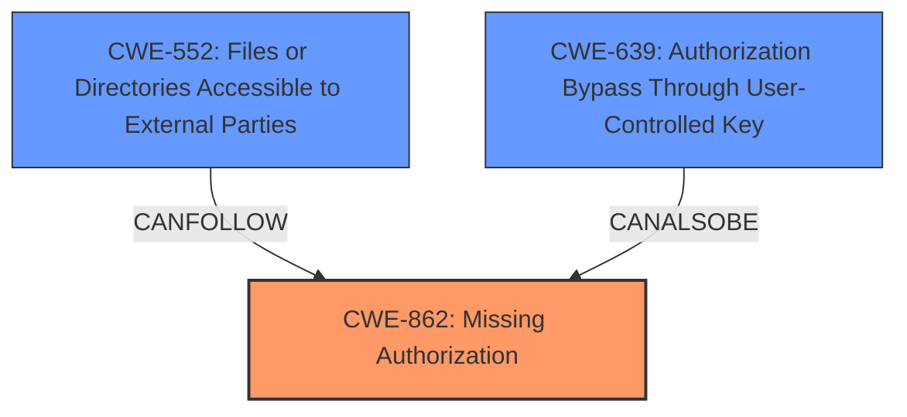

# Raw Analyzer Response for CVE-2024-52514

# Summary
| CWE ID  | CWE Name                                                                | Confidence | CWE Abstraction Level | CWE Vulnerability Mapping Label | CWE-Vulnerability Mapping Notes |
| :-------- | :---------------------------------------------------------------------- | :--------- | :-------------------- | :------------------------------ | :------------------------------ |
| CWE-862   | Missing Authorization                                                   | 0.9        | Base                  | Allowed                       | Primary CWE                     |
| CWE-552   | Files or Directories Accessible to External Parties                    | 0.7        | Base                  | Allowed                       | Secondary Candidate             |
| CWE-639   | Authorization Bypass Through User-Controlled Key                        | 0.6        | Base                  | Allowed                       | Secondary Candidate             |

## Evidence and Confidence

*   **Confidence Score:** 0.8
*   **Evidence Strength:** HIGH

## Relationship Analysis
The primary CWE is CWE-862, which represents the root cause of the vulnerability, where the application **doesn't check whether the user is authorized at all** to copy the intermediate folder. CWE-552 is a consequence of the **missing authorization** leading to files being accessible to external parties. CWE-639 is considered because the authorization bypass is achieved through user interaction (copying a folder). The abstraction levels are all Base, which is the preferred level of abstraction.

## Vulnerability Chain
The vulnerability chain starts with **missing authorization** checks (CWE-862) when copying a folder, leading to the **impact** of making files accessible to external parties (CWE-552).

## Summary of Analysis
The analysis identified CWE-862 as the primary weakness because the system **fails to perform authorization checks** when a user copies a folder. This is supported by the CVE Reference Links Content Summary which states "**Missing Access Control Checks:** The system fails to properly check access control rules when copying a folder containing blocked files." The **impact** of the vulnerability is that it allows access to blocked files, which aligns with CWE-552 (Files or Directories Accessible to External Parties).

The decision to select CWE-862 is based on the provided evidence, the retriever results, and the mapping guidance. The mapping guidance specifically indicates that CWE-862 is appropriate when the application doesn't check whether the user is authorized at all. The level of specificity is appropriate as it directly addresses the root cause of the vulnerability.

Relevant CWE Information:

# Enhanced Context (25 CWEs)
The following CWEs were identified as potentially relevant to this vulnerability:

## CWE-863: Incorrect Authorization
**Abstraction Level**: Class
**Similarity Score**: 1990.09
**Source**: sparse

**Description**:
The product performs an authorization check when an actor attempts to access a resource or perform an action, but it does not correctly perform the check.

**Mapping Guidance**:
- Usage: Allowed-with-Review
- Rationale: This CWE entry is a Class and might have Base-level children that would be more appropriate

## CWE-639: Authorization Bypass Through User-Controlled Key
**Abstraction Level**: Base
**Similarity Score**: 1988.33
**Source**: sparse

**Description**:
The system's authorization functionality does not prevent one user from gaining access to another user's data or record by modifying the key value identifying the data.

**Mapping Guidance**:
- Usage: Allowed
- Rationale: This CWE entry is at the Base level of abstraction, which is a preferred level of abstraction for mapping to the root causes of vulnerabilities.

## CWE-285: Improper Authorization
**Abstraction Level**: Class
**Similarity Score**: 1927.61
**Source**: sparse

**Description**:
The product does not perform or incorrectly performs an authorization check when an actor attempts to access a resource or perform an action.

**Mapping Guidance**:
- Usage: Discouraged
- Rationale: CWE-285 is high-level and lower-level CWEs can frequently be used instead. It is a level-1 Class (i.e., a child of a Pillar).

## CWE-306: Missing Authentication for Critical Function
**Abstraction Level**: Base
**Similarity Score**: 1872.01
**Source**: sparse

**Description**:
The product does not perform any authentication for functionality that requires a provable user identity or consumes a significant amount of resources.

**Mapping Guidance**:
- Usage: Allowed
- Rationale: This CWE entry is at the Base level of abstraction, which is a preferred level of abstraction for mapping to the root causes of vulnerabilities.

## CWE-552: Files or Directories Accessible to External Parties
**Abstraction Level**: Base
**Similarity Score**: 0.77
**Source**: dense

**Description**:
The product makes files or directories accessible to unauthorized actors, even though they should not be.

**Mapping Guidance**:
- Usage: Allowed
- Rationale: This CWE entry is at the Base level of abstraction, which is a preferred level of abstraction for mapping to the root causes of vulnerabilities.