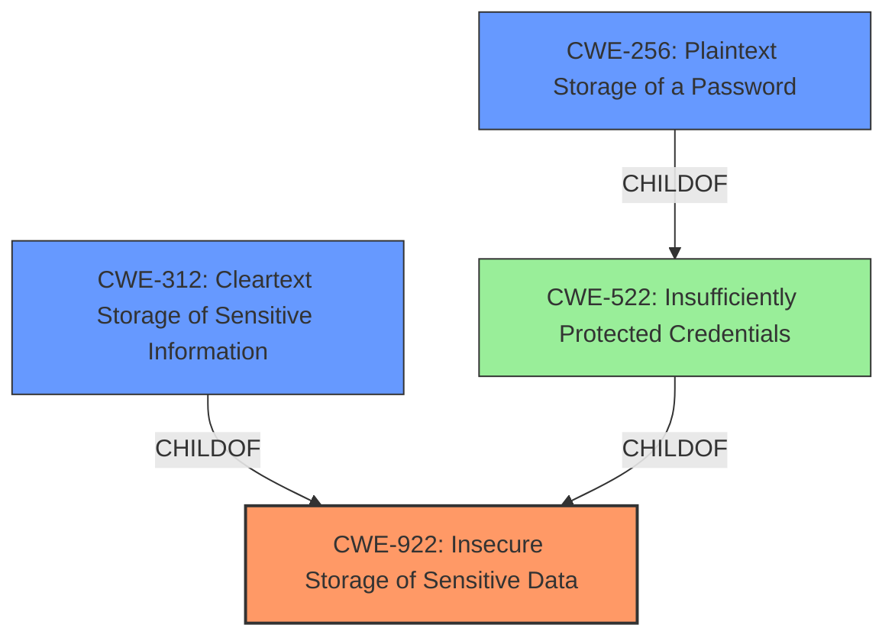

# Raw Analyzer Response for CVE-2024-52519

# Summary
| CWE ID | CWE Name | Confidence | CWE Abstraction Level | CWE Vulnerability Mapping Label | CWE-Vulnerability Mapping Notes |
|---|---|---|---|---|---|
| CWE-922 | Insecure Storage of Sensitive Data | 1.0 | Base | Primary | Allowed |
| CWE-312 | Cleartext Storage of Sensitive Information | 0.7 | Base | Secondary Candidate | Allowed |
| CWE-256 | Plaintext Storage of a Password | 0.6 | Base | Secondary Candidate | Allowed |

## Evidence and Confidence

*   **Confidence Score:** 0.9
*   **Evidence Strength:** HIGH

## Relationship Analysis
The primary relationship is that CWE-922 is a broad category that encompasses more specific storage issues. CWE-312 and CWE-256 are potential specializations. Because the vulnerability involves reversibly encrypted data, CWE-312 is considered, but the specific encryption details are unknown which makes CWE-922 a more general and fitting choice. CWE-256 is a child of CWE-522 (Insufficiently Protected Credentials), indicating a focus on password storage. However, the vulnerability relates to OAuth2 client secrets more broadly, not specifically passwords. The abstraction levels are appropriate as Base CWEs are preferred.

## Vulnerability Chain
The vulnerability chain starts with **insecure storage** of the OAuth2 client secrets, leading to potential decryption and unauthorized access to the Nextcloud data:

1.  **Root Cause:** CWE-922: Insecure Storage of Sensitive Data - OAuth2 client secrets are stored in a recoverable way.
2.  Impact: An attacker with access to the database backup and Nextcloud config file can decrypt the secrets, leading to a confidentiality breach.
3.  Final Impact: Recovered secrets could be used to impersonate applications, gaining unauthorized access to Nextcloud data.

## Summary of Analysis
The initial assessment focused on the **weakness** of storing OAuth2 client secrets in a recoverable way. The CVE Reference Links Content Summary explicitly mentions that the vulnerability is associated with CWE-922 (Insecure Storage of Sensitive Data). This, along with the description of the root cause as storing encrypted secrets that can be decrypted, strongly supports the selection of CWE-922 as the primary CWE.

The graph relationships confirm that more specific CWEs like CWE-312 (Cleartext Storage of Sensitive Information) and CWE-256 (Plaintext Storage of a Password) exist, but they are not as accurate as CWE-922, which covers the general case of **insecure storage**. The mitigation of hashing the secrets further validates that the original storage method was the core issue. The selected CWEs are at the optimal level of specificity as they accurately represent the root cause without being overly specific or narrow in scope.

Relevant CWE Information:

*   **CWE-922: Insecure Storage of Sensitive Data:** This CWE is the primary candidate because it directly addresses the **root cause** identified in the vulnerability description. The **OAuth2 client secrets** were stored in a manner that allowed for recovery if an attacker gained access to the database backup and configuration file. The vulnerability description key phrases explicitly mentions the **weakness** of "OAuth2 client secrets stored in a recoverable way". The CVE Reference Links Content Summary confirms that the vulnerability is associated with CWE-922.
*   **CWE-312: Cleartext Storage of Sensitive Information:** This CWE was considered because the secrets were stored in an encrypted format but were decryptable. However, since the primary issue is the lack of proper protection during storage, not necessarily the storage in cleartext, CWE-922 is more appropriate.
*   **CWE-256: Plaintext Storage of a Password:** This CWE was considered because secrets can be considered passwords. However, OAuth2 client secrets are not strictly passwords, so it doesn't fit perfectly.