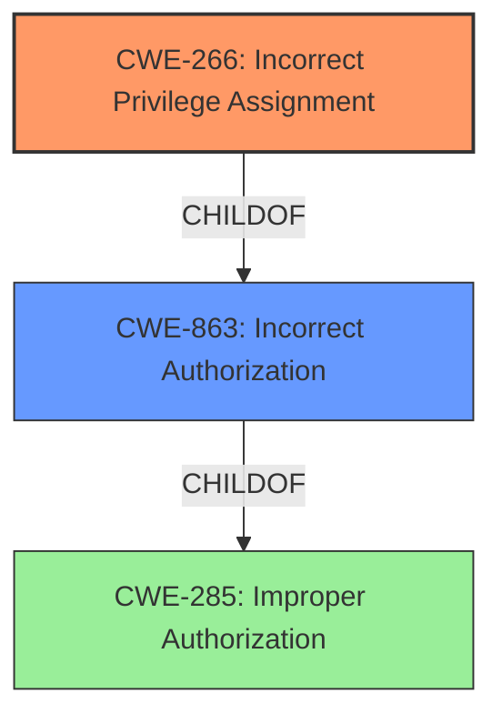

# Raw Analyzer Response for CVE-2024-5257

# Summary
| CWE ID | CWE Name | Confidence | CWE Abstraction Level | CWE Vulnerability Mapping Label | CWE-Vulnerability Mapping Notes |
|---|---|---|---|---|---|
| CWE-266 | Incorrect Privilege Assignment | 0.9 | Base | Allowed | Primary CWE. The `admin_compliance_framework` role was incorrectly assigned privileges to modify group settings. |
| CWE-863 | Incorrect Authorization | 0.7 | Class | Allowed-with-Review | Secondary candidate. The system performs an authorization check, but it is performed incorrectly, allowing users with the `admin_compliance_framework` role to modify group settings. |

## Evidence and Confidence

*   **Confidence Score:** 0.8
*   **Evidence Strength:** HIGH

## Relationship Analysis
The primary relationship influencing the selection is the hierarchical relationship between CWE-285 (Improper Authorization), CWE-863 (Incorrect Authorization), and CWE-266 (Incorrect Privilege Assignment). CWE-266 is the most specific (Base level) and directly addresses the **incorrect assignment** of the `admin_compliance_framework` role, leading to the vulnerability. CWE-863 is a more general Class-level CWE that describes the **incorrect performance of an authorization check**, which is a consequence of the privilege assignment error.

## Vulnerability Chain
The vulnerability chain starts with the **incorrect privilege assignment** (CWE-266). This leads to an **incorrect authorization** check (CWE-863) when a user with the `admin_compliance_framework` role attempts to modify group settings. The final impact is the unauthorized modification of group settings, including the group path/URL.

## Summary of Analysis
The initial analysis considered several CWEs from the Retriever Results, including CWE-285, CWE-863, CWE-267, and CWE-639. However, CWE-266 (Incorrect Privilege Assignment) emerged as the most accurate and specific representation of the vulnerability's root cause. The evidence from the "CVE Reference Links Content Summary" clearly indicates that the `admin_compliance_framework` role was granted broader permissions than intended, allowing users with this role to modify general group settings.

The hierarchical relationships between CWEs influenced the decision to choose CWE-266 over the more general CWE-285 and CWE-863. CWE-266 is a Base-level CWE that provides a more precise description of the root cause, while CWE-285 and CWE-863 are Class-level CWEs that represent higher-level abstractions of the vulnerability.

The selection of CWE-266 is based on the following evidence:

*   "The vulnerability stems from an **incorrect permission assignment** for custom roles in GitLab."
*   "Users with the `admin_compliance_framework` custom role... are inadvertently granted the ability to make arbitrary changes to group settings..."
*   "The primary weakness is that the `admin_compliance_framework` role has broader permissions than intended."

The confidence in the mapping is high (0.9) because the evidence directly supports the classification of the vulnerability as an incorrect privilege assignment.

CWE-285 (Improper Authorization) and CWE-863 (Incorrect Authorization) were considered but not used as the primary CWE because they are more general and do not specifically address the **incorrect privilege assignment**, which is the root cause of the vulnerability. CWE-267 (Privilege Defined With Unsafe Actions) and CWE-639 (Authorization Bypass Through User-Controlled Key) were also considered but deemed less relevant as they describe different scenarios. CWE-267 focuses on privileges that can be used for unintended actions, while CWE-639 describes a bypass of authorization through user-controlled keys.