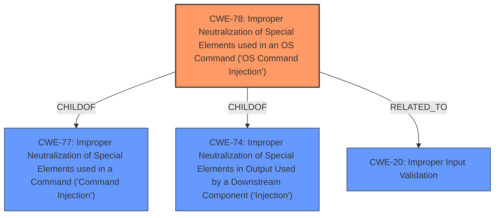

# Analysis Report for CVE-2024-52739

# Vulnerability Analysis Report: CVE-2024-52739

## Description

D-LINK DI-8400 v16.07.26A1 was discovered to contain multiple remote command execution (RCE) vulnerabilities in the msp_info_htm function via the flag and cmd parameters.

## Vulnerability Description Key Phrases

- **Impact:** remote command execution
- **Vector:** flag and cmd parameters
- **Product:** D-LINK DI-8400
- **Version:** v16.07.26A1
- **Component:** msp_info_htm function

## Analysis (with Relationship Data)

# Summary
| CWE ID | CWE Name | Confidence | CWE Abstraction Level | CWE Vulnerability Mapping Label | CWE-Vulnerability Mapping Notes |
|---|---|---|---|---|---|
| CWE-78 | Improper Neutralization of Special Elements used in an OS Command ('OS Command Injection') | 1.0 | Base | Allowed | Primary CWE: The **root cause** is the **improper neutralization** of special elements in an OS command. |
| CWE-20 | Improper Input Validation | 0.7 | Class | Discouraged | Secondary Candidate: The command injection is a result of **improper input validation**, but CWE-78 is more specific. |

## Evidence and Confidence

*   **Confidence Score:** 0.9
*   **Evidence Strength:** HIGH

## Relationship Analysis
The primary relationship is that CWE-78 is a child of CWE-77 (Improper Neutralization of Special Elements used in a Command ('Command Injection')) and CWE-74 (Improper Neutralization of Special Elements in Output Used by a Downstream Component ('Injection')). CWE-78 is also related to CWE-20 because **improper input validation** often leads to command injection vulnerabilities. We chose CWE-78 as it is more specific than its parents.



## Vulnerability Chain
The vulnerability chain starts with **improper input validation** in the `msp_info_htm` function, leading to **improper neutralization** of special elements in the OS command, and finally resulting in remote command execution (RCE).

## Summary of Analysis
The vulnerability is a remote command execution (RCE) vulnerability in the D-Link DI-8400 router. The **root cause** is the **improper neutralization** of special elements used in an OS command within the `msp_info_htm` function, triggered by the `flag` and `cmd` parameters.

The evidence supporting this conclusion is derived from the "Vulnerability Description Key Phrases" which indicate the impact (remote command execution), the vector (flag and cmd parameters), and the vulnerable component (msp_info_htm function). The "CVE Reference Links Content Summary" explicitly states that the `msp_info_htm` function doesn't properly sanitize user-supplied input, allowing an attacker to inject arbitrary shell commands.

CWE-78 (Improper Neutralization of Special Elements used in an OS Command ('OS Command Injection')) is the most appropriate CWE because it directly addresses the **root cause** of the vulnerability. It is a Base level CWE, which is preferred for mapping root causes.

CWE-20 (Improper Input Validation) was considered but not selected as the primary CWE because while **improper input validation** is a contributing factor, CWE-78 more precisely describes the specific weakness that leads to the RCE.

The final selection of CWE-78 is based on the direct evidence from the vulnerability description and the CWE specifications. The relationship analysis confirms that CWE-78 is the most specific and relevant CWE for this vulnerability.


## CWE Relationship Analysis

Current CWEs represent these abstraction levels: .


### Vulnerability Chain Analysis

**Chain starting from CWE-74:**
- 74 (Improper Neutralization of Special Elements in Output Used by a Downstream Component ('Injection')) - ROOT


**Chain starting from CWE-77:**
- 77 (Improper Neutralization of Special Elements used in a Command ('Command Injection')) - ROOT


### CWE Relationship Diagram

```mermaid
graph TD
    classDef primary fill:#f96,stroke:#333,stroke-width:2px
    classDef secondary fill:#69f,stroke:#333
    classDef tertiary fill:#9e9,stroke:#333
```


*Report generated on 2025-07-13 21:25:33*
