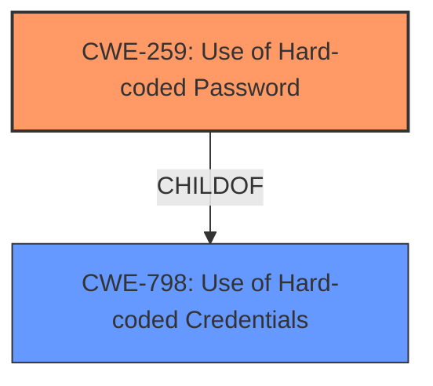

# Analysis for CVE-2024-52788

# Summary
| CWE ID | CWE Name | Confidence | CWE Abstraction Level | CWE Vulnerability Mapping Label | CWE-Vulnerability Mapping Notes |
|---|---|---|---|---|---|
| CWE-259 | Use of Hard-coded Password | 1.0 | Variant | Allowed | Primary CWE. The vulnerability description explicitly states a **hardcoded password** is the root cause. |

## Evidence and Confidence

*   **Confidence Score:** 1.0
*   **Evidence Strength:** HIGH

## Relationship Analysis
The primary CWE, CWE-259 [Use of Hard-coded Password], is a variant of CWE-798 [Use of Hard-coded Credentials]. This hierarchical relationship confirms that the selected CWE is appropriately specific. The retriever results also suggested CWE-798 but CWE-259 is a better match as it is more specific.

## Vulnerability Chain
The vulnerability chain starts with the **hardcoded password** (CWE-259). This leads to the impact of allowing attackers to log in as root.

## Summary of Analysis
The vulnerability description clearly states the presence of a **hardcoded password**, which is the root cause of the vulnerability. The retriever results strongly suggest CWE-259 [Use of Hard-coded Password] as the primary CWE. The relationship analysis shows that CWE-259 is a variant of CWE-798 [Use of Hard-coded Credentials], indicating the appropriate level of specificity.

The evidence "Tenda W9 v1.0.0.7(4456) was discovered to contain a **hardcoded password** vulnerability in /etc_ro/shadow, which allows attackers to log in as root" directly supports the selection of CWE-259. The phrase "**hardcoded password** vulnerability" clearly indicates the nature of the weakness.