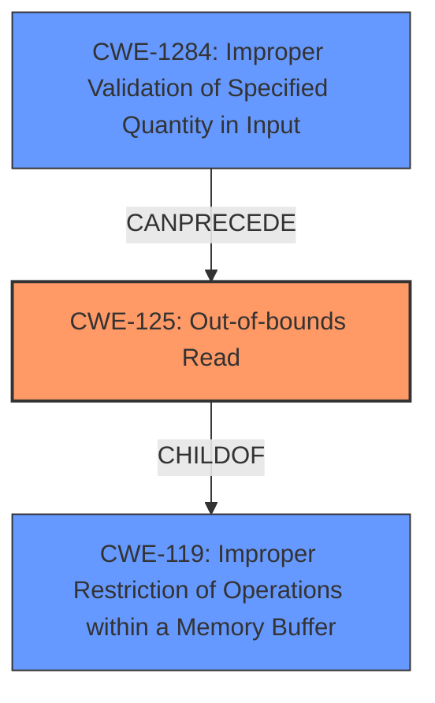

# Analysis Report for CVE-2024-52802

# Vulnerability Analysis Report: CVE-2024-52802

## Description

RIOT is an operating system for internet of things (IoT) devices. In version 2024.04 and prior, the function `_parse_advertise`, located in `/sys/net/application_layer/dhcpv6/client.c`, has **no minimum header length check** for `dhcpv6_opt_t` after processing `dhcpv6_msg_t`. This omission could lead to an **out-of-bound read**, causing system inconsistency. Additionally, the same lack of a header length check is present in the function `_preparse_advertise`, which is called by `_parse_advertise` before handling the request. As of time of publication, no known patched version exists.

## Vulnerability Description Key Phrases

- **Rootcause:** no minimum header length check
- **Weakness:** out-of-bound read
- **Impact:** system inconsistency
- **Product:** RIOT
- **Version:** 2024.04 and prior
- **Component:** ['_parse_advertise', '_preparse_advertise']

## Analysis (with Relationship Data)

# Summary
| CWE ID | CWE Name | Confidence | CWE Abstraction Level | CWE Vulnerability Mapping Label | CWE-Vulnerability Mapping Notes |
|---|---|---|---|---|---|
| CWE-125 | Out-of-bounds Read | 0.9 | Base | Primary | Allowed |
| CWE-1284 | Improper Validation of Specified Quantity in Input | 0.7 | Base | Secondary | Allowed |

## Evidence and Confidence

*   **Confidence Score:** 0.8
*   **Evidence Strength:** HIGH

## Relationship Analysis
The primary relationship that influenced the selection was the parent-child relationship between CWE-119 (Improper Restriction of Operations within a Memory Buffer) and CWE-125 (Out-of-bounds Read). CWE-125 is a specific type of CWE-119, and given the vulnerability description explicitly mentions an out-of-bounds read, choosing CWE-125 offers a more accurate and detailed classification. CWE-1284 is due to the **lack of** proper length checking.



## Vulnerability Chain
The vulnerability chain starts with the **lack of** a minimum header length check (CWE-1284), which leads to an out-of-bounds read (CWE-125), and ultimately results in system inconsistency.

## Summary of Analysis
The initial assessment focused on identifying the most specific CWE that accurately represents the vulnerability. The vulnerability description clearly states that the **root cause** is a **missing header length check**, which leads to an **out-of-bounds read**. The "CVE Reference Links Content Summary" explicitly mentions the out-of-bounds read due to the **lack of** length validation on DHCPv6 options.

The selection of CWE-125 is primarily based on the clear description of the **out-of-bounds read** vulnerability.
The selection of CWE-1284 is based on the **lack of** input validation.

Relevant CWE Information:

*   **CWE-125: Out-of-bounds Read**
    *   The vulnerability description explicitly states that the **lack of** a header length check leads to an **out-of-bounds read**. This directly aligns with the characteristics of CWE-125, where a product reads data past the end, or before the beginning, of the intended buffer.
    *   The security implication is that an attacker can potentially read sensitive information from memory locations outside the intended buffer or cause a denial-of-service condition by triggering a crash.
    *   CWE-125 is a child of CWE-119 (Improper Restriction of Operations within a Memory Buffer), which is a more general class of memory corruption vulnerabilities. However, given the specific nature of the vulnerability, CWE-125 is the more appropriate choice.
    *   The official MITRE mapping guidance allows the use of CWE-125.
*   **CWE-1284: Improper Validation of Specified Quantity in Input**
    *   The vulnerability stems from the **lack of** minimum header length checks, indicating that the product does not properly validate the size or length of the input.
    *   This weakness can lead to other vulnerabilities such as buffer overflows or out-of-bounds reads, as seen in this case.
    *   The official MITRE mapping guidance allows the use of CWE-1284.

CWEs Considered but Not Used:

*   CWE-20 (Improper Input Validation): While the vulnerability does involve input validation, CWE-1284 (Improper Validation of Specified Quantity in Input) is a more specific and accurate representation of the **lack of** header length checks.
*   CWE-190 (Integer Overflow or Wraparound) and CWE-191 (Integer Underflow (Wrap or Wraparound)): These CWEs were considered due to the potential for integer-related issues in length calculations. However, the primary issue is the **lack of** validation rather than an overflow or underflow.
*   CWE-120 (Buffer Copy without Checking Size of Input ('Classic Buffer Overflow')): This CWE was considered, but the vulnerability description explicitly mentions an out-of-bounds read, not a buffer copy without checking size.
*   CWE-755 (Improper Handling of Exceptional Conditions) and CWE-390 (Detection of Error Condition Without Action): Although errors are likely occurring, the root cause is **lack of** input validation and result in out-of-bounds read, making those other CWEs less relevant.


## CWE Relationship Analysis

Current CWEs represent these abstraction levels: .


### Vulnerability Chain Analysis

**Chain starting from CWE-390:**
- 390 (Detection of Error Condition Without Action) - ROOT


**Chain starting from CWE-1284:**
- 1284 (Improper Validation of Specified Quantity in Input) - ROOT


### CWE Relationship Diagram

```mermaid
graph TD
    classDef primary fill:#f96,stroke:#333,stroke-width:2px
    classDef secondary fill:#69f,stroke:#333
    classDef tertiary fill:#9e9,stroke:#333
```


*Report generated on 2025-07-13 21:27:16*
