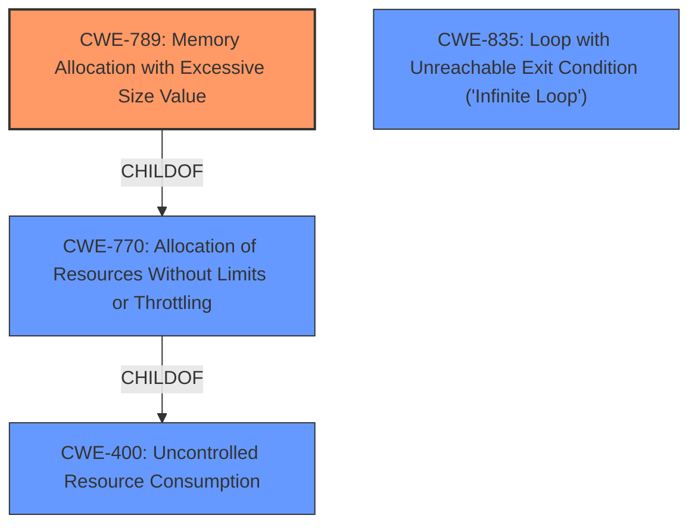

# Analysis Report for CVE-2024-52917

# Vulnerability Analysis Report: CVE-2024-52917

## Description

Bitcoin Core before 22.0 has a miniupnp infinite loop in which it allocates memory on the basis of random data received over the network, e.g., large M-SEARCH replies from a fake UPnP device.

## Vulnerability Description Key Phrases

- **Impact:** infinite loop
- **Vector:** large M-SEARCH replies
- **Product:** Bitcoin Core
- **Version:** before 22.0
- **Component:** miniupnp

## Analysis (with Relationship Data)

# Summary
| CWE ID | CWE Name | Confidence | CWE Abstraction Level | CWE Vulnerability Mapping Label | CWE-Vulnerability Mapping Notes |
|---|---|---|---|---|---|
| CWE-789 | Memory Allocation with Excessive Size Value | 0.9 | Variant | Allowed | Primary CWE. The root cause is allocating memory based on a large size value without checking limits. |
| CWE-400 | Uncontrolled Resource Consumption | 0.7 | Class | Discouraged | Secondary candidate. The impact is denial of service due to memory exhaustion. |
| CWE-835 | Loop with Unreachable Exit Condition ('Infinite Loop') | 0.6 | Base | Allowed | Secondary candidate. The vulnerability results in an infinite loop. |

## Evidence and Confidence

*   **Confidence Score:** 0.8
*   **Evidence Strength:** HIGH

## Relationship Analysis
The primary weakness is **CWE-789: Memory Allocation with Excessive Size Value**, a Variant-level CWE, which is a child of **CWE-770: Allocation of Resources Without Limits or Throttling**. The excessive memory allocation can lead to **CWE-400: Uncontrolled Resource Consumption**, a Class-level CWE. The infinite loop aspect is represented by **CWE-835: Loop with Unreachable Exit Condition ('Infinite Loop')**.



## Vulnerability Chain
The vulnerability chain starts with receiving network data, followed by allocating memory based on the size of this data without proper validation (**CWE-789**). This leads to excessive memory allocation and resource consumption (**CWE-400**), resulting in a denial-of-service (DoS). The allocation occurs inside a loop that never terminates (**CWE-835**), exacerbating the resource consumption.

## Summary of Analysis
The analysis is based on the provided vulnerability description, which indicates that the application allocates memory based on random data received over the network, without proper size validation, leading to an infinite loop and denial of service.

The primary CWE is **CWE-789: Memory Allocation with Excessive Size Value** because the **root cause** is the uncontrolled memory allocation based on untrusted size values. The evidence is: "it allocates memory on the basis of random data received over the network". This aligns directly with CWE-789's description: "The product allocates memory based on an untrusted, large size value, but it does not ensure that the size is within expected limits, allowing arbitrary amounts of memory to be allocated."

**CWE-400: Uncontrolled Resource Consumption** is considered as a secondary weakness due to the **impact** of the vulnerability. The uncontrolled memory allocation leads to resource exhaustion, which aligns with CWE-400's description: "The product does not properly control the allocation and maintenance of a limited resource, thereby enabling an actor to influence the amount of resources consumed, eventually leading to the exhaustion of available resources." However, CWE-400 is marked as "Discouraged", and the allocation error is the primary issue.

**CWE-835: Loop with Unreachable Exit Condition ('Infinite Loop')** is also a secondary issue, because the application is in an infinite loop, further exacerbating the memory allocation problem. The evidence is: "miniupnp infinite loop".

The selected CWEs are at the appropriate level of specificity. **CWE-789** is a Variant, which is the preferred level. **CWE-400** is a Class, but is considered an impact rather than a root cause. **CWE-835** is a Base, and thus is also at an appropriate level.

Several other CWEs were considered but not selected. **CWE-770: Allocation of Resources Without Limits or Throttling** was considered because it is a parent of CWE-789, but CWE-789 is more specific to memory allocation with excessive size values. **CWE-1284: Improper Validation of Specified Quantity in Input** was also considered, but the core issue is the memory allocation itself, not the validation of the quantity.


## CWE Relationship Analysis

Current CWEs represent these abstraction levels: .


### Vulnerability Chain Analysis

**Chain starting from CWE-1284:**
- 1284 (Improper Validation of Specified Quantity in Input) - ROOT


**Chain starting from CWE-400:**
- 400 (Uncontrolled Resource Consumption) - ROOT


### CWE Relationship Diagram

```mermaid
graph TD
    classDef primary fill:#f96,stroke:#333,stroke-width:2px
    classDef secondary fill:#69f,stroke:#333
    classDef tertiary fill:#9e9,stroke:#333
```


*Report generated on 2025-07-13 21:30:21*
