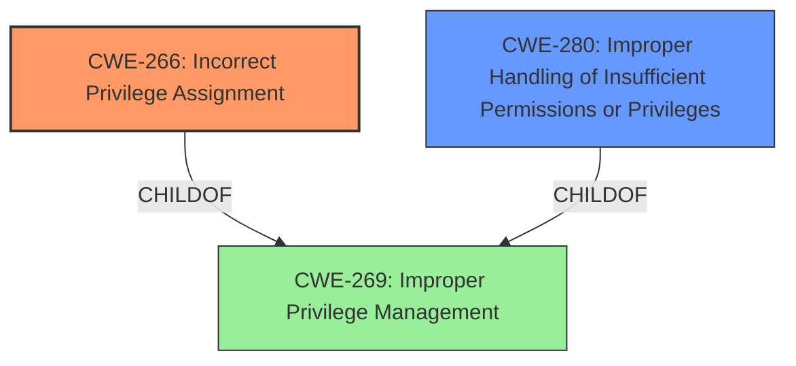

# Analysis Report for CVE-2024-52926

# Vulnerability Analysis Report: CVE-2024-52926

## Description

Delinea Privilege Manager before 12.0.2 mishandles the security of the Windows agent.

## Vulnerability Description Key Phrases

- **Product:** Delinea Privilege Manager
- **Version:** before 12.0.2
- **Component:** Windows agent

## Analysis (with Relationship Data)

# Summary
| CWE ID    | CWE Name                                                        | Confidence | CWE Abstraction Level | CWE Vulnerability Mapping Label | CWE-Vulnerability Mapping Notes |
| :--------- | :-------------------------------------------------------------- | :--------- | :-------------------- | :------------------------------ | :------------------------------ |
| CWE-266     | Incorrect Privilege Assignment                                  | 0.85       | Base                  | Primary                         | Allowed                         |
| CWE-280 | Improper Handling of Insufficient Permissions or Privileges  | 0.75       | Base                  | Secondary                       | Allowed                         |

## Evidence and Confidence

*   **Confidence Score:** 0.80
*   **Evidence Strength:** MEDIUM

## Relationship Analysis
The primary relationship that influenced the decision was the parent-child relationship between CWE-269 (Improper Privilege Management) and CWE-266 (Incorrect Privilege Assignment), as well as CWE-280. While CWE-269 is a higher-level class, the description points to a specific issue with privilege assignment, making CWE-266 a more appropriate and specific choice. CWE-280 describes the result of having insufficient privileges. Both CWE-266 and CWE-280 are at the Base level of abstraction, which is preferred.



## Vulnerability Chain
The vulnerability chain starts with the **incorrect privilege assignment** (CWE-266) within the Delinea Privilege Manager Windows agent. This **incorrect assignment** leads to applications, when elevated via policy, malfunctioning due to regressions (possibly leading to **improper handling of insufficient permissions** (CWE-280)). The final impact is that applications like Visual Studio Code, which create child processes, may become unusable, or the system itself may become unusable on newer Windows versions due to UAC failure.

## Summary of Analysis
The initial analysis focused on identifying the root cause of the vulnerability described in the provided text. The text explicitly mentions a security issue related to how elevation is performed within the Delinea Privilege Manager Windows agent. This suggests a problem with how privileges are handled. The "Privileges vs Permissions Guidance" clearly indicates that privilege issues should be mapped to CWE-266 when there's an **incorrect privilege assignment**.

The evidence supporting this assessment comes from:
- "The document mentions a security issue with Windows agent versions 12.0.2142 and older. The specific nature of the issue isn't detailed, but it is related to how elevation is performed which caused a regression."
- "Applications like Visual Studio Code, which rely on creating child processes, may malfunction if elevated using a vulnerable version of the agent."
- "The document states that older agent versions can render the system unusable if installed on Windows 11 version 24H2 or Windows Server 2025. Symptoms of the incompatibility include UAC failing to elevate programs that require admin rights."

Based on this evidence, CWE-266 (Incorrect Privilege Assignment) is selected as the primary CWE because it directly addresses the **incorrect** handling of privileges during the elevation process. The elevation process failing to grant proper permissions to applications after an **incorrect privilege assignment** is the trigger. CWE-280 is added as a secondary issue, since the applications malfunction due to the agent's **improper handling of insufficient permissions** when creating child processes.

The selected CWEs are at the optimal level of specificity, as they are Base-level CWEs that accurately represent the identified weaknesses. Higher-level CWEs like CWE-269 (Improper Privilege Management) are too general and do not capture the specific nature of the vulnerability.

Relevant CWE Information:

**CWE-266: Incorrect Privilege Assignment**
A product **incorrectly assigns a privilege** to a particular actor, creating an unintended sphere of control for that actor.

**CWE-280: Improper Handling of Insufficient Permissions or Privileges**
The product does not handle or **incorrectly handles** when it has **insufficient privileges** to access resources or functionality as specified by their permissions. This may cause it to follow unexpected code paths that may leave the product in an invalid state.


## CWE Relationship Analysis

Current CWEs represent these abstraction levels: .


### Vulnerability Chain Analysis

**Chain starting from CWE-266:**
- 266 (Incorrect Privilege Assignment) - ROOT


**Chain starting from CWE-280:**
- 280 (Improper Handling of Insufficient Permissions or Privileges ) - ROOT


### CWE Relationship Diagram

```mermaid
graph TD
    classDef primary fill:#f96,stroke:#333,stroke-width:2px
    classDef secondary fill:#69f,stroke:#333
    classDef tertiary fill:#9e9,stroke:#333
```


*Report generated on 2025-07-13 21:31:48*
