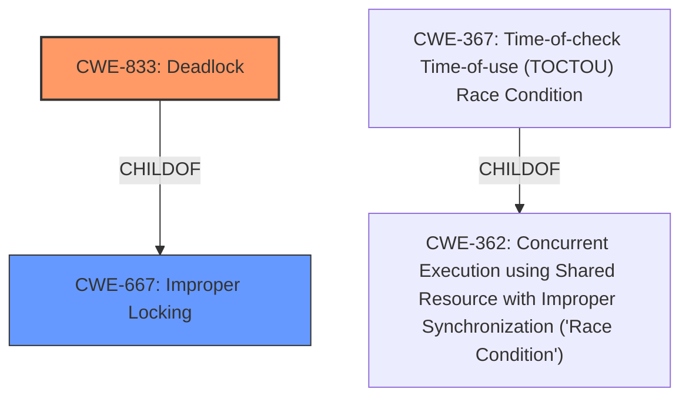

# Analysis Report for CVE-2024-53052

# Vulnerability Analysis Report: CVE-2024-53052

## Description

In the Linux kernel, the following vulnerability has been resolved io_uring/rw fix **missing NOWAIT check** for O_DIRECT start write When io_uring starts a write, itll call kiocb_start_write() to bump the super block rwsem, preventing any freezes from happening while that write is in-flight. The freeze side will grab that rwsem for writing, excluding any new writers from happening and waiting for existing writes to finish. But io_uring unconditionally uses kiocb_start_write(), which will block if someone is currently attempting to freeze the mount point. This causes a **deadlock** where freeze is waiting for previous writes to complete, but the previous writes cannot complete, as the task that is supposed to complete them is blocked waiting on starting a new write. This results in the following stuck trace showing that dependency with the write blocked starting a new write taskfio stateD stack0 pid886 tgid886 ppid876 Call trace __switch_to+0x1d8/0x348 __schedule+0x8e8/0x2248 schedule+0x110/0x3f0 percpu_rwsem_wait+0x1e8/0x3f8 __percpu_down_read+0xe8/0x500 io_write+0xbb8/0xff8 io_issue_sqe+0x10c/0x1020 io_submit_sqes+0x614/0x2110 __arm64_sys_io_uring_enter+0x524/0x1038 invoke_syscall+0x74/0x268 el0_svc_common.constprop.0+0x160/0x238 do_el0_svc+0x44/0x60 el0_svc+0x44/0xb0 el0t_64_sync_handler+0x118/0x128 el0t_64_sync+0x168/0x170 INFO task fsfreeze7364 blocked for more than 15 seconds. Not tainted 6.12.0-rc5-00063-g76aaf945701c #7963 with the attempting freezer stuck trying to grab the rwsem taskfsfreeze stateD stack0 pid7364 tgid7364 ppid995 Call trace __switch_to+0x1d8/0x348 __schedule+0x8e8/0x2248 schedule+0x110/0x3f0 percpu_down_write+0x2b0/0x680 freeze_super+0x248/0x8a8 do_vfs_ioctl+0x149c/0x1b18 __arm64_sys_ioctl+0xd0/0x1a0 invoke_syscall+0x74/0x268 el0_svc_common.constprop.0+0x160/0x238 do_el0_svc+0x44/0x60 el0_svc+0x44/0xb0 el0t_64_sync_handler+0x118/0x128 el0t_64_sync+0x168/0x170 Fix this by having the io_uring side honor IOCB_NOWAIT, and only attempt a blocking grab of the super block rwsem if it isnt set. For normal issue where IOCB_NOWAIT would always be set, this returns -EAGAIN which will have io_uring core issue a blocking attempt of the write. That will in turn also get completions run, ensuring forward progress. Since freezing requires CAP_SYS_ADMIN in the first place, this isnt something that can be triggered by a regular user.

## Vulnerability Description Key Phrases

- **Rootcause:** missing NOWAIT check
- **Weakness:** deadlock
- **Product:** Linux kernel
- **Component:** io_uring

## Analysis (with Relationship Data)

# Summary
| CWE ID | CWE Name | Confidence | CWE Abstraction Level | CWE Vulnerability Mapping Label | CWE-Vulnerability Mapping Notes |
|---|---|---|---|---|---|
| CWE-833 | Deadlock | 1.0 | Base | Primary | Allowed |
| CWE-667 | Improper Locking | 0.7 | Class | Secondary | Allowed-with-Review |

## Evidence and Confidence

*   **Confidence Score:** 0.9
*   **Evidence Strength:** HIGH

## Relationship Analysis
The primary relationship that influenced the decision was the hierarchical structure. CWE-833, Deadlock, is a Base-level CWE and a child of CWE-667, Improper Locking. Since the vulnerability description explicitly mentions a **deadlock**, the more specific CWE-833 was chosen over its parent. The relationship between CWE-362 (Race Condition) and CWE-367 (TOCTOU Race Condition) was considered, but ultimately, the vulnerability aligns more closely with a Deadlock condition.



## Vulnerability Chain
The vulnerability chain starts with a **missing NOWAIT check** which then leads to **deadlock**.

1.  **Missing NOWAIT Check:** The io\_uring subsystem doesn't check for the IOCB\_NOWAIT flag.
2.  **Blocking Attempt:** The system unconditionally attempts a blocking grab of the superblock rwsem.
3.  **Deadlock:** A deadlock occurs when the freeze operation waits for previous writes to complete, but the writes are blocked, waiting for the freeze operation to release the rwsem.

## Summary of Analysis
The initial analysis focused on identifying the root cause and the resulting weakness. The vulnerability description clearly states that the **missing NOWAIT check** leads to a **deadlock** situation. The Retriever Results highlighted CWE-833 (Deadlock) as a strong candidate, and the provided content summary confirms the presence of a deadlock condition due to improper synchronization. The relationship analysis further solidified the choice of CWE-833, as it is a specific type of improper locking.

The decision to map CWE-833 is heavily based on the evidence provided in the vulnerability description and the content summary. The explicit mention of a deadlock and the technical details describing the locking conflict strongly support this classification. The CWE is at the optimal level of specificity, as it directly represents the weakness.

Relevant CWE Information:

# Enhanced Context (25 CWEs)
The following CWEs were identified as potentially relevant to this vulnerability:

## CWE-667: Improper Locking
**Abstraction Level**: Class
**Similarity Score**: 0.77
**Source**: dense

**Description**:
The product does not properly acquire or release a lock on a resource, leading to unexpected resource state changes and behaviors.

**Mapping Guidance**:
- Usage: Allowed-with-Review
- Rationale: This CWE entry is a Class and might have Base-level children that would be more appropriate

This CWE was considered as a secondary issue, since the missing check results in the improper locking, but is not the direct root cause.

## CWE-833: Deadlock
**Abstraction Level**: Base
**Similarity Score**: 0.74
**Source**: dense

**Description**:
The product contains multiple threads or executable segments that are waiting for each other to release a necessary lock, resulting in deadlock.

**Mapping Guidance**:
- Usage: Allowed
- Rationale: This CWE entry is at the Base level of abstraction, which is a preferred level of abstraction for mapping to the root causes of vulnerabilities.

This CWE was selected as the primary CWE because the vulnerability description explicitly mentions a "deadlock".

## CWE-362: Concurrent Execution using Shared Resource with Improper Synchronization ('Race Condition')
**Abstraction Level**: Class
**Similarity Score**: 0.72
**Source**: dense

**Description**:
The product contains a concurrent code sequence that requires temporary, exclusive access to a shared resource, but a timing window exists in which the shared resource can be modified by another code sequence operating concurrently.

**Mapping Guidance**:
- Usage: Allowed-with-Review
- Rationale: This CWE entry is a Class and might have Base-level children that would be more appropriate

This was considered, but the description is more directly aligned with a Deadlock.

## CWE-367: Time-of-check Time-of-use (TOCTOU) Race Condition
**Abstraction Level**: Base
**Similarity Score**: 1329.86
**Source**: sparse

**Description**:
The product checks the state of a resource before using that resource, but the resource's state can change between the check and the use in a way that invalidates the results of the check. This can cause the product to perform invalid actions when the resource is in an unexpected state.

**Mapping Guidance**:
- Usage: Allowed
- Rationale: This CWE entry is at the Base level of abstraction, which is a preferred level of abstraction for mapping to the root causes of vulnerabilities.

Although the description refers to concurrency, the core issue is not a TOCTOU race condition, but rather a deadlock due to the missing check.

## CWE-59: Improper Link Resolution Before File Access ('Link Following')
**Abstraction Level**: Base
**Similarity Score**: 1335.65
**Source**: sparse

**Description**:
The product attempts to access a file based on the filename, but it does not properly prevent that filename from identifying a link or shortcut that resolves to an unintended resource.

**Mapping Guidance**:
- Usage: Allowed
- Rationale: This CWE entry is at the Base level of abstraction, which is a preferred level of abstraction for mapping to the root causes of vulnerabilities.

This is not relevant since it concerns symlink issues, and not concurrency/deadlocks.

## CWE-835: Loop with Unreachable Exit Condition ('Infinite Loop')
**Abstraction Level**: Base
**Similarity Score**: 0.71
**Source**: dense

**Description**:
The product contains an iteration or loop with an exit condition that cannot be reached, i.e., an infinite loop.

**Mapping Guidance**:
- Usage: Allowed
- Rationale: This CWE entry is at the Base level of abstraction, which is a preferred level of abstraction for mapping to the root causes of vulnerabilities.

This is not the correct CWE because the problem is a deadlock, and not an infinite loop.

## CWE-61: UNIX Symbolic Link (Symlink) Following
**Abstraction Level**: compound
**Similarity Score**: 3.00
**Source**: graph

**Description**:
CWE-61: UNIX Symbolic Link (Symlink) Following

**Mapping Guidance**:
- Usage: Allowed
- Rationale: This is a well-known Composite of multiple weaknesses that must all occur simultaneously, although it is attack-oriented in nature.

This is not relevant since it concerns symlink issues, and not concurrency/deadlocks.

I am confident in this assessment.


## CWE Relationship Analysis

Current CWEs represent these abstraction levels: .


### Vulnerability Chain Analysis

**Chain starting from CWE-59:**
- 59 (Improper Link Resolution Before File Access ('Link Following')) - ROOT


**Chain starting from CWE-667:**
- 667 (Improper Locking) - ROOT


### CWE Relationship Diagram

```mermaid
graph TD
    classDef primary fill:#f96,stroke:#333,stroke-width:2px
    classDef secondary fill:#69f,stroke:#333
    classDef tertiary fill:#9e9,stroke:#333
```


*Report generated on 2025-07-13 21:38:57*
