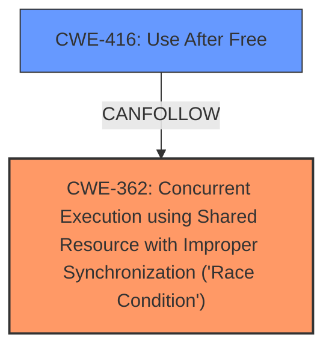

# Analysis for CVE-2024-53088

# Summary
| CWE ID | CWE Name | Confidence | CWE Abstraction Level | CWE Vulnerability Mapping Label | CWE-Vulnerability Mapping Notes |
|---|---|---|---|---|---|
| CWE-362 | Concurrent Execution using Shared Resource with Improper Synchronization ('Race Condition') | 0.9 | Class | Allowed-with-Review | Primary CWE: The core issue is a **race condition** due to concurrent access to shared resources. |
| CWE-416 | Use After Free | 0.7 | Base | Allowed | Secondary: The race condition leads to a use-after-free vulnerability when a filter is freed by one thread while another thread is still referencing it. |

## Evidence and Confidence

*   **Confidence Score:** 0.8
*   **Evidence Strength:** HIGH

## Relationship Analysis
The primary relationship is that CWE-416 Use After Free can be a consequence of CWE-362 Concurrent Execution using Shared Resource with Improper Synchronization ('Race Condition'). CWE-362 is a Class, while CWE-416 is a Base. While CWE-367 Time-of-check Time-of-use (TOCTOU) Race Condition is related to CWE-362, the vulnerability description doesn't explicitly mention a TOCTOU condition, making CWE-362 a more appropriate fit.

## Vulnerability Chain
The vulnerability chain starts with a **race condition** (CWE-362) that leads to a use-after-free vulnerability (CWE-416).

1.  **Race Condition (CWE-362):** Multiple threads concurrently modify MAC/VLAN filters without proper synchronization.
2.  **Use-After-Free (CWE-416):** A filter is freed by one thread while another thread is still referencing it.
3.  **Corruption and Leaking:** The use-after-free results in corrupted MAC/VLAN filters and potential data leakage.

## Summary of Analysis
The analysis is based on the provided vulnerability description and CVE reference content summary. The core of the vulnerability is a **race condition** (CWE-362) in the i40e driver, where multiple threads concurrently modify MAC/VLAN filters. This leads to a use-after-free condition (CWE-416) because one thread can free a filter while another thread is still referencing it.

The evidence is strong, with clear descriptions of the **race condition**, the involved components (i40e driver), and the resulting filter corruption and leaking.

The relationship analysis shows that CWE-416 is a consequence of CWE-362, fitting the vulnerability chain pattern.

The selection of CWE-362 and CWE-416 is based on the provided evidence, relationship analysis, and the abstraction levels of the CWEs. CWE-362 is selected as the primary CWE because it represents the root cause of the vulnerability and is one of the top hits in the Retriever Results. CWE-416 is chosen as a secondary CWE because it represents a direct consequence of the **race condition**, as outlined in the vulnerability description.

CWE-367 Time-of-check Time-of-use (TOCTOU) Race Condition was considered but not selected because, while related to race conditions, the vulnerability description doesn't explicitly mention a TOCTOU condition. Similarly, CWE-667 Improper Locking was considered but not selected because the description doesn't explicitly state that the **race condition** is caused by improper locking.

Relevant CWE Information:

# Enhanced Context (25 CWEs)
The following CWEs were identified as potentially relevant to this vulnerability:

## CWE-362: Concurrent Execution using Shared Resource with Improper Synchronization ('Race Condition')
**Abstraction Level**: Class
**Similarity Score**: 0.78
**Source**: dense

**Description**:
The product contains a concurrent code sequence that requires temporary, exclusive access to a shared resource, but a timing window exists in which the shared resource can be modified by another code sequence operating concurrently.

**Mapping Guidance**:
- Usage: Allowed-with-Review
- Rationale: This CWE entry is a Class and might have Base-level children that would be more appropriate

## CWE-367: Time-of-check Time-of-use (TOCTOU) Race Condition
**Abstraction Level**: Base
**Similarity Score**: 0.77
**Source**: dense

**Description**:
The product checks the state of a resource before using that resource, but the resource's state can change between the check and the use in a way that invalidates the results of the check. This can cause the product to perform invalid actions when the resource is in an unexpected state.

**Mapping Guidance**:
- Usage: Allowed
- Rationale: This CWE entry is at the Base level of abstraction, which is a preferred level of abstraction for mapping to the root causes of vulnerabilities.

## CWE-366: Race Condition within a Thread
**Abstraction Level**: Base
**Similarity Score**: 0.76
**Source**: dense

**Description**:
If two threads of execution use a resource simultaneously, there exists the possibility that resources may be used while invalid, in turn making the state of execution undefined.

**Mapping Guidance**:
- Usage: Allowed
- Rationale: This CWE entry is at the Base level of abstraction, which is a preferred level of abstraction for mapping to the root causes of vulnerabilities.

## CWE-667: Improper Locking
**Abstraction Level**: Class
**Similarity Score**: 0.75
**Source**: dense

**Description**:
The product does not properly acquire or release a lock on a resource, leading to unexpected resource state changes and behaviors.

**Mapping Guidance**:
- Usage: Allowed-with-Review
- Rationale: This CWE entry is a Class and might have Base-level children that would be more appropriate

## CWE-755: Improper Handling of Exceptional Conditions
**Abstraction Level**: Class
**Similarity Score**: 0.74
**Source**: dense

**Description**:
The product does not handle or incorrectly handles an exceptional condition.

**Mapping Guidance**:
- Usage: Discouraged
- Rationale: This CWE entry is a level-1 Class (i.e., a child of a Pillar). It might have lower-level children that would be more appropriate

## CWE-696: Incorrect Behavior Order
**Abstraction Level**: Class
**Similarity Score**: 0.73
**Source**: dense

**Description**:
The product performs multiple related behaviors, but the behaviors are performed in the wrong order in ways which may produce resultant weaknesses.

**Mapping Guidance**:
- Usage: Allowed-with-Review
- Rationale: This CWE entry is a Class and might have Base-level children that would be more appropriate

## CWE-824: Access of Uninitialized Pointer
**Abstraction Level**: Base
**Similarity Score**: 0.73
**Source**: dense

**Description**:
The product accesses or uses a pointer that has not been initialized.

**Mapping Guidance**:
- Usage: Allowed
- Rationale: This CWE entry is at the Base level of abstraction, which is a preferred level of abstraction for mapping to the root causes of vulnerabilities.

## CWE-1285: Improper Validation of Specified Index, Position, or Offset in Input
**Abstraction Level**: Base
**Similarity Score**: 0.72
**Source**: dense

**Description**:
The product receives input that is expected to specify an index, position, or offset into an indexable resource such as a buffer or file, but it does not validate or incorrectly validates that the specified index/position/offset has the required properties.

**Mapping Guidance**:
- Usage: Allowed
- Rationale: This CWE entry is at the Base level of abstraction, which is a preferred level of abstraction for mapping to the root causes of vulnerabilities.

## CWE-843: Access of Resource Using Incompatible Type ('Type Confusion')
**Abstraction Level**: Base
**Similarity Score**: 0.72
**Source**: dense

**Description**:
The product allocates or initializes a resource such as a pointer, object, or variable using one type, but it later accesses that resource using a type that is incompatible with the original type.

**Mapping Guidance**:
- Usage: Allowed
- Rationale: This CWE entry is at the Base level of abstraction, which is a preferred level of abstraction for mapping to the root causes of vulnerabilities.

## CWE-754: Improper Check for Unusual or Exceptional Conditions
**Abstraction Level**: Class
**Similarity Score**: 0.72
**Source**: dense

**Description**:
The product does not check or incorrectly checks for unusual or exceptional conditions that are not expected to occur frequently during day to day operation of the product.

**Mapping Guidance**:
- Usage: Allowed-with-Review
- Rationale: This CWE entry is a Class and might have Base