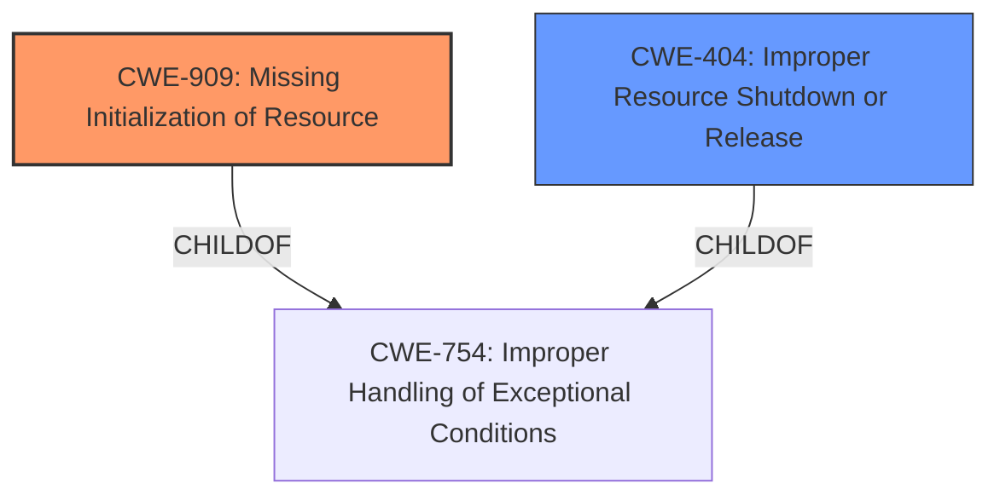

# Analysis for CVE-2024-53096

# Summary
| CWE ID | CWE Name | Confidence | CWE Abstraction Level | CWE Vulnerability Mapping Label | CWE-Vulnerability Mapping Notes |
|---|---|---|---|---|---|
| CWE-909 | Missing Initialization of Resource | 0.75 | Class | Primary CWE | Allowed-with-Review |
| CWE-404 | Improper Resource Shutdown or Release | 0.65 | Class | Secondary Candidate CWE | Allowed-with-Review |

## Evidence and Confidence

*   **Confidence Score:** 0.7
*   **Evidence Strength:** MEDIUM

## Relationship Analysis
The primary relationship that influenced the CWE selection was the parent-child relationship. CWE-909 (Missing Initialization of Resource) is a Class-level CWE. This relationship suggests that the vulnerability involves a failure to properly initialize a resource, leading to potential issues down the line. Additionally, CWE-404 (Improper Resource Shutdown or Release) was considered as a secondary candidate due to the resource leak issues described, which can be a result of improper shutdown. The abstraction level of Class was used because there was no specific base CWE to address the initialization issue described in the vulnerability.

## Vulnerability Chain
The vulnerability chain starts with the **incomplete state** of the `mmap_region()` function. This leads to a **missing initialization** of resources, which in turn causes memory leaks and other issues.

`Incomplete State` -> `Missing Initialization of Resource (CWE-909)` -> `Improper Resource Shutdown or Release (CWE-404)` -> `Memory Leaks and Inconsistent State`

## Summary of Analysis
The initial analysis focused on identifying the root cause of the vulnerability. The vulnerability description highlights the **incomplete state** within the `mmap_region()` function, leading to issues such as memory leaks and inconsistent state.

The evidence for this is present in the "Vulnerability Description Key Phrases" which includes "rootcause: incomplete state". The "CVE Reference Links Content Summary" section lists "Complex control flow in `mmap_region()`" and "Inconsistent state management during error handling" as weaknesses, and "Resource leaks and inconsistent state" as the impact.

The Retriever Results suggested several CWEs, but CWE-909 (Missing Initialization of Resource) best fit the description. The refactoring of the `mmap_region()` function to simplify its control flow and improve error handling supports this. This directly relates to addressing the **incomplete state** and ensuring resources are properly initialized.

The decision to select CWE-909 is based on the **root cause** being the **incomplete state** and the resulting memory leaks. The "CVE Reference Links Content Summary" identifies "Inconsistent state management during error handling".

Relevant CWE Information:
- CWE-909: Missing Initialization of Resource
- CWE-404: Improper Resource Shutdown or Release
- CWE-754: Improper Handling of Exceptional Conditions