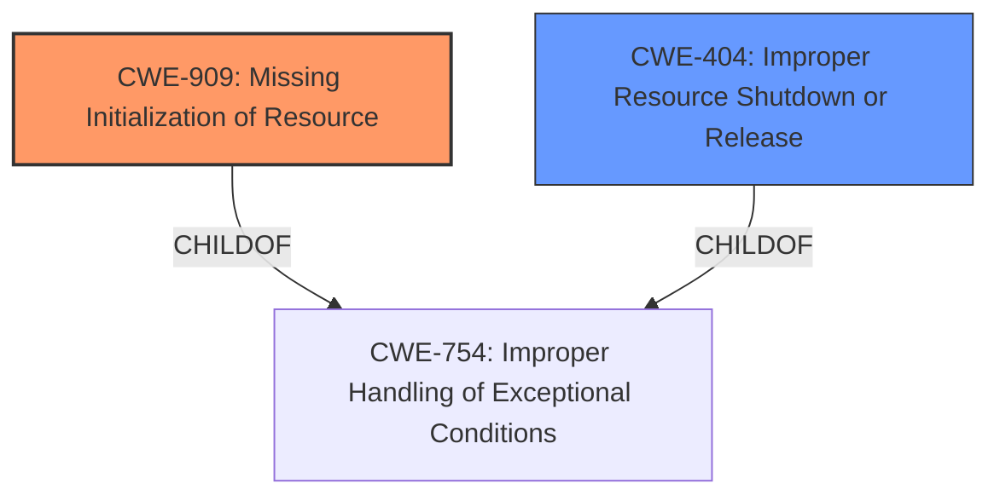

# Analysis Report for CVE-2024-53096

# Vulnerability Analysis Report: CVE-2024-53096

## Description

In the Linux kernel, the following vulnerability has been resolved mm resolve faulty mmap_region() error path behaviour The mmap_region() function is somewhat terrifying, with spaghetti-like control flow and numerous means by which issues can arise and **incomplete state**, memory leaks and other unpleasantness can occur. A large amount of the complexity arises from trying to handle errors late in the process of mapping a VMA, which forms the basis of recently observed issues with resource leaks and observable inconsistent state. Taking advantage of previous patches in this series we move a number of checks earlier in the code, simplifying things by moving the core of the logic into a static internal function __mmap_region(). Doing this allows us to perform a number of checks up front before we do any real work, and allows us to unwind the writable unmap check unconditionally as required and to perform a CONFIG_DEBUG_VM_MAPLE_TREE validation unconditionally also. We move a number of things here 1. We preallocate memory for the iterator before we call the file-backed memory hook, allowing us to exit early and avoid having to perform complicated and error-prone close/free logic. We carefully free iterator state on both success and error paths. 2. The enclosing mmap_region() function handles the mapping_map_writable() logic early. Previously the logic had the mapping_map_writable() at the point of mapping a newly allocated file-backed VMA, and a matching mapping_unmap_writable() on success and error paths. We now do this unconditionally if this is a file-backed, shared writable mapping. If a driver changes the flags to eliminate VM_MAYWRITE, however doing so does not invalidate the seal check we just performed, and we in any case always decrement the counter in the wrapper. We perform a debug assert to ensure a driver does not attempt to do the opposite. 3. We also move arch_validate_flags() up into the mmap_region() function. This is only relevant on arm64 and sparc64, and the check is only meaningful for SPARC with ADI enabled. We explicitly add a warning for this arch if a driver invalidates this check, though the code ought eventually to be fixed to eliminate the need for this. With all of these measures in place, we no longer need to explicitly close the VMA on error paths, as we place all checks which might fail prior to a call to any driver mmap hook. This eliminates an entire class of errors, makes the code easier to reason about and more robust.

## Vulnerability Description Key Phrases

- **Rootcause:** incomplete state
- **Impact:** memory leaks and other unpleasantness
- **Product:** Linux kernel
- **Component:** mmap_region() function

## Analysis (with Relationship Data)

# Summary
| CWE ID | CWE Name | Confidence | CWE Abstraction Level | CWE Vulnerability Mapping Label | CWE-Vulnerability Mapping Notes |
|---|---|---|---|---|---|
| CWE-909 | Missing Initialization of Resource | 0.75 | Class | Primary CWE | Allowed-with-Review |
| CWE-404 | Improper Resource Shutdown or Release | 0.65 | Class | Secondary Candidate CWE | Allowed-with-Review |

## Evidence and Confidence

*   **Confidence Score:** 0.7
*   **Evidence Strength:** MEDIUM

## Relationship Analysis
The primary relationship that influenced the CWE selection was the parent-child relationship. CWE-909 (Missing Initialization of Resource) is a Class-level CWE. This relationship suggests that the vulnerability involves a failure to properly initialize a resource, leading to potential issues down the line. Additionally, CWE-404 (Improper Resource Shutdown or Release) was considered as a secondary candidate due to the resource leak issues described, which can be a result of improper shutdown. The abstraction level of Class was used because there was no specific base CWE to address the initialization issue described in the vulnerability.



## Vulnerability Chain
The vulnerability chain starts with the **incomplete state** of the `mmap_region()` function. This leads to a **missing initialization** of resources, which in turn causes memory leaks and other issues.

`Incomplete State` -> `Missing Initialization of Resource (CWE-909)` -> `Improper Resource Shutdown or Release (CWE-404)` -> `Memory Leaks and Inconsistent State`

## Summary of Analysis
The initial analysis focused on identifying the root cause of the vulnerability. The vulnerability description highlights the **incomplete state** within the `mmap_region()` function, leading to issues such as memory leaks and inconsistent state.

The evidence for this is present in the "Vulnerability Description Key Phrases" which includes "rootcause: incomplete state". The "CVE Reference Links Content Summary" section lists "Complex control flow in `mmap_region()`" and "Inconsistent state management during error handling" as weaknesses, and "Resource leaks and inconsistent state" as the impact.

The Retriever Results suggested several CWEs, but CWE-909 (Missing Initialization of Resource) best fit the description. The refactoring of the `mmap_region()` function to simplify its control flow and improve error handling supports this. This directly relates to addressing the **incomplete state** and ensuring resources are properly initialized.

The decision to select CWE-909 is based on the **root cause** being the **incomplete state** and the resulting memory leaks. The "CVE Reference Links Content Summary" identifies "Inconsistent state management during error handling".

Relevant CWE Information:
- CWE-909: Missing Initialization of Resource
- CWE-404: Improper Resource Shutdown or Release
- CWE-754: Improper Handling of Exceptional Conditions


## CWE Relationship Analysis

Current CWEs represent these abstraction levels: .


### Vulnerability Chain Analysis

**Chain starting from CWE-754:**
- 754 (Improper Check for Unusual or Exceptional Conditions) - ROOT


**Chain starting from CWE-909:**
- 909 (Missing Initialization of Resource) - ROOT


### CWE Relationship Diagram

```mermaid
graph TD
    classDef primary fill:#f96,stroke:#333,stroke-width:2px
    classDef secondary fill:#69f,stroke:#333
    classDef tertiary fill:#9e9,stroke:#333
```


*Report generated on 2025-07-13 21:41:22*
