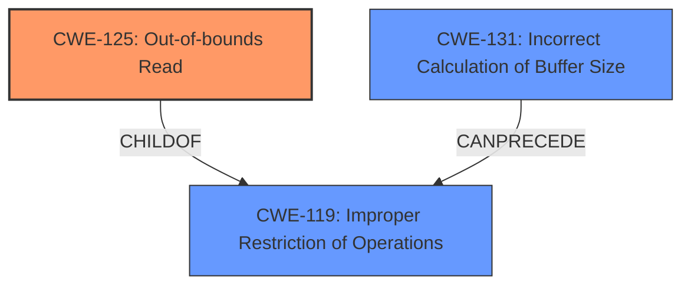

# Analysis Report for CVE-2024-53106

# Vulnerability Analysis Report: CVE-2024-53106

## Description

In the Linux kernel, the following vulnerability has been resolved ima fix **buffer overrun** in ima_eventdigest_init_common Function ima_eventdigest_init() calls ima_eventdigest_init_common() with HASH_ALGO__LAST which is then used to access the array hash_digest_size[] leading to **buffer overrun**. Have a conditional statement to handle this.

## Vulnerability Description Key Phrases

- **Weakness:** buffer overrun
- **Product:** Linux kernel
- **Component:** ima_eventdigest_init() function

## Analysis (with Relationship Data)

# Summary
| CWE ID | CWE Name | Confidence | CWE Abstraction Level | CWE Vulnerability Mapping Label | CWE-Vulnerability Mapping Notes |
|---|---|---|---|---|---|
| CWE-125 | Out-of-bounds Read | 0.9 | Base | Primary | Allowed |
| CWE-131 | Incorrect Calculation of Buffer Size | 0.6 | Base | Secondary Candidate | Allowed |

## Evidence and Confidence

*   **Confidence Score:** 0.8
*   **Evidence Strength:** MEDIUM

## Relationship Analysis
The primary CWE is CWE-125 (Out-of-bounds Read), which is a **Base** level CWE. It relates to CWE-119 (Improper Restriction of Operations within the Bounds of a Memory Buffer), which is a **Class** level CWE and a parent of CWE-125. CWE-131 (Incorrect Calculation of Buffer Size) can **precede** CWE-119.



## Vulnerability Chain
The vulnerability chain starts with calling `ima_eventdigest_init_common` with `HASH_ALGO__LAST` which is an index out-of-bounds for the `hash_digest_size` array. This leads to **CWE-125** (Out-of-bounds Read) when attempting to read the digest size. The subsequent write using the invalid size leads to a **buffer overrun**.

## Summary of Analysis
The vulnerability involves a buffer over-read due to accessing an array with an out-of-bounds index. The description clearly states that the `ima_eventdigest_init_common` function is called with `HASH_ALGO__LAST`, which is then used to access the `hash_digest_size` array, leading to a **buffer overrun**.

The primary weakness is **CWE-125** (Out-of-bounds Read) because the code first attempts to read from the array using the out-of-bounds index. The evidence supporting this is "ima_eventdigest_init() calls ima_eventdigest_init_common() with HASH_ALGO__LAST which is then used to access the array hash_digest_size[] leading to **buffer overrun**." The CVE Reference Links Content Summary also states, "By calling `ima_eventdigest_init_common` with  `HASH_ALGO__LAST` which is outside the bounds of the `hash_digest_size` array, the code would perform a read outside the bounds of the array, leading to a buffer over-read and subsequent buffer-overrun when attempting to write with this invalid size."

I considered other CWEs such as CWE-119 (Improper Restriction of Operations within the Bounds of a Memory Buffer), CWE-120 (Buffer Copy without Checking Size of Input ('Classic Buffer Overflow')), and CWE-787 (Out-of-bounds Write), but these are less precise than CWE-125. CWE-119 is too general (Class level), and CWE-120 is specific to buffer copies. CWE-787 refers to writing out of bounds, which is a consequence of the initial out-of-bounds read in this case.

CWE-131 (Incorrect Calculation of Buffer Size) is considered as a secondary candidate since the root cause is the function `ima_eventdigest_init_common` is called with `HASH_ALGO__LAST` which is outside the bounds of the `hash_digest_size` array. This could be due to an incorrect calculation of the required buffer size or a **missing** check on the input before calling `ima_eventdigest_init_common`.

Relevant CWE Information:

# Enhanced Context (25 CWEs)
The following CWEs were identified as potentially relevant to this vulnerability:

## CWE-131: Incorrect Calculation of Buffer Size
**Abstraction Level**: Base
**Similarity Score**: 0.73
**Source**: dense

**Description**:
The product does not correctly calculate the size to be used when allocating a buffer, which could lead to a buffer overflow.

**Mapping Guidance**:
- Usage: Allowed
- Rationale: This CWE entry is at the Base level of abstraction, which is a preferred level of abstraction for mapping to the root causes of vulnerabilities.


## CWE Relationship Analysis

Current CWEs represent these abstraction levels: .


### Vulnerability Chain Analysis

**Chain starting from CWE-125:**
- 125 (Out-of-bounds Read) - ROOT


**Chain starting from CWE-131:**
- 131 (Incorrect Calculation of Buffer Size) - ROOT


### CWE Relationship Diagram

```mermaid
graph TD
    classDef primary fill:#f96,stroke:#333,stroke-width:2px
    classDef secondary fill:#69f,stroke:#333
    classDef tertiary fill:#9e9,stroke:#333
```


*Report generated on 2025-07-13 21:42:12*
