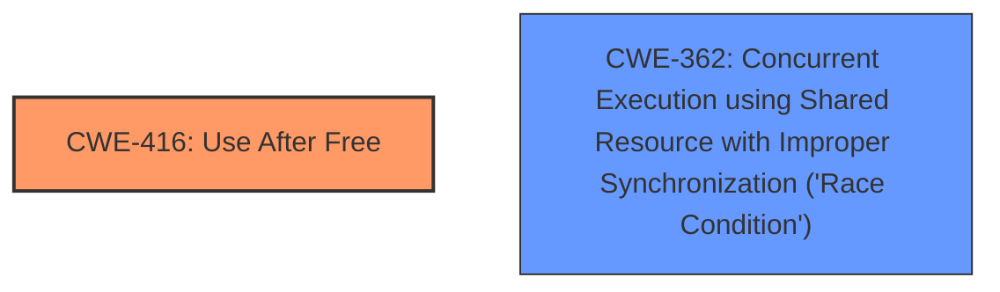

# Enhanced Analysis for CVE-2024-53171

# Summary
| CWE ID  | CWE Name                                                                                    | Confidence | CWE Abstraction Level | CWE Vulnerability Mapping Label | CWE-Vulnerability Mapping Notes |
| :-------- | :------------------------------------------------------------------------------------------ | :--------- | :---------------------- | :------------------------------ | :-------------------------------- |
| CWE-416 | Use After Free                                                                            | 1.0        | Variant               |                                 | Allowed                           |
| CWE-362 | Concurrent Execution using Shared Resource with Improper Synchronization ('Race Condition') | 0.6        | Class                   |                                 | Allowed-with-Review             |

## Evidence and Confidence

*   **Confidence Score:** 0.8
*   **Evidence Strength:** HIGH

## Relationship Analysis
The primary weakness is CWE-416 (Use After Free), a variant-level CWE which accurately describes the vulnerability. CWE-362 (Race Condition) is included as a secondary CWE because the vulnerability occurs in a concurrent environment and involves shared resources, though it is not the direct cause of the vulnerability. The analysis focused on identifying the root cause and selecting the most specific CWE that accurately captures the weakness.



## Vulnerability Chain
The vulnerability chain starts with incorrect handling of parent pointers in the TNC after tree splits and node deletions, which leads to a dangling pointer (`znode->cparent`). This dangling pointer is then dereferenced in `ubifs_copy_hash()`, resulting in a use-after-free condition.

## Summary of Analysis
The analysis is based on the provided vulnerability description and CVE reference links, which clearly indicate a use-after-free vulnerability in the Linux kernel's UBIFS file system. The evidence is strong, as it includes detailed crash traces and a clear explanation of the root cause. CWE-416 is chosen as the primary CWE because it directly describes the vulnerability, while CWE-362 is included as a secondary CWE due to the concurrent nature of the environment where the vulnerability occurs. The selection of CWE-416 is at the optimal level of specificity, as it is a variant-level CWE that accurately captures the weakness.

Relevant CWE Information:

# Enhanced Context (25 CWEs)
The following CWEs were identified as potentially relevant to this vulnerability:

## CWE-416: Use After Free
**Abstraction Level**: variant
**Similarity Score**: 3.89
**Source**: graph

**Description**:
CWE-416: Use After Free

**Mapping Guidance**:
- Usage: Allowed
- Rationale: This CWE entry is at the Variant level of abstraction, which is a preferred level of abstraction for mapping to the root causes of vulnerabilities.

**Relationships**:
- CANFOLLOW -> CWE-754
- CANFOLLOW -> CWE-364
- CANFOLLOW -> CWE-362
- CANFOLLOW -> CWE-1265
- CANPRECEDE -> CWE-123

# Complete CWE Specifications

CWE-416: Use After Free

CWE-362: Concurrent Execution using Shared Resource with Improper Synchronization ('Race Condition')
```
# Summary
| CWE ID  | CWE Name                                                                                    | Confidence | CWE Abstraction Level | CWE Vulnerability Mapping Label | CWE-Vulnerability Mapping Notes |
| :-------- | :------------------------------------------------------------------------------------------ | :--------- | :---------------------- | :------------------------------ | :-------------------------------- |
| CWE-416 | Use After Free                                                                            | 1.0        | Variant               | Primary                         | Allowed                           |
| CWE-362 | Concurrent Execution using Shared Resource with Improper Synchronization ('Race Condition') | 0.6        | Class                   | Secondary                       | Allowed-with-Review             |

## Evidence and Confidence

*   **Confidence Score:** 0.8
*   **Evidence Strength:** HIGH

## Relationship Analysis
The primary weakness is **CWE-416 (Use After Free)**, a variant-level CWE which accurately describes the vulnerability. **CWE-362 (Concurrent Execution using Shared Resource with Improper Synchronization ('Race Condition'))** is included as a secondary CWE because the vulnerability occurs in a concurrent environment and involves shared resources, though it is not the direct cause of the vulnerability. The analysis focused on identifying the **root cause** and selecting the most specific CWE that accurately captures the weakness.


## Vulnerability Chain
The vulnerability chain starts with **incorrect** handling of parent pointers in the TNC after tree splits and node deletions, which leads to a dangling pointer (`znode->cparent`). This dangling pointer is then dereferenced in `ubifs_copy_hash()`, resulting in a **use-after-free** condition. The **rootcause** is the incorrect handling of the `cparent` pointer during TNC node updates and deletions.

## Summary of Analysis
The analysis is based on the provided vulnerability description and CVE reference links, which clearly indicate a **use-after-free** vulnerability in the Linux kernel's UBIFS file system. The evidence is strong, as it includes detailed crash traces and a clear explanation of the **root cause**. **CWE-416** is chosen as the primary CWE because it directly describes the vulnerability, while **CWE-362** is included as a secondary CWE due to the concurrent nature of the environment where the vulnerability occurs. The selection of **CWE-416** is at the optimal level of specificity, as it is a variant-level CWE that accurately captures the weakness.

The vulnerability description states, "After an insertion in TNC, the tree might split and cause a node to change its `znode->parent`. A further deletion of other nodes in the tree (which also could free the nodes), the aforementioned nodes `znode->cparent` could still point to a freed node. This `znode->cparent` may not be updated when getting nodes to commit in `ubifs_tnc_start_commit()`. This could then trigger a **use-after-free** when accessing the `znode->cparent` in `write_index()` in `ubifs_tnc_end_commit()`." This directly supports the selection of **CWE-416 (Use After Free)** as the primary weakness.

The CVE Reference Links Content Summary further clarifies the root cause: "The **root cause** of this vulnerability is a **use-after-free** in the `ubifs_tnc_end_commit` function within the UBIFS file system when authentication is enabled (`CONFIG_UBIFS_FS_AUTHENTICATION`). This occurs due to a mismatch between the parent and child pointers in the TNC (Tree Node Cache) after tree splits and node deletions."

Other CWEs Considered:

*   **CWE-401 (Missing Release of Memory after Effective Lifetime):** While memory is involved, the issue isn't a general memory leak but a specific use-after-free scenario.
*   **CWE-415 (Double Free):** This is a different type of memory corruption vulnerability.
*   **CWE-364 (Signal Handler Race Condition):** This is not directly related to signal handling.
*   **CWE-59 (Improper Link Resolution Before File Access ('Link Following'))** and **CWE-41 (Improper Resolution of Path Equivalence):** These are file system related issues but not the root cause here.
*   **CWE-667 (Improper Locking):** While concurrency is involved, the root cause isn't a locking issue but a use-after-free.
*   **CWE-123 (Write-what-where Condition):** While the vulnerability could potentially lead to writing arbitrary data, the direct cause is use-after-free.
```


## CWE Relationship Analysis

Current CWEs represent these abstraction levels: .


### Vulnerability Chain Analysis

**Chain starting from CWE-123:**
- 123 (Write-what-where Condition) - ROOT


**Chain starting from CWE-416:**
- 416 (Use After Free) - ROOT


### CWE Relationship Diagram

```mermaid
graph TD
    classDef primary fill:#f96,stroke:#333,stroke-width:2px
    classDef secondary fill:#69f,stroke:#333
    classDef tertiary fill:#9e9,stroke:#333
```