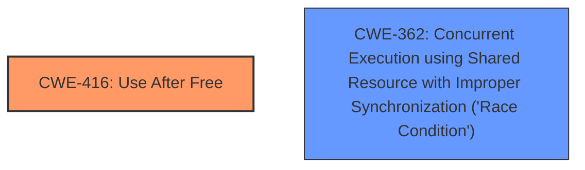

# Analysis Report for CVE-2024-53171

# Vulnerability Analysis Report: CVE-2024-53171

## Description

In the Linux kernel, the following vulnerability has been resolved ubifs authentication Fix ****use-after-free**** in ubifs_tnc_end_commit After an insertion in TNC, the tree might split and cause a node to change its `znode->parent`. A further deletion of other nodes in the tree (which also could free the nodes), the aforementioned nodes `znode->cparent` could still point to a freed node. This `znode->cparent` may not be updated when getting nodes to commit in `ubifs_tnc_start_commit()`. This could then trigger a ****use-after-free**** when accessing the `znode->cparent` in `write_index()` in `ubifs_tnc_end_commit()`. This can be triggered by running rm -f /etc/test-file.bin dd if=/dev/urandom of=/etc/test-file.bin bs=1M count=60 conv=fsync in a loop, and with `CONFIG_UBIFS_FS_AUTHENTICATION`. KASAN then reports BUG KASAN ****use-after-free**** in ubifs_tnc_end_commit+0xa5c/0x1950 Write of size 32 at addr ffffff800a3af86c by task ubifs_bgt0_20/153 Call trace dump_backtrace+0x0/0x340 show_stack+0x18/0x24 dump_stack_lvl+0x9c/0xbc print_address_description.constprop.0+0x74/0x2b0 kasan_report+0x1d8/0x1f0 kasan_check_range+0xf8/0x1a0 memcpy+0x84/0xf4 ubifs_tnc_end_commit+0xa5c/0x1950 do_commit+0x4e0/0x1340 ubifs_bg_thread+0x234/0x2e0 kthread+0x36c/0x410 ret_from_fork+0x10/0x20 Allocated by task 401 kasan_save_stack+0x38/0x70 __kasan_kmalloc+0x8c/0xd0 __kmalloc+0x34c/0x5bc tnc_insert+0x140/0x16a4 ubifs_tnc_add+0x370/0x52c ubifs_jnl_write_data+0x5d8/0x870 do_writepage+0x36c/0x510 ubifs_writepage+0x190/0x4dc __writepage+0x58/0x154 write_cache_pages+0x394/0x830 do_writepages+0x1f0/0x5b0 filemap_fdatawrite_wbc+0x170/0x25c file_write_and_wait_range+0x140/0x190 ubifs_fsync+0xe8/0x290 vfs_fsync_range+0xc0/0x1e4 do_fsync+0x40/0x90 __arm64_sys_fsync+0x34/0x50 invoke_syscall.constprop.0+0xa8/0x260 do_el0_svc+0xc8/0x1f0 el0_svc+0x34/0x70 el0t_64_sync_handler+0x108/0x114 el0t_64_sync+0x1a4/0x1a8 Freed by task 403 kasan_save_stack+0x38/0x70 kasan_set_track+0x28/0x40 kasan_set_free_info+0x28/0x4c __kasan_slab_free+0xd4/0x13c kfree+0xc4/0x3a0 tnc_delete+0x3f4/0xe40 ubifs_tnc_remove_range+0x368/0x73c ubifs_tnc_remove_ino+0x29c/0x2e0 ubifs_jnl_delete_inode+0x150/0x260 ubifs_evict_inode+0x1d4/0x2e4 evict+0x1c8/0x450 iput+0x2a0/0x3c4 do_unlinkat+0x2cc/0x490 __arm64_sys_unlinkat+0x90/0x100 invoke_syscall.constprop.0+0xa8/0x260 do_el0_svc+0xc8/0x1f0 el0_svc+0x34/0x70 el0t_64_sync_handler+0x108/0x114 el0t_64_sync+0x1a4/0x1a8 The offending `memcpy()` in `ubifs_copy_hash()` has a ****use-after-free**** when a node becomes root in TNC but still has a `cparent` to an already freed node. More specifically, consider the following TNC zroot / / zp1 / / zn Inserting a new node `zn_new` with a key smaller then `zn` will trigger a split in `tnc_insert()` if `zp1` is full zroot / \\ / \\ zp1 zp2 / \\ / \\ zn_new zn `zn->parent` has now been moved to `zp2`, *but* `zn->cparent` still points to `zp1`. Now, consider a removal of all the nodes _except_ `zn`. Just when `tnc_delete()` is about to delete `zroot` and `zp2` zroot \\ \\ zp2 \\ \\ zn `zroot` and `zp2` get freed and the tree collapses zn `zn` now becomes the new `zroot`. `get_znodes_to_commit()` will now only find `zn`, the new `zroot`, and `write_index()` will check its `znode->cparent` that wrongly points to the already freed `zp1`. `ubifs_copy_hash()` thus gets wrongly called with `znode->cparent->zbranch[znode->iip].hash` that triggers the ****use-after-free****! Fix this by explicitly setting `znode->cparent` to `NULL` in `get_znodes_to_commit()` for the root node. The search for the dirty nodes ---truncated---

## Vulnerability Description Key Phrases

- **Rootcause:** use-after-free
- **Weakness:** use-after-free
- **Product:** Linux kernel
- **Component:** ubifs

## Analysis (with Relationship Data)

# Summary
| CWE ID  | CWE Name                                                                                    | Confidence | CWE Abstraction Level | CWE Vulnerability Mapping Label | CWE-Vulnerability Mapping Notes |
| :-------- | :------------------------------------------------------------------------------------------ | :--------- | :---------------------- | :------------------------------ | :-------------------------------- |
| CWE-416 | Use After Free                                                                            | 1.0        | Variant               |                                 | Allowed                           |
| CWE-362 | Concurrent Execution using Shared Resource with Improper Synchronization ('Race Condition') | 0.6        | Class                   |                                 | Allowed-with-Review             |

## Evidence and Confidence

*   **Confidence Score:** 0.8
*   **Evidence Strength:** HIGH

## Relationship Analysis
The primary weakness is CWE-416 (Use After Free), a variant-level CWE which accurately describes the vulnerability. CWE-362 (Race Condition) is included as a secondary CWE because the vulnerability occurs in a concurrent environment and involves shared resources, though it is not the direct cause of the vulnerability. The analysis focused on identifying the root cause and selecting the most specific CWE that accurately captures the weakness.



## Vulnerability Chain
The vulnerability chain starts with incorrect handling of parent pointers in the TNC after tree splits and node deletions, which leads to a dangling pointer (`znode->cparent`). This dangling pointer is then dereferenced in `ubifs_copy_hash()`, resulting in a use-after-free condition.

## Summary of Analysis
The analysis is based on the provided vulnerability description and CVE reference links, which clearly indicate a use-after-free vulnerability in the Linux kernel's UBIFS file system. The evidence is strong, as it includes detailed crash traces and a clear explanation of the root cause. CWE-416 is chosen as the primary CWE because it directly describes the vulnerability, while CWE-362 is included as a secondary CWE due to the concurrent nature of the environment where the vulnerability occurs. The selection of CWE-416 is at the optimal level of specificity, as it is a variant-level CWE that accurately captures the weakness.

Relevant CWE Information:

# Enhanced Context (25 CWEs)
The following CWEs were identified as potentially relevant to this vulnerability:

## CWE-416: Use After Free
**Abstraction Level**: variant
**Similarity Score**: 3.89
**Source**: graph

**Description**:
CWE-416: Use After Free

**Mapping Guidance**:
- Usage: Allowed
- Rationale: This CWE entry is at the Variant level of abstraction, which is a preferred level of abstraction for mapping to the root causes of vulnerabilities.

**Relationships**:
- CANFOLLOW -> CWE-754
- CANFOLLOW -> CWE-364
- CANFOLLOW -> CWE-362
- CANFOLLOW -> CWE-1265
- CANPRECEDE -> CWE-123

# Complete CWE Specifications

CWE-416: Use After Free

CWE-362: Concurrent Execution using Shared Resource with Improper Synchronization ('Race Condition')
```
# Summary
| CWE ID  | CWE Name                                                                                    | Confidence | CWE Abstraction Level | CWE Vulnerability Mapping Label | CWE-Vulnerability Mapping Notes |
| :-------- | :------------------------------------------------------------------------------------------ | :--------- | :---------------------- | :------------------------------ | :-------------------------------- |
| CWE-416 | Use After Free                                                                            | 1.0        | Variant               | Primary                         | Allowed                           |
| CWE-362 | Concurrent Execution using Shared Resource with Improper Synchronization ('Race Condition') | 0.6        | Class                   | Secondary                       | Allowed-with-Review             |

## Evidence and Confidence

*   **Confidence Score:** 0.8
*   **Evidence Strength:** HIGH

## Relationship Analysis
The primary weakness is **CWE-416 (Use After Free)**, a variant-level CWE which accurately describes the vulnerability. **CWE-362 (Concurrent Execution using Shared Resource with Improper Synchronization ('Race Condition'))** is included as a secondary CWE because the vulnerability occurs in a concurrent environment and involves shared resources, though it is not the direct cause of the vulnerability. The analysis focused on identifying the **root cause** and selecting the most specific CWE that accurately captures the weakness.


## Vulnerability Chain
The vulnerability chain starts with **incorrect** handling of parent pointers in the TNC after tree splits and node deletions, which leads to a dangling pointer (`znode->cparent`). This dangling pointer is then dereferenced in `ubifs_copy_hash()`, resulting in a **use-after-free** condition. The **rootcause** is the incorrect handling of the `cparent` pointer during TNC node updates and deletions.

## Summary of Analysis
The analysis is based on the provided vulnerability description and CVE reference links, which clearly indicate a **use-after-free** vulnerability in the Linux kernel's UBIFS file system. The evidence is strong, as it includes detailed crash traces and a clear explanation of the **root cause**. **CWE-416** is chosen as the primary CWE because it directly describes the vulnerability, while **CWE-362** is included as a secondary CWE due to the concurrent nature of the environment where the vulnerability occurs. The selection of **CWE-416** is at the optimal level of specificity, as it is a variant-level CWE that accurately captures the weakness.

The vulnerability description states, "After an insertion in TNC, the tree might split and cause a node to change its `znode->parent`. A further deletion of other nodes in the tree (which also could free the nodes), the aforementioned nodes `znode->cparent` could still point to a freed node. This `znode->cparent` may not be updated when getting nodes to commit in `ubifs_tnc_start_commit()`. This could then trigger a **use-after-free** when accessing the `znode->cparent` in `write_index()` in `ubifs_tnc_end_commit()`." This directly supports the selection of **CWE-416 (Use After Free)** as the primary weakness.

The CVE Reference Links Content Summary further clarifies the root cause: "The **root cause** of this vulnerability is a **use-after-free** in the `ubifs_tnc_end_commit` function within the UBIFS file system when authentication is enabled (`CONFIG_UBIFS_FS_AUTHENTICATION`). This occurs due to a mismatch between the parent and child pointers in the TNC (Tree Node Cache) after tree splits and node deletions."

Other CWEs Considered:

*   **CWE-401 (Missing Release of Memory after Effective Lifetime):** While memory is involved, the issue isn't a general memory leak but a specific use-after-free scenario.
*   **CWE-415 (Double Free):** This is a different type of memory corruption vulnerability.
*   **CWE-364 (Signal Handler Race Condition):** This is not directly related to signal handling.
*   **CWE-59 (Improper Link Resolution Before File Access ('Link Following'))** and **CWE-41 (Improper Resolution of Path Equivalence):** These are file system related issues but not the root cause here.
*   **CWE-667 (Improper Locking):** While concurrency is involved, the root cause isn't a locking issue but a use-after-free.
*   **CWE-123 (Write-what-where Condition):** While the vulnerability could potentially lead to writing arbitrary data, the direct cause is use-after-free.
```


## CWE Relationship Analysis

Current CWEs represent these abstraction levels: .


### Vulnerability Chain Analysis

**Chain starting from CWE-123:**
- 123 (Write-what-where Condition) - ROOT


**Chain starting from CWE-416:**
- 416 (Use After Free) - ROOT


### CWE Relationship Diagram

```mermaid
graph TD
    classDef primary fill:#f96,stroke:#333,stroke-width:2px
    classDef secondary fill:#69f,stroke:#333
    classDef tertiary fill:#9e9,stroke:#333
```


*Report generated on 2025-07-13 21:45:03*
