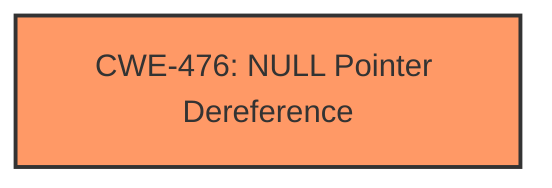

# Enhanced Analysis for CVE-2024-53185

# Summary
| CWE ID  | CWE Name                                                                 | Confidence | CWE Abstraction Level | CWE Vulnerability Mapping Label | CWE-Vulnerability Mapping Notes |
| :-------- | :----------------------------------------------------------------------- | :--------- | :---------------------- | :------------------------------ | :------------------------------ |
| CWE-476 | CWE-476: NULL Pointer Dereference                                        | 1.0        | Base                    | Primary                         | Allowed                         |

## Evidence and Confidence

*   **Confidence Score:** 1.0
*   **Evidence Strength:** HIGH

## Relationship Analysis

The primary relationship that influenced the selection was the direct match of the vulnerability description to the definition of CWE-476. The other CWEs listed did not have a direct correlation to the **null pointer dereference** described in the vulnerability.



## Vulnerability Chain

The vulnerability chain is straightforward:

1.  A **NULL pointer dereference** occurs in the `crypto_aead_setkey()` function due to an unset `cipher_type` for SMB3.02.
2.  This leads to a crash, as indicated by the KASAN report.

The root cause and impact are closely linked, with the **NULL pointer dereference** directly causing the system to crash.

## Summary of Analysis

The primary weakness identified is **CWE-476: NULL Pointer Dereference**. This is based on the explicit mention of "**NULL ptr deref**" and "**null-ptr-deref**" in the vulnerability description and KASAN report, which aligns directly with the definition of CWE-476.

The vulnerability description clearly states: "smb client fix **NULL ptr deref** in crypto_aead_setkey()." The KASAN report also confirms a "**null-ptr-deref** in crypto_aead_setkey+0x2c/0x130." This provides strong evidence for classifying the vulnerability as CWE-476.

The other CWEs suggested by the retriever are not applicable in this context. For example, CWE-266 relates to incorrect privilege assignment, CWE-532 to insertion of sensitive information into log files, CWE-88 to argument injection, and CWE-327 to broken cryptographic algorithms. None of these are directly relevant to the described **NULL pointer dereference**.

Therefore, based on the evidence and the direct match with the CWE definition, **CWE-476: NULL Pointer Dereference** is the most appropriate classification. It is also at the Base level of abstraction, which is preferred.


## CWE Relationship Analysis

Current CWEs represent these abstraction levels: .


### Vulnerability Chain Analysis

**Chain starting from CWE-476:**
- 476 (NULL Pointer Dereference) - ROOT


**Chain starting from CWE-327:**
- 327 (Use of a Broken or Risky Cryptographic Algorithm) - ROOT


### CWE Relationship Diagram

```mermaid
graph TD
    classDef primary fill:#f96,stroke:#333,stroke-width:2px
    classDef secondary fill:#69f,stroke:#333
    classDef tertiary fill:#9e9,stroke:#333
```