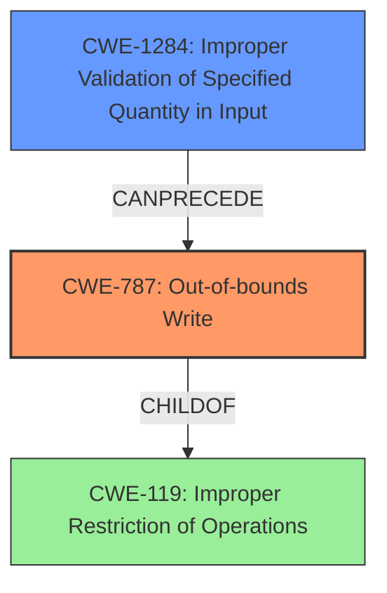

# Analysis Report for CVE-2024-53209

# Vulnerability Analysis Report: CVE-2024-53209

## Description

In the Linux kernel, the following vulnerability has been resolved bnxt_en Fix receive ring space parameters when XDP is active The MTU setting at the time an XDP multi-buffer is attached determines whether the aggregation ring will be used and the rx_skb_func handler. This is done in bnxt_set_rx_skb_mode(). If the MTU is later changed, the aggregation ring setting may need to be changed and it may become out-of-sync with the settings initially done in bnxt_set_rx_skb_mode(). This may result in **random memory corruption** and crashes as the HW may DMA data larger than the allocated buffer size, such as

## Vulnerability Description Key Phrases

- **Weakness:** random memory corruption
- **Impact:** memory corruption
- **Product:** Linux kernel
- **Component:** bnxt_en

## Analysis (with Relationship Data)

# Summary

| CWE ID  | CWE Name | Confidence | CWE Abstraction Level | CWE Vulnerability Mapping Label | CWE-Vulnerability Mapping Notes |
|--------------|-----------------------------------------------------------------------------------------------------------------------------------------------------------------------------------------------------------------------|--------------------|-------------------------|-------------------------------------|---------------------------------------------------------------------------------------------------------------------------------------------------------------------------------------------------------------------------------|
| CWE-787 | CWE-787: Out-of-bounds Write | 0.9 | Base | Allowed | The hardware DMA may write data beyond the allocated buffer, potentially causing memory corruption. |
| CWE-1284 | CWE-1284: Improper Validation of Specified Quantity in Input | 0.6 | Base | Allowed | MTU value is a quantity that influences buffer size, and **improper validation** of MTU after XDP attachment contributes to the vulnerability. |

## Evidence and Confidence

*   **Confidence Score:** 0.8
*   **Evidence Strength:** MEDIUM

## Relationship Analysis

The primary relationship that influenced the CWE selection is the parent-child relationship.

*   CWE-787 (Out-of-bounds Write) is a base CWE that describes the **memory corruption** caused by writing beyond the allocated buffer.
*   CWE-1284 (Improper Validation of Specified Quantity in Input) is a Base level CWE that can precede CWE-787, where MTU (quantity) isn't validated and leads to an out-of-bounds write.



## Vulnerability Chain

The vulnerability chain starts with a configuration issue and leads to **memory corruption**.

1.  The MTU setting at the time an XDP multi-buffer is attached determines the aggregation ring and handler (`bnxt_set_rx_skb_mode()`).
2.  If the MTU is later changed, the settings may become out of sync.
3.  The hardware DMA may then write data larger than the allocated buffer size, resulting in an out-of-bounds write (CWE-787) and **memory corruption**.

CWE-1284 (Improper Validation of Specified Quantity in Input) represents a contributing factor where the input (MTU) isn't validated correctly.

## Summary of Analysis

The primary weakness is an out-of-bounds write (CWE-787) resulting from a configuration issue related to MTU settings and aggregation rings. The evidence supports this, stating, "This may result in **random memory corruption** and crashes as the HW may DMA data larger than the allocated buffer size".

CWE-1284 (Improper Validation of Specified Quantity in Input) is a secondary weakness, because the **improper validation** of the MTU size after the XDP program is attached can lead to memory corruption.

The selected CWEs are at the appropriate level of specificity, with CWE-787 being a Base CWE and CWE-1284 also a Base CWE, accurately describing the **root cause** and resulting **memory corruption**.

# Enhanced Context (25 CWEs)
The following CWEs were identified as potentially relevant to this vulnerability:

## CWE-131: Incorrect Calculation of Buffer Size
**Abstraction Level**: Base
**Similarity Score**: 0.74
**Source**: dense

**Description**:
The product does not correctly calculate the size to be used when allocating a buffer, which could lead to a buffer overflow.

**Mapping Guidance**:
- Usage: Allowed
- Rationale: This CWE entry is at the Base level of abstraction, which is a preferred level of abstraction for mapping to the root causes of vulnerabilities.

## CWE-789: Memory Allocation with Excessive Size Value
**Abstraction Level**: Variant
**Similarity Score**: 0.74
**Source**: dense

**Description**:
The product allocates memory based on an untrusted, large size value, but it does not ensure that the size is within expected limits, allowing arbitrary amounts of memory to be allocated.

**Mapping Guidance**:
- Usage: Allowed
- Rationale: This CWE entry is at the Variant level of abstraction, which is a preferred level of abstraction for mapping to the root causes of vulnerabilities.

## CWE-362: Concurrent Execution using Shared Resource with Improper Synchronization ('Race Condition')
**Abstraction Level**: Class
**Similarity Score**: 0.74
**Source**: dense

**Description**:
The product contains a concurrent code sequence that requires temporary, exclusive access to a shared resource, but a timing window exists in which the shared resource can be modified by another code sequence operating concurrently.

**Mapping Guidance**:
- Usage: Allowed-with-Review
- Rationale: This CWE entry is a Class and might have Base-level children that would be more appropriate

## CWE-119: Improper Restriction of Operations within the Bounds of a Memory Buffer
**Abstraction Level**: Class
**Similarity Score**: 0.73
**Source**: dense

**Description**:
The product performs operations on a memory buffer, but it reads from or writes to a memory location outside the buffer's intended boundary. This may result in read or write operations on unexpected memory locations that could be linked to other variables, data structures, or internal program data.

**Mapping Guidance**:
- Usage: Discouraged
- Rationale: CWE-119 is commonly misused in low-information vulnerability reports when lower-level CWEs could be used instead, or when more details about the vulnerability are available.

## CWE-755: Improper Handling of Exceptional Conditions
**Abstraction Level**: Class
**Similarity Score**: 0.73
**Source**: dense

**Description**:
The product does not handle or incorrectly handles an exceptional condition.

**Mapping Guidance**:
- Usage: Discouraged
- Rationale: This CWE entry is a level-1 Class (i.e., a child of a Pillar). It might have lower-level children that would be more appropriate

## CWE-191: Integer Underflow (Wrap or Wraparound)
**Abstraction Level**: Base
**Similarity Score**: 0.73
**Source**: dense

**Description**:
The product subtracts one value from another, such that the result is less than the minimum allowable integer value, which produces a value that is not equal to the correct result.

**Mapping Guidance**:
- Usage: Allowed
- Rationale: This CWE entry is at the Base level of abstraction, which is a preferred level of abstraction for mapping to the root causes of vulnerabilities.

## CWE-667: Improper Locking
**Abstraction Level**: Class
**Similarity Score**: 0.72
**Source**: dense

**Description**:
The product does not properly acquire or release a lock on a resource, leading to unexpected resource state changes and behaviors.

**Mapping Guidance**:
- Usage: Allowed-with-Review
- Rationale: This CWE entry is a Class and might have Base-level children that would be more appropriate

## CWE-1285: Improper Validation of Specified Index, Position, or Offset in Input
**Abstraction Level**: Base
**Similarity Score**: 0.72
**Source**: dense

**Description**:
The product receives input that is expected to specify an index, position, or offset into an indexable resource such as a buffer or file, but it does not validate or incorrectly validates that the specified index/position/offset has the required properties.

**Mapping Guidance**:
- Usage: Allowed
- Rationale: This CWE entry is at the Base level of abstraction, which is a preferred level of abstraction for mapping to the root causes of vulnerabilities.

## CWE-1284: Improper Validation of Specified Quantity in Input
**Abstraction Level**: Base
**Similarity Score**: 0.72
**Source**: dense

**Description**:
The product receives input that is expected to specify a quantity (such as size or length), but it does not validate or incorrectly validates that the quantity has the required properties.

**Mapping Guidance**:
- Usage: Allowed
- Rationale: This CWE entry is at the Base level of abstraction, which is a preferred level of abstraction for mapping to the root causes of vulnerabilities.

## CWE-824: Access of Uninitialized Pointer
**Abstraction Level**: Base
**Similarity Score**: 0.72
**Source**: dense

**Description**:
The product accesses or uses a pointer that has not been initialized.

**Mapping Guidance**:
- Usage: Allowed
- Rationale: This CWE entry is at the Base level of abstraction, which is a preferred level of abstraction for mapping to the root causes of vulnerabilities.

## CWE-789: Memory Allocation with Excessive Size Value
**Abstraction Level**: Variant


## CWE Relationship Analysis

Current CWEs represent these abstraction levels: .


### Vulnerability Chain Analysis

**Chain starting from CWE-1284:**
- 1284 (Improper Validation of Specified Quantity in Input) - ROOT


**Chain starting from CWE-131:**
- 131 (Incorrect Calculation of Buffer Size) - ROOT


### CWE Relationship Diagram

```mermaid
graph TD
    classDef primary fill:#f96,stroke:#333,stroke-width:2px
    classDef secondary fill:#69f,stroke:#333
    classDef tertiary fill:#9e9,stroke:#333
```


*Report generated on 2025-07-13 21:46:33*
