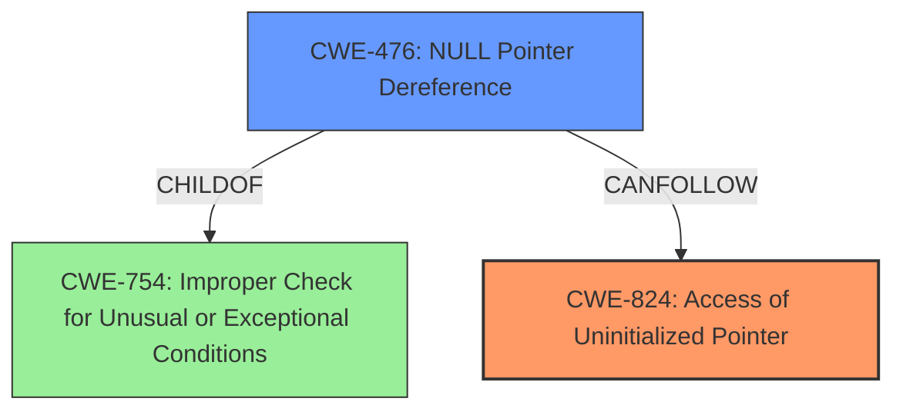

# Analysis for CVE-2024-53238

# Summary
| CWE ID | CWE Name | Confidence | CWE Abstraction Level | CWE Vulnerability Mapping Label | CWE-Vulnerability Mapping Notes |
|---|---|---|---|---|---|
| CWE-824 | Access of Uninitialized Pointer | 0.9 | Base | Primary | Allowed |
| CWE-476 | NULL Pointer Dereference | 0.7 | Base | Secondary | Allowed |

## Evidence and Confidence

*   **Confidence Score:** 0.8
*   **Evidence Strength:** HIGH

## Relationship Analysis
The primary weakness is **CWE-824 (Access of Uninitialized Pointer)**, which directly aligns with the root cause of the vulnerability. The secondary weakness, **CWE-476 (NULL Pointer Dereference)**, is a consequence of the uninitialized pointer being dereferenced. CWE-476 is a child of CWE-754 (Improper Check for Unusual or Exceptional Conditions), which is related to the initial error handling. The relationship shows a chain of events: an uninitialized pointer (CWE-824) leads to a NULL pointer dereference (CWE-476), resulting in a kernel crash.

## Vulnerability Chain
The vulnerability chain starts with the **missing initialization** of the iso data anchor. This leads to a **NULL pointer**, which is then **dereferenced** during the disconnect process, causing a crash.
1.  **Root Cause:** Missing Initialization (CWE-824)
2.  **Intermediate State:** NULL Pointer
3.  **Impact:** NULL Pointer Dereference (CWE-476) leading to Kernel Crash

## Summary of Analysis
The analysis indicates that the root cause is the **failure to properly initialize** the ISO data anchor before a potential USB disconnect. The direct result of this is a **NULL pointer dereference**. Therefore, **CWE-824 (Access of Uninitialized Pointer)** is the primary CWE, accurately capturing the initial coding error. The subsequent **NULL pointer dereference** is represented by **CWE-476**. This mapping is based on the evidence from the vulnerability description, the retriever results, and the relationship analysis. The selected CWEs are at the Base level of abstraction, providing the necessary specificity for this vulnerability.

Relevant CWE Information:

# Enhanced Context (25 CWEs)
The following CWEs were identified as potentially relevant to this vulnerability:

## CWE-824: Access of Uninitialized Pointer
**Abstraction Level**: Base
**Similarity Score**: 0.79
**Source**: dense

**Description**:
The product accesses or uses a pointer that has not been initialized.

**Mapping Guidance**:
- Usage: Allowed
- Rationale: This CWE entry is at the Base level of abstraction, which is a preferred level of abstraction for mapping to the root causes of vulnerabilities.

## CWE-476: NULL Pointer Dereference
**Abstraction Level**: Base
**Similarity Score**: 0.76
**Source**: dense

**Description**:
The product dereferences a pointer that it expects to be valid but is NULL.

**Mapping Guidance**:
- Usage: Allowed
- Rationale: This CWE entry is at the Base level of abstraction, which is a preferred level of abstraction for mapping to the root causes of vulnerabilities.

**CWE-824**: The vulnerability occurs because the ISO data anchor is accessed without being properly initialized due to an unexpected USB disconnect during the setup flow. The vulnerability description states: "If there is an unexpected BT usb disconnect during setup flow, it will cause a **NULL pointer crash** issue when releasing iso anchor since the anchor wasnt been init yet." This clearly indicates that the pointer is accessed in an uninitialized state.

**CWE-476**: The direct consequence of accessing the uninitialized pointer is a **NULL pointer dereference**, leading to a crash. The vulnerability description explicitly mentions "**NULL pointer crash** issue when releasing iso anchor since the anchor wasnt been init yet". This confirms that the **NULL pointer** is being dereferenced.

**CWEs Considered But Not Used:**

*   **CWE-362 Concurrent Execution using Shared Resource with Improper Synchronization ('Race Condition')**: While there is a race condition element (USB disconnect occurring before initialization), the primary issue is the missing initialization itself, making CWE-824 a more direct and accurate mapping.
*   **CWE-401 Missing Release of Memory after Effective Lifetime**: This is not the primary issue, as the crash occurs due to accessing an uninitialized pointer, not due to a memory leak.
*   **CWE-755 Improper Handling of Exceptional Conditions**: Although a USB disconnect is an exceptional condition, the vulnerability's core is the missing initialization, not the handling of the disconnect event itself.
*   **CWE-909 Missing Initialization of Resource**: Similar to CWE-824, but CWE-824 is more specific as it involves a pointer.