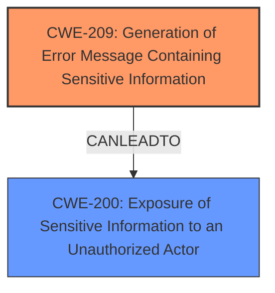

# Analysis Report for CVE-2024-53253

# Vulnerability Analysis Report: CVE-2024-53253

## Description

Sentry is an error tracking and performance monitoring platform. Version 24.11.0, and only version 24.11.0, is vulnerable to a scenario where a specific error message generated by the Sentry platform could include a plaintext Client ID and Client Secret for an application integration. The Client ID and Client Secret would not be displayed in the UI, but would be returned in the underlying HTTP response to the end user. This could occur under the following conditions An app installation made use of a Search UI component with the `async` flag set to true (default true) auser types types into the Search Component which creates a request to the third-party for search or query results and that third-party response may then fail validation and Sentry would return the `select-requester.invalid-response` error code along with a serialized version of a Sentry application containing the integration Client Secret. Should this error be found, its reasonable to assume the potential exposure of an integration Client Secret. However, an ID and Secret pair alone does not provide direct access to any data. For that secret to be abused an attacker would also need to obtain a valid API token for a Sentry application. Sentry SaaS users do not need to take any action. For Sentry SaaS users, only a single application integration was impacted and the owner has rotated their Client Secret. No abuse of the leaked Client Secret has occurred. As of time of publication, a fix is available for users of Sentry self-hosted in pull request 81038. Sentry self-hosted does not ship with any application integrations. This could only impact self-hosted users that maintain their own integrations. In that case, search for a `select-requester.invalid-response` event. Please note that this error was also shared with another event unrelated to this advisory so Sentry self-hosted users will also need to review the parameters logged for each named event. Sentry self-hosted users may review `select_requester.py` for the instances where these errors can be generated. With the security fix this is no longer a shared event type. Sentry self-hosted users may not install version 24.11.0 and instead wait for the next release. Self-hosted instance that are already running the affected version may consider downgrading to to 24.10.0.

## Vulnerability Description Key Phrases

- **Weakness:** information disclosure
- **Vector:** specific error message generated by the Sentry platform
- **Product:** Sentry
- **Version:** 24.11.0

## Analysis (with Relationship Data)

# Summary
| CWE ID | CWE Name | Confidence | CWE Abstraction Level | CWE Vulnerability Mapping Label | CWE-Vulnerability Mapping Notes |
|---|---|---|---|---|---|
| CWE-209 | Generation of Error Message Containing Sensitive Information | 1.0 | Base | Allowed | Primary CWE: The root cause is the generation of an error message containing the client ID and secret. |
| CWE-200 | Exposure of Sensitive Information to an Unauthorized Actor | 0.7 | Class | Discouraged | Secondary CWE: This describes the impact of the vulnerability. |

## Evidence and Confidence

*   **Confidence Score:** 0.9
*   **Evidence Strength:** HIGH

## Relationship Analysis
The primary relationship that influenced the CWE selection is that CWE-209 Generation of Error Message Containing Sensitive Information can lead to CWE-200 Exposure of Sensitive Information to an Unauthorized Actor. CWE-209 is the root cause, as it describes the mechanism by which the sensitive information is exposed. CWE-200 describes the impact of that exposure. The abstraction levels were considered to ensure the most specific CWE was chosen. CWE-209 is a Base level CWE, while CWE-200 is a Class level CWE.



## Vulnerability Chain
The vulnerability chain starts with the **improper generation of an error message** (CWE-209), which leads to the **exposure of sensitive information** (CWE-200).
  - **Root Cause:** CWE-209 (Generation of Error Message Containing Sensitive Information)
  - **Impact:** CWE-200 (Exposure of Sensitive Information to an Unauthorized Actor)

## Summary of Analysis
The initial analysis focused on identifying the root cause of the vulnerability. The vulnerability description and CVE reference links clearly point to the fact that the **weakness** lies in the generation of an error message that includes sensitive information (Client ID and Client Secret). This aligns perfectly with CWE-209, which describes the generation of error messages containing sensitive information. The relationship analysis confirms that CWE-209 can lead to the impact of CWE-200 (Exposure of Sensitive Information). The retriever results also listed CWE-209 and CWE-200, supporting the initial assessment.

The selection of CWE-209 is based on the following evidence from the provided text:
- Vulnerability Description Key Phrases: "**weakness:** **information disclosure**" and "specific error message generated by the Sentry platform"
- CVE Reference Links Content Summary: "Improper error handling in the Sentry application integration's `select-requester` component. Specifically, when a third-party API response failed validation, the system returned an error message that included the application integration's Client ID and Client Secret."

The analysis considered several other CWEs, including CWE-532 (Insertion of Sensitive Information into Log File) and CWE-201 (Insertion of Sensitive Information Into Sent Data), but these were deemed less relevant as the sensitive information was exposed through an error message, not a log file or general data transmission. The selected CWEs are at the optimal level of specificity, with CWE-209 being a Base level CWE that accurately represents the weakness.

Relevant CWE Information:

# Enhanced Context (25 CWEs)
The following CWEs were identified as potentially relevant to this vulnerability:

## CWE-212: Improper Removal of Sensitive Information Before Storage or Transfer
**Abstraction Level**: Base
**Similarity Score**: 0.73
**Source**: dense

**Description**:
The product stores, transfers, or shares a resource that contains sensitive information, but it does not properly remove that information before the product makes the resource available to unauthorized actors.

**Mapping Guidance**:
- Usage: Allowed
- Rationale: This CWE entry is at the Base level of abstraction, which is a preferred level of abstraction for mapping to the root causes of vulnerabilities.


## CWE-497: Exposure of Sensitive System Information to an Unauthorized Control Sphere
**Abstraction Level**: Base
**Similarity Score**: 0.73
**Source**: dense

**Description**:
The product does not properly prevent sensitive system-level information from being accessed by unauthorized actors who do not have the same level of access to the underlying system as the product does.

**Mapping Guidance**:
- Usage: Allowed
- Rationale: This CWE entry is at the Base level of abstraction, which is a preferred level of abstraction for mapping to the root causes of vulnerabilities.


## CWE-209: Generation of Error Message Containing Sensitive Information
**Abstraction Level**: Base
**Similarity Score**: 0.72
**Source**: dense

**Description**:
The product generates an error message that includes sensitive information about its environment, users, or associated data.

**Mapping Guidance**:
- Usage: Allowed
- Rationale: This CWE entry is at the Base level of abstraction, which is a preferred level of abstraction for mapping to the root causes of vulnerabilities.


## CWE-918: Server-Side Request Forgery (SSRF)
**Abstraction Level**: Base
**Similarity Score**: 0.72
**Source**: dense

**Description**:
The web server receives a URL or similar request from an upstream component and retrieves the contents of this URL, but it does not sufficiently ensure that the request is being sent to the expected destination.

**Mapping Guidance**:
- Usage: Allowed
- Rationale: This CWE entry is at the Base level of abstraction, which is a preferred level of abstraction for mapping to the root causes of vulnerabilities.


## CWE-538: Insertion of Sensitive Information into Externally-Accessible File or Directory
**Abstraction Level**: Base
**Similarity Score**: 0.72
**Source**: dense

**Description**:
The product places sensitive information into files or directories that are accessible to actors who are allowed to have access to the files, but not to the sensitive information.

**Mapping Guidance**:
- Usage: Allowed
- Rationale: This CWE entry is at the Base level of abstraction, which is a preferred level of abstraction for mapping to the root causes of vulnerabilities.


## CWE-201: Insertion of Sensitive Information Into Sent Data
**Abstraction Level**: Base
**Similarity Score**: 0.71
**Source**: dense

**Description**:
The code transmits data to another actor, but a portion of the data includes sensitive information that should not be accessible to that actor.

**Mapping Guidance**:
- Usage: Allowed
- Rationale: This CWE entry is at the Base level of abstraction, which is a preferred level of abstraction for mapping to the root causes of vulnerabilities.


## CWE-319: Cleartext Transmission of Sensitive Information
**Abstraction Level**: Base
**Similarity Score**: 0.71
**Source**: dense

**Description**:
The product transmits sensitive or security-critical data in cleartext in a communication channel that can be sniffed by unauthorized actors.

**Mapping Guidance**:
- Usage: Allowed
- Rationale: This CWE entry is at the Base level of abstraction, which is a preferred level of abstraction for mapping to the root causes of vulnerabilities.


## CWE-200: Exposure of Sensitive Information to an Unauthorized Actor
**Abstraction Level**: Class
**Similarity Score**: 0.71
**Source**: dense

**Description**:
The product exposes sensitive information to an actor that is not explicitly authorized to have access to that information.

**Mapping Guidance**:
- Usage: Discouraged
- Rationale: CWE-200 is commonly misused to represent the loss of confidentiality in a vulnerability, but confidentiality loss is a technical impact - not a root cause error. As of CWE 4.9, over 400 CWE entries can lead to a loss of confidentiality. Other options are often available. [REF-1287].


## CWE-941: Incorrectly Specified Destination in a Communication Channel
**Abstraction Level**: Base
**Similarity Score**: 0.71
**Source**: dense

**Description**:
The product creates a communication channel to initiate an outgoing request to an actor, but it does not correctly specify the intended destination for that actor.

**Mapping Guidance**:
- Usage: Allowed
- Rationale: This CWE entry is at the Base level of abstraction, which is a preferred level of abstraction for mapping to the root causes of vulnerabilities.


## CWE-204: Observable Response Discrepancy
**Abstraction Level**: Base
**Similarity Score**: 0.71
**Source**: dense

**Description**:
The product provides different responses to incoming requests in a way that reveals internal state information to an unauthorized actor outside of the intended control sphere.

**Mapping Guidance**:
- Usage: Allowed
- Rationale: This CWE entry is at the Base level of abstraction, which is a preferred level of abstraction for mapping to the root causes of vulnerabilities.


## CWE-532: Insertion of Sensitive Information into Log File
**Abstraction Level**: Base
**Similarity Score**: 17


## CWE Relationship Analysis

Current CWEs represent these abstraction levels: .


### Vulnerability Chain Analysis

**Chain starting from CWE-319:**
- 319 (Cleartext Transmission of Sensitive Information) - ROOT


**Chain starting from CWE-201:**
- 201 (Insertion of Sensitive Information Into Sent Data) - ROOT


### CWE Relationship Diagram

```mermaid
graph TD
    classDef primary fill:#f96,stroke:#333,stroke-width:2px
    classDef secondary fill:#69f,stroke:#333
    classDef tertiary fill:#9e9,stroke:#333
```


*Report generated on 2025-07-13 21:49:22*
