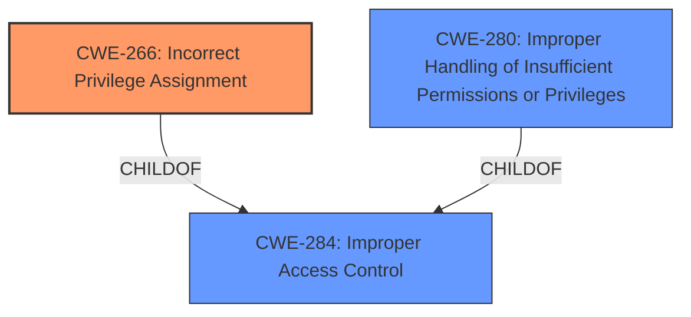

# Enhanced Analysis for CVE-2024-53295

# Summary
| CWE ID | CWE Name | Confidence | CWE Abstraction Level | CWE Vulnerability Mapping Label | CWE-Vulnerability Mapping Notes |
|---|---|---|---|---|---|
| CWE-266 | Incorrect Privilege Assignment | 0.8 | Base | Allowed | Primary CWE. The vulnerability is due to **improper access control**, which can be attributed to incorrect privilege assignment. |
| CWE-280 | Improper Handling of Insufficient Permissions or Privileges | 0.6 | Base | Allowed | Secondary candidate. The vulnerability occurs because a user with low privileges is able to perform actions that require higher privileges. |
| CWE-284 | Improper Access Control | 0.5 | Pillar | Discouraged | Secondary candidate. This is a general access control issue, but CWE-266 is more specific. |

## Evidence and Confidence

*   **Confidence Score:** 0.8
*   **Evidence Strength:** HIGH

## Relationship Analysis
The primary relationship influencing the decision is the hierarchical structure within the CWE framework. CWE-266 (Incorrect Privilege Assignment) is a more specific type of access control issue than the broader CWE-284 (Improper Access Control). Since the vulnerability involves a low-privilege user escalating privileges, CWE-266 is a better fit. CWE-280 (Improper Handling of Insufficient Permissions or Privileges) is a peer of CWE-266 and could also be applicable, but CWE-266 more directly addresses the root cause of the vulnerability.



## Vulnerability Chain
The vulnerability chain starts with the **improper access control** (root cause), specifically an incorrect privilege assignment (CWE-266). This leads to a low-privilege user being able to perform actions they should not be authorized to do (CWE-280), ultimately resulting in privilege escalation (impact).

## Summary of Analysis
The initial analysis pointed towards a general access control issue. However, the detailed description and the "Privileges vs Permissions Guidance" indicate that the root cause is more specifically related to how privileges are assigned. The vulnerability description explicitly mentions that a local malicious user with low privileges can escalate privileges. This suggests that the user was incorrectly assigned some privilege, leading to the escalation. The selection of CWE-266 is based on the evidence provided in the vulnerability description and the CWE specifications. It is the most specific and accurate representation of the root cause.

Relevant CWE Information:

# Enhanced Context (25 CWEs)
The following CWEs were identified as potentially relevant to this vulnerability:

## CWE-266: Incorrect Privilege Assignment
**Abstraction Level**: Base
**Similarity Score**: 0.75
**Source**: dense

**Description**:
A product incorrectly assigns a privilege to a particular actor, creating an unintended sphere of control for that actor.

**Mapping Guidance**:
- Usage: Allowed
- Rationale: This CWE entry is at the Base level of abstraction, which is a preferred level of abstraction for mapping to the root causes of vulnerabilities.

### Technical Explanation for CWE-266
CWE-266 (Incorrect Privilege Assignment) accurately captures the root cause of the vulnerability. The vulnerability description states that a local malicious user with low privileges can escalate privileges. This aligns with the definition of CWE-266, where a product incorrectly assigns a privilege to a particular actor, leading to an unintended sphere of control.

**Security Implications and Potential Impact:** The security implication is that a low-privilege user can gain higher-level access, potentially compromising the entire system.

**Parent-Child Relationships and Chain Patterns:** CWE-266 is a child of CWE-284 (Improper Access Control). The chain pattern is that incorrect privilege assignment leads to privilege escalation.

**Primary or Secondary Weakness:** This is the primary weakness because it is the direct cause of the vulnerability.

**Influence of Official MITRE Mapping Guidance:** The MITRE mapping guidance explicitly allows the use of CWE-266 and recommends it as a Base-level CWE, which is preferred for root cause analysis.

### Technical Explanation for CWE-280
CWE-280 (Improper Handling of Insufficient Permissions or Privileges) is included as a secondary candidate because it describes the situation where the system does not properly handle a user having insufficient privileges to perform an operation. While CWE-266 describes the root cause (the incorrect assignment), CWE-280 describes the immediate consequence of that incorrect assignment.

**Security Implications and Potential Impact:** The security implication is that the system might allow unauthorized actions because it doesn't properly check for sufficient privileges.

**Parent-Child Relationships and Chain Patterns:** CWE-280 is a child of CWE-284. It describes the situation that occurs after an incorrect privilege assignment.

**Primary or Secondary Weakness:** This is a secondary weakness because it is a consequence of the primary weakness (CWE-266).

**Influence of Official MITRE Mapping Guidance:** The MITRE mapping guidance allows the use of CWE-280, and it is a Base-level CWE.

### Technical Explanation for CWE-284
CWE-284 (Improper Access Control) was considered but is not used as the primary CWE because it is a high-level category. The vulnerability description provides sufficient detail to identify the root cause as incorrect privilege assignment (CWE-266), which is a more specific type of access control issue.

**Security Implications and Potential Impact:** The security implication is a general failure to restrict access to resources.

**Parent-Child Relationships and Chain Patterns:** CWE-284 is a parent of CWE-266 and CWE-280.

**Primary or Secondary Weakness:** This is a secondary weakness because it is a high-level description of the vulnerability.

**Influence of Official MITRE Mapping Guidance:** The MITRE mapping guidance discourages the use of CWE-284 when more specific child CWEs are available.


## CWE Relationship Analysis

Current CWEs represent these abstraction levels: .


### Vulnerability Chain Analysis

**Chain starting from CWE-284:**
- 284 (Improper Access Control) - ROOT


**Chain starting from CWE-266:**
- 266 (Incorrect Privilege Assignment) - ROOT


### CWE Relationship Diagram

```mermaid
graph TD
    classDef primary fill:#f96,stroke:#333,stroke-width:2px
    classDef secondary fill:#69f,stroke:#333
    classDef tertiary fill:#9e9,stroke:#333
```