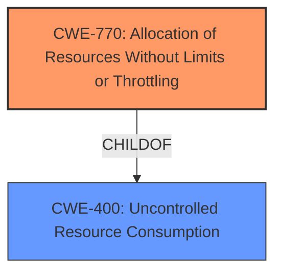

# Analysis for CVE-2024-53299

# Summary

| CWE ID  | CWE Name                                                     | Confidence | CWE Abstraction Level | CWE Vulnerability Mapping Label | CWE-Vulnerability Mapping Notes |
| :-------- | :----------------------------------------------------------- | :--------- | :---------------------- | :------------------------------ | :------------------------------ |
| CWE-770   | Allocation of Resources Without Limits or Throttling       | 0.9        | Base                    | Primary                         | Allowed                         |
| CWE-400   | Uncontrolled Resource Consumption                            | 0.7        | Class                   | Secondary                       | Discouraged                    |

## Evidence and Confidence

*   **Confidence Score:** 0.8
*   **Evidence Strength:** MEDIUM

## Relationship Analysis

The primary CWE selected is CWE-770 Allocation of Resources Without Limits or Throttling. This is a base-level CWE that directly addresses the **root cause** of the vulnerability: the lack of control over resource allocation leading to a denial-of-service. CWE-400 Uncontrolled Resource Consumption is a class-level CWE and a parent of CWE-770. While CWE-400 broadly describes the uncontrolled consumption, CWE-770 pinpoints the allocation aspect as the primary weakness. The relationship between CWE-770 and CWE-400 influenced the selection, favoring the more specific base-level CWE-770.

## Vulnerability Chain

The vulnerability chain starts with the **root cause**: **improper** resource allocation in the request handling of Apache Wicket. This leads to the **impact**: a denial-of-service condition due to resource exhaustion.

`Improper Resource Allocation` -> `Resource Exhaustion` -> `Denial of Service`

CWE-770 represents the **root cause** and CWE-400 is a general class of the **impact**.

## Summary of Analysis

The analysis focused on identifying the **root cause** of the denial-of-service vulnerability in Apache Wicket. The vulnerability description and CVE reference links point to an issue in request handling that allows an attacker to create a DoS by sending multiple requests. The key phrase "memory leak" further clarifies the nature of the resource consumption.

The selection of CWE-770 is based on the evidence suggesting a lack of limits or throttling in resource allocation. This aligns with the description of CWE-770: "The product allocates a reusable resource or group of resources on behalf of an actor without imposing any restrictions on the size or number of resources that can be allocated." The fact that the vulnerability is triggered by "multiple requests" is consistent with a scenario where resources are allocated without limits, eventually leading to exhaustion.

CWE-400 was considered as it describes the general case of uncontrolled resource consumption. However, it's a class-level CWE and the evidence supports the more specific CWE-770, which is a child of CWE-400. While CWE-400 could describe the resulting resource consumption and DoS, CWE-770 better captures the **underlying flaw** in resource management.

The retriever results also listed other CWEs such as CWE-789, CWE-1333, and CWE-410. These were considered but deemed less relevant. CWE-789 (Memory Allocation with Excessive Size Value) is similar, but the vulnerability description doesn't specifically mention excessive size values. CWE-1333 (Inefficient Regular Expression Complexity) and CWE-410 (Insufficient Resource Pool) are also not directly supported by the provided evidence.

The final selection of CWE-770 and CWE-400 is based on a combination of the vulnerability description, CVE reference information, and the hierarchical relationship between these CWEs. CWE-770 is at the optimal level of specificity as it directly addresses the **root cause**, while CWE-400 acknowledges the broader impact of uncontrolled resource consumption.

Relevant CWE Information:

# Enhanced Context (25 CWEs)

## CWE-425: Direct Request ('Forced Browsing')
**Abstraction Level**: Base
**Similarity Score**: 0.72
**Source**: dense

**Description**:
The web application does not adequately enforce appropriate authorization on all restricted URLs, scripts, or files.

**Mapping Guidance**:
- Usage: Allowed
- Rationale: This CWE entry is at the Base level of abstraction, which is a preferred level of abstraction for mapping to the root causes of vulnerabilities.

## CWE-789: Memory Allocation with Excessive Size Value
**Abstraction Level**: Variant
**Similarity Score**: 0.72
**Source**: dense

**Description**:
The product allocates memory based on an untrusted, large size value, but it does not ensure that the size is within expected limits, allowing arbitrary amounts of memory to be allocated.

**Mapping Guidance**:
- Usage: Allowed
- Rationale: This CWE entry is at the Variant level of abstraction, which is a preferred level of abstraction for mapping to the root causes of vulnerabilities.

## CWE-116: Improper Encoding or Escaping of Output
**Abstraction Level**: Class
**Similarity Score**: 0.72
**Source**: dense

**Description**:
The product prepares a structured message for communication with another component, but encoding or escaping of the data is either missing or done incorrectly. As a result, the intended structure of the message is not preserved.

**Mapping Guidance**:
- Usage: Allowed-with-Review
- Rationale: This CWE entry is a Class and might have Base-level children that would be more appropriate

## CWE-201: Insertion of Sensitive Information Into Sent Data
**Abstraction Level**: Base
**Similarity Score**: 0.72
**Source**: dense

**Description**:
The code transmits data to another actor, but a portion of the data includes sensitive information that should not be accessible to that actor.

**Mapping Guidance**:
- Usage: Allowed
- Rationale: This CWE entry is at the Base level of abstraction, which is a preferred level of abstraction for mapping to the root causes of vulnerabilities.

## CWE-538: Insertion of Sensitive Information into Externally-Accessible File or Directory
**Abstraction Level**: Base
**Similarity Score**: 0.72
**Source**: dense

**Description**:
The product places sensitive information into files or directories that are accessible to actors who are allowed to have access to the files, but not to the sensitive information.

**Mapping Guidance**:
- Usage: Allowed
- Rationale: This CWE entry is at the Base level of abstraction, which is a preferred level of abstraction for mapping to the root causes of vulnerabilities.

## CWE-918: Server-Side Request Forgery (SSRF)
**Abstraction Level**: Base
**Similarity Score**: 0.72
**Source**: dense

**Description**:
The web server receives a URL or similar request from an upstream component and retrieves the contents of this URL, but it does not sufficiently ensure that the request is being sent to the expected destination.

**Mapping Guidance**:
- Usage: Allowed
- Rationale: This CWE entry is at the Base level of abstraction, which is a preferred level of abstraction for mapping to the root causes of vulnerabilities.

## CWE-212: Improper Removal of Sensitive Information Before Storage or Transfer
**Abstraction Level**: Base
**Similarity Score**: 0.72
**Source**: dense

**Description**:
The product stores, transfers, or shares a resource that contains sensitive information, but it does not properly remove that information before the product makes the resource available to unauthorized actors.

**Mapping Guidance**:
- Usage: Allowed
- Rationale: This CWE entry is at the Base level of abstraction, which is a preferred level of abstraction for mapping to the root causes of vulnerabilities.

## CWE-209: Generation of Error Message Containing Sensitive Information
**Abstraction Level**: Base
**Similarity Score**: 0.72
**Source**: dense

**Description**:
The product generates an error message that includes sensitive information about its environment, users, or associated data.

**Mapping Guidance**:
- Usage: Allowed
- Rationale: This CWE entry is at the Base level of abstraction, which is a preferred level of abstraction for mapping to the root causes of vulnerabilities.

## CWE-923: Improper Restriction of Communication Channel to Intended Endpoints
**Abstraction Level**: Class
**Similarity Score**: 0.71
**Source**: dense

**Description**:
The product establishes a communication channel to (or from) an endpoint for privileged or protected operations, but it does not properly ensure that it is communicating with the correct endpoint.

**Mapping Guidance**:
- Usage: Allowed-with-Review
- Rationale: This CWE entry is a Class and might have Base-level children that would be more appropriate

## CWE-497: Exposure of Sensitive System Information to an Unauthorized Control Sphere
**Abstraction Level**: Base
**Similarity Score**: 0.71
**Source**: dense

**Description**:
The product does