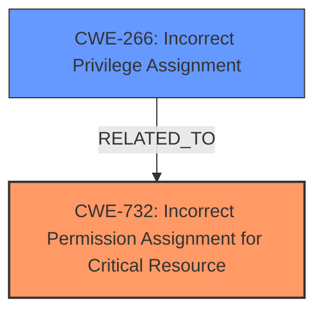

# Analysis Report for CVE-2024-53350

# Vulnerability Analysis Report: CVE-2024-53350

## Description

**Insecure permissions** in kubeslice v1.3.1 allow attackers to gain access to the service accounts token, leading to escalation of privileges.

## Vulnerability Description Key Phrases

- **Rootcause:** Insecure permissions
- **Impact:** escalation of privileges
- **Attacker:** attackers
- **Product:** kubeslice
- **Version:** v1.3.1

## Analysis (with Relationship Data)

# Summary
| CWE ID | CWE Name | Confidence | CWE Abstraction Level | CWE Vulnerability Mapping Label | CWE-Vulnerability Mapping Notes |
|---|---|---|---|---|---|
| CWE-732 | Incorrect Permission Assignment for Critical Resource | 0.9 | Class | Allowed-with-Review | Primary CWE. Matches the **insecure permissions** root cause. |
| CWE-266 | Incorrect Privilege Assignment | 0.7 | Base | Allowed | Secondary candidate. The impact allows attackers to gain access to the service accounts token, leading to escalation of privileges. |

## Evidence and Confidence

*   **Confidence Score:** 0.8
*   **Evidence Strength:** HIGH

## Relationship Analysis
The primary relationship influencing my decision is the hierarchical structure with CWE-732 (Class) and its potential children which might be more specific. However, the description focuses on the **incorrect assignment of permissions** for a critical resource, making CWE-732 a good fit, even if at the Class level. CWE-266 is related to privilege assignment, which is a consequence of the permission issue in this case, making it a secondary consideration.



## Vulnerability Chain
The vulnerability chain starts with **insecure permissions (CWE-732)**, leading to unauthorized access to service account tokens. This, in turn, results in privilege escalation (CWE-266) and potential compromise of the Kubernetes cluster. The chain highlights how a fundamental flaw in permission assignment can have cascading effects on the overall system security.

## Summary of Analysis
The analysis is strongly based on the provided evidence, particularly the vulnerability description stating "**Insecure permissions** in kubeslice v1.3.1 allow attackers to gain access to the service accounts token, leading to escalation of privileges." This directly points to a problem with how permissions are set for critical resources.

The retriever results and the "Privileges vs Permissions Guidance" both pointed towards access control related CWEs. Given the specific mention of "**insecure permissions**", CWE-732 (Incorrect Permission Assignment for Critical Resource) is the most appropriate primary CWE. While it is a Class-level CWE, the available information does not allow for a more specific Base or Variant level CWE to be selected. The impact of privilege escalation suggests a secondary CWE of CWE-266 (Incorrect Privilege Assignment) is related because gaining access to the token then allows privilege escalation.

The selected CWEs are at an optimal level of specificity given the available evidence. While more granular CWEs might exist, the current description does not provide sufficient information to warrant their selection.

Relevant CWE Information:

# Enhanced Context (25 CWEs)
The following CWEs were identified as potentially relevant to this vulnerability:

## CWE-266: Incorrect Privilege Assignment
**Abstraction Level**: Base
**Similarity Score**: 0.79
**Source**: dense

**Description**:
A product incorrectly assigns a privilege to a particular actor, creating an unintended sphere of control for that actor.

**Mapping Guidance**:
- Usage: Allowed
- Rationale: This CWE entry is at the Base level of abstraction, which is a preferred level of abstraction for mapping to the root causes of vulnerabilities.

*Technical Explanation:*
CWE-266 (Incorrect Privilege Assignment) is considered as a secondary candidate because the **insecure permissions (CWE-732)** allow attackers to gain access to the service accounts token, leading to escalation of privileges. This suggests a privilege misassignment as a consequence of the initial permission issue. The potential impact is significant, enabling attackers to compromise Secrets components and potentially take over the entire Kubernetes cluster. The hierarchical relationships show it could be related to the primary CWE as a consequence.
CWE-266 is at the Base level of abstraction, which aligns with the goal of identifying specific root causes. It is allowed for mapping.

## CWE-267: Privilege Defined With Unsafe Actions
**Abstraction Level**: Base
**Similarity Score**: 0.77
**Source**: dense

**Description**:
A particular privilege, role, capability, or right can be used to perform unsafe actions that were not intended, even when it is assigned to the correct entity.

**Mapping Guidance**:
- Usage: Allowed
- Rationale: This CWE entry is at the Base level of abstraction, which is a preferred level of abstraction for mapping to the root causes of vulnerabilities.

*Why it was not selected:*
CWE-267 is not selected because the description doesn't specify if the actions are unsafe.

## CWE-280: Improper Handling of Insufficient Permissions or Privileges 
**Abstraction Level**: Base
**Similarity Score**: 0.77
**Source**: dense

**Description**:
The product does not handle or incorrectly handles when it has insufficient privileges to access resources or functionality as specified by their permissions. This may cause it to follow unexpected code paths that may leave the product in an invalid state.

**Mapping Guidance**:
- Usage: Allowed
- Rationale: This CWE entry is at the Base level of abstraction, which is a preferred level of abstraction for mapping to the root causes of vulnerabilities.

*Why it was not selected:*
CWE-280 is not selected because the description specifies the permissions are **insecure** not insufficient.

## CWE-274: Improper Handling of Insufficient Privileges
**Abstraction Level**: Base
**Similarity Score**: 0.76
**Source**: dense

**Description**:
The product does not handle or incorrectly handles when it has insufficient privileges to perform an operation, leading to resultant weaknesses.

**Mapping Guidance**:
- Usage: Discouraged
- Rationale: This CWE entry could be deprecated in a future version of CWE.

*Why it was not selected:*
CWE-274 is not selected because the description specifies the permissions are **insecure** not insufficient.

## CWE-276: Incorrect Default Permissions
**Abstraction Level**: Base
**Similarity Score**: 0.76
**Source**: dense

**Description**:
During installation, installed file permissions are set to allow anyone to modify those files.

**Mapping Guidance**:
- Usage: Allowed
- Rationale: This CWE entry is at the Base level of abstraction, which is a preferred level of abstraction for mapping to the root causes of vulnerabilities.

*Why it was not selected:*
CWE-276 is not selected because it's specific to installation.

## CWE-668: Exposure of Resource to Wrong Sphere
**Abstraction Level**: Class
**Similarity Score**: 0.75
**Source**: dense

**Description**:
The product exposes a resource to the wrong control sphere, providing unintended actors with inappropriate access to the resource.

**Mapping Guidance**:
- Usage: Discouraged
- Rationale: CWE-668 is high-level and is often misused as a catch-all when lower-level CWE IDs might be applicable. It is sometimes used for low-information vulnerability reports [REF-1287]. It is a level-1 Class (i.e., a child of a Pillar). It is not useful for trend analysis.

*Why it was not selected:*
CWE-668 is too generic and doesn't focus on **incorrect permission assignment**.

## CWE-281: Improper Preservation of Permissions
**Abstraction Level**: Base
**Similarity Score**: 0.75
**Source**: dense

**Description**:
The product does not preserve permissions or incorrectly preserves permissions when copying, restoring, or sharing objects, which can cause them to have less restrictive permissions than intended.

**Mapping Guidance**:
- Usage: Allowed
- Rationale: This CWE entry is at the Base level of abstraction, which is a preferred level of abstraction for mapping to the root causes of vulnerabilities.

*Why it was not selected:*
CWE-281 is not selected because there is no mention of copying, restoring or sharing objects.

## CWE-59: Improper Link Resolution Before File Access ('Link Following')
**Abstraction Level**: Base
**Similarity Score**: 0.74
**Source**: dense

**Description**:
The product attempts to access a file based on the filename, but it does not properly prevent that filename from identifying a link or shortcut that resolves to an unintended resource.

**Mapping Guidance**:
- Usage: Allowed
- Rationale: This CWE entry is at the Base level of abstraction, which is a preferred level of abstraction for mapping to the root causes of vulnerabilities.

*Why it was not selected:*
CWE-59 is not selected because there is no mention of links or shortcuts.

## CWE-497: Exposure of Sensitive System Information to an Unauthorized Control Sphere
**Abstraction Level**: Base
**Similarity Score**: 0.73
**Source**: dense

**Description**:
The product does not properly prevent sensitive system-level information from being accessed by unauthorized actors who do not have the same level of access to the underlying system as the product does.

**Mapping Guidance**:
- Usage: Allowed


## CWE Relationship Analysis

Current CWEs represent these abstraction levels: .


### Vulnerability Chain Analysis

**Chain starting from CWE-274:**
- 274 (Improper Handling of Insufficient Privileges) - ROOT


**Chain starting from CWE-280:**
- 280 (Improper Handling of Insufficient Permissions or Privileges ) - ROOT


### CWE Relationship Diagram

```mermaid
graph TD
    classDef primary fill:#f96,stroke:#333,stroke-width:2px
    classDef secondary fill:#69f,stroke:#333
    classDef tertiary fill:#9e9,stroke:#333
```


*Report generated on 2025-07-13 21:53:57*
