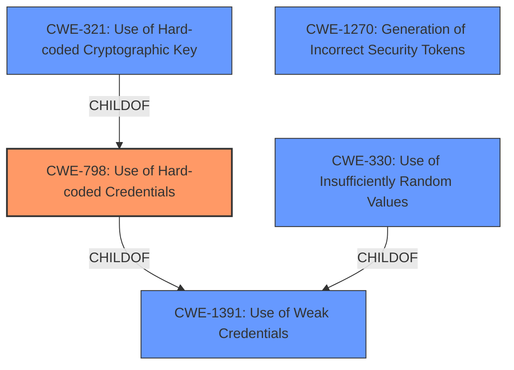

# Raw Analyzer Response for CVE-2024-53356

# Summary

| CWE ID  | CWE Name                                                     | Confidence | CWE Abstraction Level | CWE Vulnerability Mapping Label | CWE-Vulnerability Mapping Notes |
| :-------- | :----------------------------------------------------------- | :--------- | :-------------------- | :------------------------------ | :------------------------------ |
| CWE-798   | Use of Hard-coded Credentials                                | 1          | Base                  | Primary CWE                     | Allowed                         |
| CWE-321   | Use of Hard-coded Cryptographic Key                          | 0.8        | Variant               | Secondary Candidate             | Allowed                         |
| CWE-1391  | Use of Weak Credentials                                      | 0.6        | Class                 | Secondary Candidate             | Allowed-with-Review           |
| CWE-330   | Use of Insufficiently Random Values                          | 0.5        | Class                 | Secondary Candidate             | Discouraged                     |
| CWE-1270  | Generation of Incorrect Security Tokens                      | 0.4        | Base                  | Secondary Candidate             | Allowed                         |

## Evidence and Confidence

*   **Confidence Score:** 0.9
*   **Evidence Strength:** HIGH

## Relationship Analysis

The primary CWE is CWE-798 (Use of Hard-coded Credentials), which directly addresses the hardcoded secret. CWE-321 (Use of Hard-coded Cryptographic Key) is a variant of CWE-798 and a more specific case, but the description doesn't explicitly state that the hardcoded credential is used as a cryptographic key, so while relevant, it's a secondary consideration. CWE-1391 (Use of Weak Credentials) is a class-level CWE, less specific than CWE-798 but still applicable. CWE-330 (Use of Insufficiently Random Values) is a higher-level class that could be considered as using a hardcoded value would be not very random, but is not the most specific. CWE-1270 (Generation of Incorrect Security Tokens) is related to the JWT context, which is valid, but it doesn't specify the root cause itself.

## Vulnerability Chain

The vulnerability chain starts with the **hardcoded secret** (CWE-798), leading to the ability to forge JWTs, which ultimately results in privilege escalation.

CWE-798 (Hardcoded Secret) -> JWT Forging -> Privilege Escalation

## Summary of Analysis

The primary assessment is heavily based on the vulnerability description that explicitly mentions a **hardcoded secret**. The key phrase "**weak HMAC secret**" directly supports the identification of CWE-798 (Use of Hard-coded Credentials) as the root cause.

The graph relationships and retriever results helped to consider related CWEs, like CWE-321 and CWE-1391, but the evidence points most strongly to the direct use of hardcoded credentials without specific mention of cryptographic functions or general weakness, making CWE-798 the most accurate and specific classification.

The selected CWEs are at the optimal level of specificity because they directly address the **root cause** (hardcoded secret) rather than just the impact (privilege escalation) or a more general weakness category.

Relevant CWE Information:

# Enhanced Context (25 CWEs)
The following CWEs were identified as potentially relevant to this vulnerability:

## CWE-1391: Use of Weak Credentials
**Abstraction Level**: Class
**Similarity Score**: 0.78
**Source**: dense

**Description**:
The product uses weak credentials (such as a default key or hard-coded password) that can be calculated, derived, reused, or guessed by an attacker.

**Mapping Guidance**:
- Usage: Allowed-with-Review
- Rationale: This CWE entry is a Class and might have Base-level children that would be more appropriate

## CWE-330: Use of Insufficiently Random Values
**Abstraction Level**: Class
**Similarity Score**: 0.77
**Source**: dense

**Description**:
The product uses insufficiently random numbers or values in a security context that depends on unpredictable numbers.

**Mapping Guidance**:
- Usage: Discouraged
- Rationale: This CWE entry is a level-1 Class (i.e., a child of a Pillar). It might have lower-level children that would be more appropriate

## CWE-266: Incorrect Privilege Assignment
**Abstraction Level**: Base
**Similarity Score**: 0.77
**Source**: dense

**Description**:
A product incorrectly assigns a privilege to a particular actor, creating an unintended sphere of control for that actor.

**Mapping Guidance**:
- Usage: Allowed
- Rationale: This CWE entry is at the Base level of abstraction, which is a preferred level of abstraction for mapping to the root causes of vulnerabilities.

## CWE-274: Improper Handling of Insufficient Privileges
**Abstraction Level**: Base
**Similarity Score**: 0.77
**Source**: dense

**Description**:
The product does not handle or incorrectly handles when it has insufficient privileges to perform an operation, leading to resultant weaknesses.

**Mapping Guidance**:
- Usage: Discouraged
- Rationale: This CWE entry could be deprecated in a future version of CWE.

## CWE-267: Privilege Defined With Unsafe Actions
**Abstraction Level**: Base
**Similarity Score**: 0.77
**Source**: dense

**Description**:
A particular privilege, role, capability, or right can be used to perform unsafe actions that were not intended, even when it is assigned to the correct entity.

**Mapping Guidance**:
- Usage: Allowed
- Rationale: This CWE entry is at the Base level of abstraction, which is a preferred level of abstraction for mapping to the root causes of vulnerabilities.

## CWE-807: Reliance on Untrusted Inputs in a Security Decision
**Abstraction Level**: Base
**Similarity Score**: 0.76
**Source**: dense

**Description**:
The product uses a protection mechanism that relies on the existence or values of an input, but the input can be modified by an untrusted actor in a way that bypasses the protection mechanism.

**Mapping Guidance**:
- Usage: Allowed
- Rationale: This CWE entry is at the Base level of abstraction, which is a preferred level of abstraction for mapping to the root causes of vulnerabilities.

## CWE-472: External Control of Assumed-Immutable Web Parameter
**Abstraction Level**: Base
**Similarity Score**: 0.76
**Source**: dense

**Description**:
The web application does not sufficiently verify inputs that are assumed to be immutable but are actually externally controllable, such as hidden form fields.

**Mapping Guidance**:
- Usage: Allowed
- Rationale: This CWE entry is at the Base level of abstraction, which is a preferred level of abstraction for mapping to the root causes of vulnerabilities.

## CWE-668: Exposure of Resource to Wrong Sphere
**Abstraction Level**: Class
**Similarity Score**: 0.76
**Source**: dense

**Description**:
The product exposes a resource to the wrong control sphere, providing unintended actors with inappropriate access to the resource.

**Mapping Guidance**:
- Usage: Discouraged
- Rationale: CWE-668 is high-level and is often misused as a catch-all when lower-level CWE IDs might be applicable. It is sometimes used for low-information vulnerability reports [REF-1287]. It is a level-1 Class (i.e., a child of a Pillar). It is not useful for trend analysis.

## CWE-280: Improper Handling of Insufficient Permissions or Privileges 
**Abstraction Level**: Base
**Similarity Score**: 0.76
**Source**: dense

**Description**:
The product does not handle or incorrectly handles when it has insufficient privileges to access resources or functionality as specified by their permissions. This may cause it to follow unexpected code paths that may leave the product in an invalid state.

**Mapping Guidance**:
- Usage: Allowed
- Rationale: This CWE entry is at the Base level of abstraction, which is a preferred level of abstraction for mapping to the root causes of vulnerabilities.

## CWE-798: Use of Hard-coded Credentials
**Abstraction Level**: Base
**Similarity Score**: