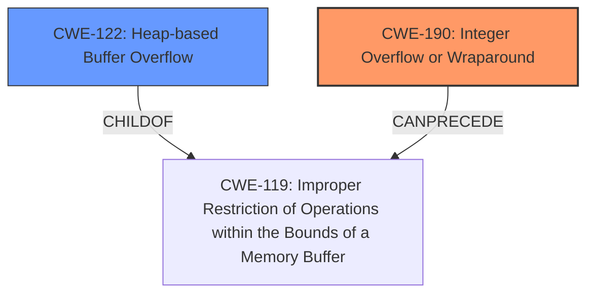

# Analysis Report for CVE-2024-53379

# Vulnerability Analysis Report: CVE-2024-53379

## Description

**Heap buffer overflow** in the server site handshake implementation in Real Time Logic LLCs SharkSSL version (from 05/05/24) commit 64808a5e12c83b38f85c943dee0112e428dc2a43 allows a remote attacker to trigger a Denial-of-Service via a malformed Client-Hello message.

## Vulnerability Description Key Phrases

- **Weakness:** Heap buffer overflow
- **Impact:** Denial-of-Service
- **Vector:** malformed Client-Hello message
- **Attacker:** remote attacker
- **Product:** Real Time Logic LLCs SharkSSL
- **Version:** version (from 05/05/24) commit 64808a5e12c83b38f85c943dee0112e428dc2a43
- **Component:** server site handshake implementation

## Analysis (with Relationship Data)

# Summary

| CWE ID | CWE Name | Confidence | CWE Abstraction Level | CWE Vulnerability Mapping Label | CWE-Vulnerability Mapping Notes |
|---|---|---|---|---|---|
| CWE-190 | Integer Overflow or Wraparound | 0.9 | Base |  Primary CWE | Allowed |
| CWE-122 | Heap-based Buffer Overflow | 0.9 | Variant | Secondary Candidate | Allowed |

## Evidence and Confidence

*   **Confidence Score:** 0.9
*   **Evidence Strength:** HIGH

## Relationship Analysis
The analysis reveals a hierarchical relationship between CWE-122 (Heap-based Buffer Overflow) and CWE-119 (Improper Restriction of Operations within the Bounds of a Memory Buffer) as CWE-122 is a variant of CWE-119. Additionally, CWE-190 (Integer Overflow or Wraparound) can precede CWE-119, which aligns with the vulnerability description indicating an integer wraparound leading to a buffer overflow. Choosing CWE-190 as the root cause and CWE-122 as the result of that overflow.



## Vulnerability Chain
The vulnerability chain starts with **CWE-190: Integer Overflow or Wraparound**, which occurs due to the manipulation of the `len` variable in the loop condition. This leads to a high value for `len`, and subsequently results in **CWE-122: Heap-based Buffer Overflow** due to the iterative increment of `registeredevent` beyond the allocated buffer.

## Summary of Analysis
The initial assessment identified both integer overflow and heap buffer overflow. The evidence clearly shows that the integer overflow is the root cause. The "CVE Reference Links Content Summary" states that "The loop subtracts small values from `len` repeatedly, which can lead to an integer wrap-around and a high value for `len`. This, combined with the loop condition and the iterative increment of `registeredevent`, leads to a buffer overflow." This confirms that the integer overflow precedes and causes the heap buffer overflow.

The selection of CWE-190 and CWE-122 is based on the detailed analysis of the vulnerability description and the supporting evidence. The relationship analysis further solidifies this mapping, as CWE-190 can precede CWE-119, the parent of CWE-122. The chosen CWEs are at the optimal level of specificity, with CWE-190 being a Base CWE and CWE-122 being a Variant CWE.

**CWE-190: Integer Overflow or Wraparound**
*   **Technical Explanation:** The vulnerability involves an integer wraparound in the `len` variable, which is used to control a loop that increments a pointer. By manipulating the input, an attacker can cause `len` to wrap around to a large value, leading to excessive pointer increments and a buffer overflow.
*   **Security Implications:** An integer overflow can lead to unexpected behavior, including buffer overflows, which can result in denial of service, information leakage, or remote code execution.
*   **Relationship to Other CWEs:** CWE-190 can precede CWE-119 (Improper Restriction of Operations within the Bounds of a Memory Buffer), as the overflow leads to out-of-bounds memory access.
*   **Primary/Secondary:** Primary CWE
*   **Mapping Guidance Influence:** The official MITRE mapping guidance allows for the use of CWE-190 and it aligns with the described vulnerability.

**CWE-122: Heap-based Buffer Overflow**
*   **Technical Explanation:** The integer overflow leads to a heap-based buffer overflow because the `registeredevent` pointer is incremented beyond the allocated buffer on the heap, resulting in memory corruption.
*   **Security Implications:** Heap-based buffer overflows can allow attackers to overwrite critical data structures, potentially leading to arbitrary code execution or denial of service.
*   **Relationship to Other CWEs:** CWE-122 is a variant of CWE-119 (Improper Restriction of Operations within the Bounds of a Memory Buffer), indicating that the overflow occurs due to insufficient bounds checking.
*   **Primary/Secondary:** Secondary CWE
*   **Mapping Guidance Influence:** The official MITRE mapping guidance allows for the use of CWE-122, and it accurately represents the resulting buffer overflow on the heap.

**CWEs Considered But Not Used:**

*   CWE-119 (Improper Restriction of Operations within the Bounds of a Memory Buffer): While relevant as a parent of CWE-122, it is less specific than CWE-122.
*   CWE-125 (Out-of-bounds Read): The primary issue is a write, not a read.
*   CWE-131 (Incorrect Calculation of Buffer Size): The buffer size calculation is not the primary issue; the integer overflow leading to out-of-bounds access is.
*   CWE-1284 (Improper Validation of Specified Quantity in Input): While input validation is a factor, the integer overflow is the more direct cause.


## CWE Relationship Analysis

Current CWEs represent these abstraction levels: .


### Vulnerability Chain Analysis

**Chain starting from CWE-1284:**
- 1284 (Improper Validation of Specified Quantity in Input) - ROOT


**Chain starting from CWE-125:**
- 125 (Out-of-bounds Read) - ROOT


### CWE Relationship Diagram

```mermaid
graph TD
    classDef primary fill:#f96,stroke:#333,stroke-width:2px
    classDef secondary fill:#69f,stroke:#333
    classDef tertiary fill:#9e9,stroke:#333
```


*Report generated on 2025-07-13 21:55:07*
