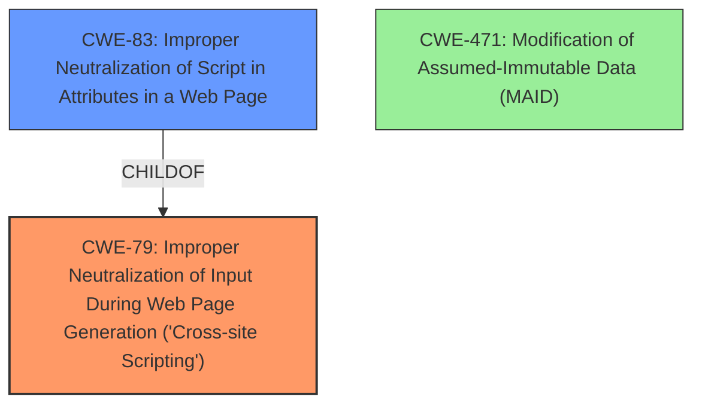

# Analysis Report for CVE-2024-53382

# Vulnerability Analysis Report: CVE-2024-53382

## Description

Prism (aka PrismJS) through 1.29.0 allows DOM Clobbering (with resultant XSS for untrusted input that contains HTML but does not directly contain JavaScript), because document.currentScript lookup can be shadowed by attacker-injected HTML elements.

## Vulnerability Description Key Phrases

- **Rootcause:** document.currentScript lookup shadowing
- **Vector:** untrusted input with HTML
- **Weakness:** XSS, DOM Clobbering
- **Product:** Prism (aka PrismJS)
- **Version:** through 1.29.0

## Analysis (with Relationship Data)

# Summary
| CWE ID | CWE Name | Confidence | CWE Abstraction Level | CWE Vulnerability Mapping Label | CWE-Vulnerability Mapping Notes |
|---|---|---|---|---|---|
| CWE-79 | Improper Neutralization of Input During Web Page Generation ('Cross-site Scripting') | 1.0 | Base | Allowed | Primary CWE. The core weakness is the ability to overwrite the `document.currentScript` object with an attacker-controlled element and leads to XSS. |
| CWE-83 | Improper Neutralization of Script in Attributes in a Web Page | 0.7 | Variant | Allowed | Secondary CWE. The attacker can inject a malicious HTML element and load a script from a controlled domain. |
| CWE-471 | Modification of Assumed-Immutable Data (MAID) | 0.4 | Base | Allowed |  Secondary CWE. The vulnerability stems from the use of `document.currentScript` in the `prism-autoloader.js` plugin without proper type checking. An attacker can shadow this value with a controlled HTML element |

## Evidence and Confidence

*   **Confidence Score:** 0.9
*   **Evidence Strength:** HIGH

## Relationship Analysis
The primary CWE is CWE-79, which describes the XSS vulnerability resulting from improper neutralization. CWE-83 is a variant of CWE-79 and deals with the specific case of improper neutralization of script in attributes. CWE-471 relates to the modification of assumed-immutable data, which in this case is the `document.currentScript` object. The relationship between these CWEs helps to understand the specific nature of the vulnerability.



## Vulnerability Chain
The vulnerability chain starts with the **rootcause** of **document.currentScript lookup shadowing**, leading to DOM Clobbering. This allows an attacker to inject a malicious HTML element, which then results in Cross-Site Scripting (XSS).
  - Initial Flaw: DOM Clobbering vulnerability in the `prism-autoloader` plugin due to missing type checking on `document.currentScript`.
  - Weakness 1: **Improper Neutralization of Input** (CWE-79) - The product doesn't neutralize or incorrectly neutralizes user-controllable input before it is placed in output that is used as a web page.
  - Weakness 2: **Modification of Assumed-Immutable Data** (CWE-471) - The `document.currentScript` object is assumed to be immutable but is modified by attacker-controlled HTML.
  - Final Impact: **Cross-Site Scripting (XSS)** - Arbitrary code execution in the context of the vulnerable webpage.

## Summary of Analysis
The analysis is based on the vulnerability description and the provided CVE content summary. The primary weakness is clearly XSS (CWE-79) as the attacker can inject arbitrary code. The root cause involves DOM Clobbering due to the shadowing of `document.currentScript`.

The evidence from "CVE Reference Links Content Summary" says:
"The vulnerability stems from the use of `document.currentScript` in the `prism-autoloader.js` plugin without proper type checking. An attacker can shadow this value with a controlled HTML element (e.g., an `` tag with a specific `name` attribute)."

The retriever results support the selection of CWE-79 as the primary weakness.

The relationships between CWEs clarify the vulnerability. CWE-83 (Improper Neutralization of Script in Attributes in a Web Page) is a variant of CWE-79 and relates to the specific attack vector of injecting malicious HTML attributes.

CWE-471 has a lower confidence because it describes a more general class of vulnerability, but it is still applicable as the `document.currentScript` object is being modified.

The selected CWEs are at the optimal level of specificity as they describe the vulnerability accurately and provide actionable information for remediation.

Relevant CWE Information:
*   **CWE-79: Improper Neutralization of Input During Web Page Generation ('Cross-site Scripting')**
    *   The product does not neutralize or incorrectly neutralizes user-controllable input before it is placed in output that is used as a web page that is served to other users.
*   **CWE-83: Improper Neutralization of Script in Attributes in a Web Page**
    *   Improper Neutralization of Script in Attributes in a Web Page
*   **CWE-471: Modification of Assumed-Immutable Data (MAID)**
    *   Modification of Assumed-Immutable Data (MAID)

Other CWEs Considered but Not Used:

*   CWE-116 (Improper Encoding or Escaping of Output), CWE-138 (Improper Neutralization of Special Elements) - These are more general and less specific than CWE-79.
*   CWE-95 (Improper Neutralization of Directives in Dynamically Evaluated Code ('Eval Injection')) - While code is being dynamically evaluated, the primary issue is the lack of neutralization leading to XSS.
*   CWE-611 (Improper Restriction of XML External Entity Reference), CWE-112 (Missing XML Validation) - Not relevant as the vulnerability is not related to XML processing.
*   CWE-1333 (Inefficient Regular Expression Complexity) - Not relevant as the vulnerability is not related to regular expressions.
*   CWE-356 (Product UI does not Warn User of Unsafe Actions) - Not relevant as the vulnerability is not related to UI warnings.


## CWE Relationship Analysis

Current CWEs represent these abstraction levels: .


### Vulnerability Chain Analysis

**Chain starting from CWE-471:**
- 471 (Modification of Assumed-Immutable Data (MAID)) - ROOT


**Chain starting from CWE-611:**
- 611 (Improper Restriction of XML External Entity Reference) - ROOT


### CWE Relationship Diagram

```mermaid
graph TD
    classDef primary fill:#f96,stroke:#333,stroke-width:2px
    classDef secondary fill:#69f,stroke:#333
    classDef tertiary fill:#9e9,stroke:#333
```


*Report generated on 2025-07-13 21:55:24*
