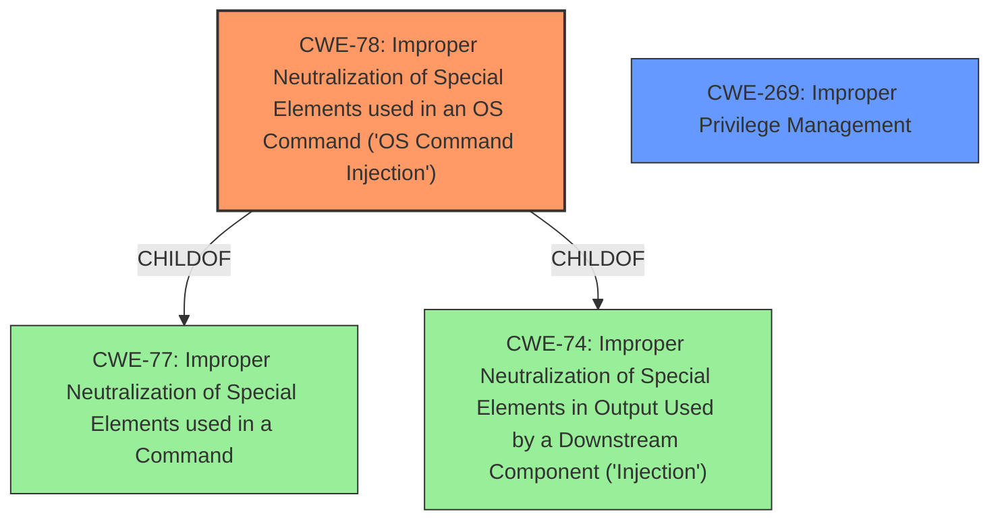

# Analysis for CVE-2024-53672

# Summary
| CWE ID | CWE Name | Confidence | CWE Abstraction Level | CWE Vulnerability Mapping Label | CWE-Vulnerability Mapping Notes |
|---|---|---|---|---|---|
| CWE-78 | Improper Neutralization of Special Elements used in an OS Command ('OS Command Injection') | 0.9 | Base | Allowed | Primary CWE. The application constructs an OS command using externally-influenced input, but it does not neutralize or incorrectly neutralizes special elements that could modify the intended OS command. |
| CWE-269 | Improper Privilege Management | 0.5 | Class | Discouraged | Secondary candidate. The product does not properly assign, modify, track, or check privileges for an actor, creating an unintended sphere of control for that actor. |

## Evidence and Confidence

*   **Confidence Score:** 0.7
*   **Evidence Strength:** LOW

## Relationship Analysis
The primary relationship influencing the decision is that CWE-78 is a base level CWE, which is preferred. CWE-78 also has child relationships to CWE-77 (Improper Neutralization of Special Elements used in a Command) and CWE-74 (Improper Neutralization of Special Elements in Output Used by a Downstream Component ('Injection')), which shows that command injection is a specific type of injection. CWE-269 is a class level CWE and discouraged for use.

## Vulnerability Chain
The vulnerability chain starts with **improper neutralization of special elements used in an OS command** (CWE-78), leading to the ability to **execute arbitrary commands** on the underlying operating system. The initial flaw allows an attacker to inject commands.

## Summary of Analysis
The initial assessment focused on the vulnerability description, which indicated that remote authenticated users could **run arbitrary commands** on the underlying host due to a vulnerability in the ClearPass Policy Manager web-based management interface. This strongly suggests **OS Command Injection** (CWE-78).

The retriever results listed CWE-78 as the top candidate, which reinforces this initial assessment. The description of CWE-78 aligns perfectly with the vulnerability: "The product constructs all or part of an OS command using externally-influenced input from an upstream component, but it does not neutralize or incorrectly neutralizes special elements that could modify the intended OS command when it is sent to a downstream component."

CWE-269 (Improper Privilege Management) was considered because the vulnerability allows execution of commands as a lower-privileged user. However, since the root cause is the **improper neutralization**, not a privilege management issue, CWE-78 is the more appropriate primary CWE. The fact that the attacker gains lower privileged access is a secondary effect of the **command injection**.

The final decision is based on the evidence that the **vulnerability enables command execution through improper neutralization of input**, making CWE-78 the optimal and most specific choice.

Relevant CWE Information:
- CWE-78: Improper Neutralization of Special Elements used in an OS Command ('OS Command Injection')
- CWE-269: Improper Privilege Management