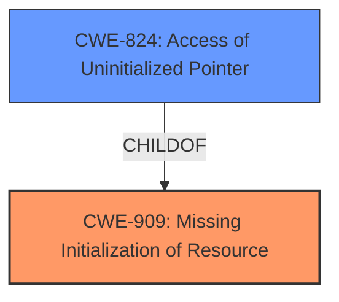

# Analysis Report for CVE-2024-53680

# Vulnerability Analysis Report: CVE-2024-53680

## Description

In the Linux kernel, the following vulnerability has been resolved ipvs fix UB due to **uninitialized stack access** in ip_vs_protocol_init() Under certain kernel configurations when building with Clang/LLVM, the compiler does not generate a return or jump as the terminator instruction for ip_vs_protocol_init(), triggering the following objtool warning during build time vmlinux.o warning objtool ip_vs_protocol_init() falls through to next function __initstub__kmod_ip_vs_rr__935_123_ip_vs_rr_init6() At runtime, this either causes an oops when trying to load the ipvs module or a boot-time panic if ipvs is built-in. This same issue has been reported by the Intel kernel test robot previously. Digging deeper into both LLVM and the kernel code reveals this to be a **undefined behavior** problem. ip_vs_protocol_init() uses a on-stack buffer of 64 chars to store the registered protocol names and leaves it uninitialized after definition. The function calls strnlen() when concatenating protocol names into the buffer. With CONFIG_FORTIFY_SOURCE strnlen() performs an extra step to check whether the last byte of the input char buffer is a null character (commit 3009f891bb9f (fortify Allow strlen() and strnlen() to pass compile-time known lengths)). This, together with possibly other configurations, cause the following IR to be generated define hidden i32 @ip_vs_protocol_init() local_unnamed_addr #5 section .init.text align 16 !kcfi_type !29 { %1 = alloca [64 x i8], align 16 ... 14 preds = %11 %15 = getelementptr inbounds i8, ptr %1, i64 63 %16 = load i8, ptr %15, align 1 %17 = tail call i1 @llvm.is.constant.i8(i8 %16) %18 = icmp eq i8 %16, 0 %19 = select i1 %17, i1 %18, i1 false br i1 %19, label %20, label %23 20 preds = %14 %21 = call i64 @strlen(ptr noundef nonnull dereferenceable(1) %1) #23 ... 23 preds = %14, %11, %20 %24 = call i64 @strnlen(ptr noundef nonnull dereferenceable(1) %1, i64 noundef 64) #24 ... } The above code calculates the address of the last char in the buffer (value %15) and then loads from it (value %16). Because the buffer is never initialized, the LLVM GVN pass marks value %16 as undefined %13 = getelementptr inbounds i8, ptr %1, i64 63 br i1 undef, label %14, label %17 This gives later passes (SCCP, in particular) more DCE opportunities by propagating the undef value further, and eventually removes everything after the load on the uninitialized stack location define hidden i32 @ip_vs_protocol_init() local_unnamed_addr #0 section .init.text align 16 !kcfi_type !11 { %1 = alloca [64 x i8], align 16 ... 12 preds = %11 %13 = getelementptr inbounds i8, ptr %1, i64 63 unreachable } In this way, the generated native code will just fall through to the next function, as LLVM does not generate any code for the unreachable IR instruction and leaves the function without a terminator. Zero the on-stack buffer to avoid this possible UB.

## Vulnerability Description Key Phrases

- **Component:** ip_vs_protocol_init()
- **Rootcause:** uninitialized stack access
- **Weakness:** undefined behavior
- **Product:** Linux kernel
- **Impact:** ['either causes an oops when trying to load the ipvs module', 'or a boot-time panic if ipvs is built-in']

## Analysis (with Relationship Data)

# Summary
| CWE ID | CWE Name | Confidence | CWE Abstraction Level | CWE Vulnerability Mapping Label | CWE-Vulnerability Mapping Notes |
|---|---|---|---|---|---|
| CWE-909 | Missing Initialization of Resource | 0.9 | Class | Primary | Allowed-with-Review |
| CWE-824 | Access of Uninitialized Pointer | 0.7 | Base | Secondary | Allowed |

## Evidence and Confidence

*   **Confidence Score:** 0.8
*   **Evidence Strength:** HIGH

## Relationship Analysis
The primary relationship influencing the decision is the parent-child relationship between CWE-909 (Missing Initialization of Resource) and CWE-824 (Access of Uninitialized Pointer). CWE-909 represents the broader class of missing initialization, while CWE-824 is a more specific case of accessing an uninitialized pointer. The vulnerability description clearly states an "**uninitialized stack access**" leading to **undefined behavior**. While the immediate issue is an access of uninitialized data, the root cause is the missing initialization.



## Vulnerability Chain
The vulnerability chain starts with the **missing initialization** of a stack buffer (`CWE-909`). This leads to the access of **uninitialized data** when `strnlen()` is called on the buffer, which can then lead to **undefined behavior** as LLVM optimizes away the code, causing a fall-through to the next function. This fall-through results in either a kernel oops or boot-time panic.

## Summary of Analysis
The analysis is based on the provided vulnerability description, which clearly indicates an **uninitialized stack access**. The description states "ip_vs_protocol_init() uses a on-stack buffer of 64 chars to store the registered protocol names and leaves it uninitialized after definition." This directly supports the selection of CWE-909 (Missing Initialization of Resource) as the primary cause. The LLVM optimization based on this uninitialized value leads to the "undefined behavior" and subsequent kernel failure. While other CWEs like CWE-789 (Memory Allocation with Excessive Size Value) and CWE-770 (Allocation of Resources Without Limits or Throttling) were considered due to the mention of memory and buffer, they don't accurately describe the core issue of missing initialization. CWE-824 is a valid secondary CWE because the code attempts to load from this uninitialized buffer.

Relevant CWE Information:

# Enhanced Context (25 CWEs)
The following CWEs were identified as potentially relevant to this vulnerability:

## CWE-909: Missing Initialization of Resource
**Abstraction Level**: Class
**Similarity Score**: 0.78
**Source**: dense

**Description**:
The product does not initialize a critical resource.

**Mapping Guidance**:
- Usage: Allowed-with-Review
- Rationale: This CWE entry is a Class and might have Base-level children that would be more appropriate

## CWE-824: Access of Uninitialized Pointer
**Abstraction Level**: Base
**Similarity Score**: 0.78
**Source**: dense

**Description**:
The product accesses or uses a pointer that has not been initialized.

**Mapping Guidance**:
- Usage: Allowed
- Rationale: This CWE entry is at the Base level of abstraction, which is a preferred level of abstraction for mapping to the root causes of vulnerabilities.


## CWE Relationship Analysis

Current CWEs represent these abstraction levels: .


### Vulnerability Chain Analysis

**Chain starting from CWE-824:**
- 824 (Access of Uninitialized Pointer) - ROOT


**Chain starting from CWE-770:**
- 770 (Allocation of Resources Without Limits or Throttling) - ROOT


### CWE Relationship Diagram

```mermaid
graph TD
    classDef primary fill:#f96,stroke:#333,stroke-width:2px
    classDef secondary fill:#69f,stroke:#333
    classDef tertiary fill:#9e9,stroke:#333
```


*Report generated on 2025-07-13 22:01:44*
