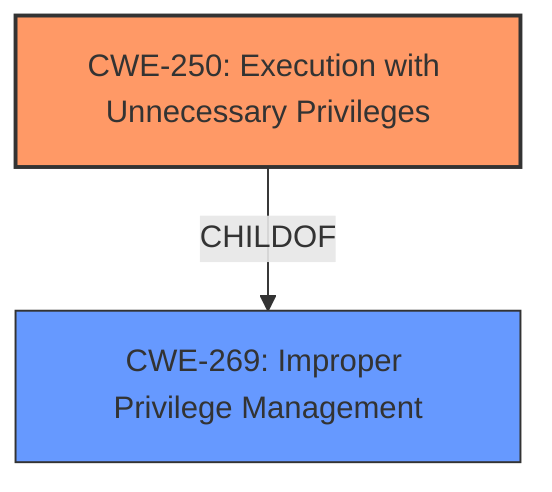

# Analysis Report for CVE-2024-53706

# Vulnerability Analysis Report: CVE-2024-53706

## Description

A vulnerability in the Gen7 SonicOS Cloud platform NSv, allows a remote authenticated local low-privileged attacker to elevate privileges to `root` and potentially lead to code execution.

## Vulnerability Description Key Phrases

- **Product:** Gen7 SonicOS Cloud platform NSv
- **Impact:** privilege elevation, code execution
- **Attacker:** remote authenticated local low-privileged attacker

## Analysis (with Relationship Data)

# Summary
| CWE ID | CWE Name | Confidence | CWE Abstraction Level | CWE Vulnerability Mapping Label | CWE-Vulnerability Mapping Notes |
|---|---|---|---|---|---|
| CWE-250 | Execution with Unnecessary Privileges | 0.75 | Base | Allowed | Primary CWE |
| CWE-266 | Incorrect Privilege Assignment | 0.5 | Base | Allowed | Secondary Candidate |

## Evidence and Confidence

*   **Confidence Score:** 0.6
*   **Evidence Strength:** LOW

## Relationship Analysis
The primary relationship that influenced the decision was the parent-child relationship between CWE-269 (Improper Privilege Management) and CWE-250 (Execution with Unnecessary Privileges). While CWE-269 was a candidate, the description pointed to a specific case of unnecessary privileges, making CWE-250 a more precise fit. The Privilege vs Permissions Guidance section also helped guide the selection.



## Vulnerability Chain
The chain starts with the **vulnerability** in the Gen7 SonicOS Cloud platform NSv. This leads to a low-privileged attacker being able to elevate privileges to `root`, potentially leading to code execution. The root cause is the **Execution with Unnecessary Privileges (CWE-250)**, where the system likely grants more privileges than needed to certain processes, which the attacker then exploits to gain root access.

## Summary of Analysis
The initial analysis considered several CWEs related to privilege management and access control. The final decision hinged on the specific details provided in the vulnerability description. The vulnerability allows a low-privileged attacker to elevate privileges to `root`, potentially leading to code execution.

The selection of CWE-250 is primarily based on the "**privilege elevation**" impact and the potential for code execution. The "Privileges vs Permissions Guidance" section suggests that "escalate to root/admin" indicates a privilege escalation impact, pointing towards CWE-250 as a potential root cause if code is running with higher privileges than needed. The evidence is limited, hence the lower confidence score.

CWE-266 was considered as a potential secondary weakness if the privilege was misassigned.

Relevant CWE Information:

# Enhanced Context (25 CWEs)
The following CWEs were identified as potentially relevant to this vulnerability:

## CWE-250: Execution with Unnecessary Privileges
**Abstraction Level**: Base
**Similarity Score**: 0.061
**Source**: sparse

**Description**:
Code executes with privileges that are not required to perform the intended functionality, which can allow unintended actions, reduced auditing, or other security problems.

## CWE-266: Incorrect Privilege Assignment
**Abstraction Level**: Base
**Similarity Score**: 1236.58
**Source**: sparse

**Description**:
A product incorrectly assigns a privilege to a particular actor, creating an unintended sphere of control for that actor.

## CWE-250: Execution with Unnecessary Privileges
*   **CWE-250 (Execution with Unnecessary Privileges)**: The **root** access gained by the attacker suggests that some part of the system was running with elevated privileges that were not strictly necessary. This aligns with the description of CWE-250. The security implication is that an attacker with low-level access can leverage these unnecessary privileges to gain complete control over the system.
*   **CWE-266 (Incorrect Privilege Assignment)**: This CWE was considered as a secondary factor. If the initial low-privileged user was incorrectly assigned those initial privileges, then CWE-266 would apply in addition to CWE-250.


## CWE Relationship Analysis

Current CWEs represent these abstraction levels: .


### Vulnerability Chain Analysis

**Chain starting from CWE-266:**
- 266 (Incorrect Privilege Assignment) - ROOT


**Chain starting from CWE-269:**
- 269 (Improper Privilege Management) - ROOT


### CWE Relationship Diagram

```mermaid
graph TD
    classDef primary fill:#f96,stroke:#333,stroke-width:2px
    classDef secondary fill:#69f,stroke:#333
    classDef tertiary fill:#9e9,stroke:#333
```


*Report generated on 2025-07-13 22:03:21*
