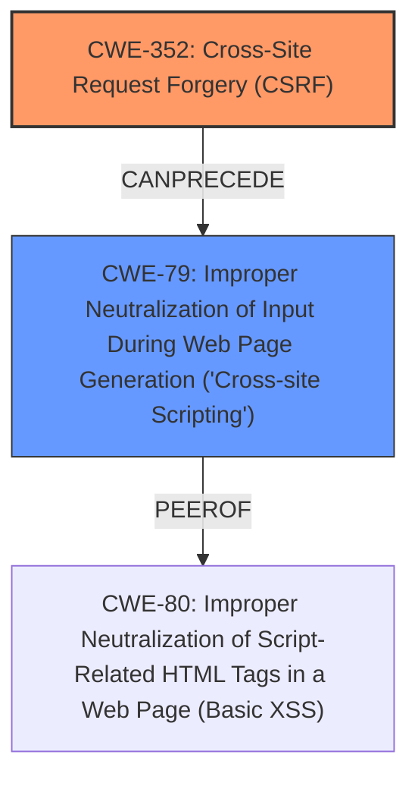

# Analysis for CVE-2024-53715

# Summary
| CWE ID | CWE Name | Confidence | CWE Abstraction Level | CWE Vulnerability Mapping Label | CWE-Vulnerability Mapping Notes |
|---|---|---|---|---|---|
| CWE-352 | Cross-Site Request Forgery (CSRF) | 1.0 | Compound | Primary | Allowed |
| CWE-79 | Improper Neutralization of Input During Web Page Generation ('Cross-site Scripting') | 1.0 | Base | Secondary | Allowed |

## Evidence and Confidence

*   **Confidence Score:** 1.0
*   **Evidence Strength:** HIGH

## Relationship Analysis
The primary weakness is the **lack of CSRF protection**, which allows an attacker to induce users into performing actions they did not intend. This can then lead to a **stored XSS** vulnerability if the attacker uses the **CSRF** vulnerability to inject malicious scripts.

## Vulnerability Chain
The vulnerability chain starts with **lack of CSRF protection (CWE-352)**. An attacker leverages this to inject malicious code. This injected code is then stored and executed in the context of other users due to **Improper Neutralization of Input During Web Page Generation ('Cross-site Scripting') (CWE-79)**, resulting in stored XSS.

## Summary of Analysis
The vulnerability is a combination of **lack of CSRF protection** and **stored XSS**. The **CSRF** vulnerability allows for injecting malicious code, and the **lack of proper neutralization** leads to the **XSS**.

The primary CWE is **CWE-352: Cross-Site Request Forgery (CSRF)** because the **lack of CSRF protection** is the root cause that enables the **XSS** vulnerability. The **Cross-Site Request Forgery (CSRF)** is the **rootcause**.

The secondary CWE is **CWE-79: Improper Neutralization of Input During Web Page Generation ('Cross-site Scripting')** because the application **does not neutralize or incorrectly neutralizes user-controllable input before it is placed in output that is used as a web page that is served to other users**, resulting in stored **XSS**.

The evidence strongly supports this classification, as the vulnerability description explicitly mentions the **lack of CSRF protection** leading to **stored XSS**.

CWEs considered but not used:

*   CWE-434: Unrestricted Upload of File with Dangerous Type - Not applicable because the vulnerability is not related to file uploads.
*   CWE-89: Improper Neutralization of Special Elements used in an SQL Command ('SQL Injection') - Not applicable because the vulnerability is not related to SQL injection.
*   CWE-116: Improper Encoding or Escaping of Output - While encoding issues might be present, the core issue is the lack of neutralization for **XSS**.
*   CWE-80: Improper Neutralization of Script-Related HTML Tags in a Web Page (Basic XSS) - This is a more specific variant of CWE-79, but CWE-79 is more appropriate as the application **does not neutralize or incorrectly neutralizes user-controllable input**.
*   CWE-319: Cleartext Transmission of Sensitive Information - Not relevant to the described vulnerability.
*   CWE-425: Direct Request ('Forced Browsing') - Not directly related to the **CSRF** and **XSS** issues.