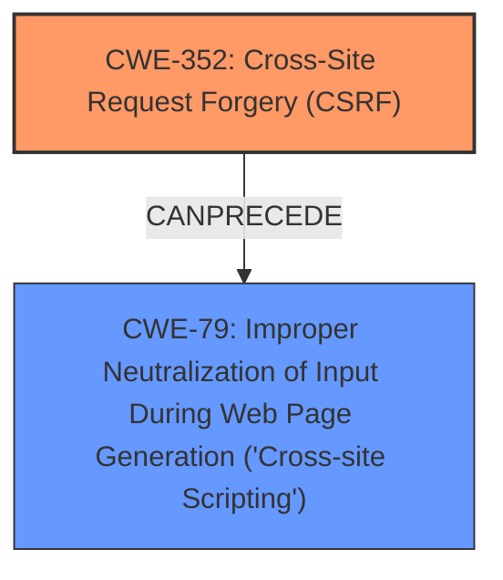

# Analysis Report for CVE-2024-53716

# Vulnerability Analysis Report: CVE-2024-53716

## Description

**Cross-Site Request Forgery** (CSRF) vulnerability in overtrue wp auto top allows Stored **XSS**.This issue affects wp auto top from n/a through 2.9.3.

## Vulnerability Description Key Phrases

- **Rootcause:** lack of CSRF protection
- **Weakness:** ['Cross-Site Request Forgery', 'XSS']
- **Impact:** Stored XSS
- **Product:** overtrue wp auto top
- **Version:** n/a through 2.9.3

## Analysis (with Relationship Data)

# Summary
| CWE ID | CWE Name | Confidence | CWE Abstraction Level | CWE Vulnerability Mapping Label | CWE-Vulnerability Mapping Notes |
|---|---|---|---|---|---|
| CWE-352 | Cross-Site Request Forgery (CSRF) | 1.0 | Compound | Primary | Allowed |
| CWE-79 | Improper Neutralization of Input During Web Page Generation ('Cross-site Scripting') | 1.0 | Base | Secondary | Allowed |

## Evidence and Confidence

*   **Confidence Score:** 1.0
*   **Evidence Strength:** HIGH

## Relationship Analysis
The primary weakness is CWE-352 Cross-Site Request Forgery (CSRF), a compound weakness indicating the web application doesn't sufficiently verify if a request was intentionally provided by the user. The secondary weakness is CWE-79 Improper Neutralization of Input During Web Page Generation ('Cross-site Scripting'), a base weakness because the product doesn't neutralize user-controllable input before placing it in a web page served to other users. CWE-352 can lead to other vulnerabilities like XSS.



## Vulnerability Chain
The vulnerability chain begins with the **lack of CSRF protection** (CWE-352). This allows an attacker to trick a user into performing actions they did not intend, leading to **Stored XSS** (CWE-79) because the malicious input isn't properly neutralized before being displayed to other users.

## Summary of Analysis
The analysis indicates that the primary vulnerability is CWE-352, due to the **lack of CSRF protection**. This allows an attacker to inject malicious scripts into the web application, resulting in stored XSS (CWE-79). The evidence provided clearly supports this classification, and the retriever results align with this assessment.

The vulnerability description explicitly mentions "**Cross-Site Request Forgery** (CSRF) vulnerability" and "**Stored XSS**". The ROOTCAUSE is identified as "**lack of CSRF protection**". This directly maps to CWE-352. The resulting **XSS** maps to CWE-79 because the application does not neutralize user-controllable input.

The selected CWEs are at the optimal level of specificity because they accurately represent the root cause (CWE-352) and the resulting impact (CWE-79) of the vulnerability.

Relevant CWE Information:
- CWE-352: Cross-Site Request Forgery (CSRF)
- CWE-79: Improper Neutralization of Input During Web Page Generation ('Cross-site Scripting')


## CWE Relationship Analysis

Current CWEs represent these abstraction levels: .


### Vulnerability Chain Analysis

**Chain starting from CWE-352:**
- 352 (Cross-Site Request Forgery (CSRF)) - ROOT


**Chain starting from CWE-79:**
- 79 (Improper Neutralization of Input During Web Page Generation ('Cross-site Scripting')) - ROOT


### CWE Relationship Diagram

```mermaid
graph TD
    classDef primary fill:#f96,stroke:#333,stroke-width:2px
    classDef secondary fill:#69f,stroke:#333
    classDef tertiary fill:#9e9,stroke:#333
```


*Report generated on 2025-07-13 22:05:26*
