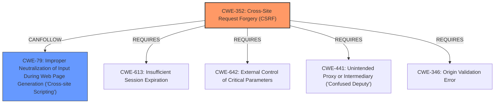

# Analysis Report for CVE-2024-53720

# Vulnerability Analysis Report: CVE-2024-53720

## Description

Cross-Site Request Forgery (CSRF) vulnerability in ole1986 , MachineITSvcs WP-ISPConfig 3 allows Stored **XSS**.This issue affects WP-ISPConfig 3 from n/a through 1.5.6.

## Vulnerability Description Key Phrases

- **Rootcause:** lack of CSRF protection
- **Weakness:** ['XSS', 'cross-site scripting']
- **Impact:** Stored XSS
- **Product:** MachineITSvcs WP-ISPConfig
- **Version:** n/a through 1.5.6

## Analysis (with Relationship Data)

# Summary
| CWE ID    | CWE Name                                                                    | Confidence | CWE Abstraction Level | CWE Vulnerability Mapping Label | CWE-Vulnerability Mapping Notes |
| --------- | --------------------------------------------------------------------------- | ---------- | --------------------- | ------------------------------- | ----------------------------- |
| CWE-352   | Cross-Site Request Forgery (CSRF)                                         | 0.9        | Compound              | Primary                         | Allowed                       |
| CWE-79    | Improper Neutralization of Input During Web Page Generation ('Cross-site Scripting') | 0.8        | Base                  | Secondary                       | Allowed                       |

## Evidence and Confidence

*   **Confidence Score:** 0.85
*   **Evidence Strength:** HIGH

## Relationship Analysis
The primary weakness is the **lack of CSRF protection**, which allows an attacker to induce users into performing actions they did not intend to. The resulting action, in this case, allows for **stored XSS** because of the **improper neutralization of input**.
CWE-352's relationship to other CWEs is that it often requires other CWEs to be present to be exploitable. CWE-79 is a common result of a successful CWE-352 attack when input is not properly neutralized.



## Vulnerability Chain
The vulnerability chain starts with the **lack of CSRF protection (CWE-352)**, which then leads to a **stored XSS vulnerability (CWE-79)** due to **improper input neutralization**.

## Summary of Analysis
The initial assessment identified CWE-352 as the primary root cause, due to the **lack of CSRF protection**. The resulting **Stored XSS** is best characterized by CWE-79, **Improper Neutralization of Input During Web Page Generation ('Cross-site Scripting')**. This is because the root cause **lack of CSRF protection** leads to the impact of **Stored XSS**.

The selection of CWE-352 and CWE-79 is at the optimal level of specificity because they represent the root cause and the direct impact of the vulnerability, respectively.

Relevant CWE Information:

# Enhanced Context (25 CWEs)
The following CWEs were identified as potentially relevant to this vulnerability:

## ROOTCAUSE: 'lack of CSRF protection'

### 1. CWE-352: Cross-Site Request Forgery (CSRF) (Score: 315.45)

The web application does not, or can not, sufficiently verify whether a well-formed, valid, consistent request was intentionally provided by the user who submitted the request....

### 2. CWE-434: Unrestricted Upload of File with Dangerous Type (Score: 241.14)

The product allows the upload or transfer of dangerous file types that are automatically processed within its environment....

### 3. CWE-79: Improper Neutralization of Input During Web Page Generation ('Cross-site Scripting') (Score: 207.52)

The product does not neutralize or incorrectly neutralizes user-controllable input before it is placed in output that is used as a web page that is served to other users....

## WEAKNESS: 'XSS'

### 3. CWE-79: Improper Neutralization of Input During Web Page Generation ('Cross-site Scripting') (Score: 207.52)

The product does not neutralize or incorrectly neutralizes user-controllable input before it is placed in output that is used as a web page that is served to other users....

### 5. CWE-1004: Sensitive Cookie Without 'HttpOnly' Flag (Score: 155.36)

The product uses a cookie to store sensitive information, but the cookie is not marked with the HttpOnly flag....

## WEAKNESS: 'cross-site scripting'

### 3. CWE-79: Improper Neutralization of Input During Web Page Generation ('Cross-site Scripting') (Score: 207.52)

The product does not neutralize or incorrectly neutralizes user-controllable input before it is placed in output that is used as a web page that is served to other users....

## IMPACT: 'Stored XSS'

### 3. CWE-79: Improper Neutralization of Input During Web Page Generation ('Cross-site Scripting') (Score: 207.52)

The product does not neutralize or incorrectly neutralizes user-controllable input before it is placed in output that is used as a web page that is served to other users....

### 5. CWE-1004: Sensitive Cookie Without 'HttpOnly' Flag (Score: 155.36)

The product uses a cookie to store sensitive information, but the cookie is not marked with the HttpOnly flag....


## CWE Relationship Analysis

Current CWEs represent these abstraction levels: .


### Vulnerability Chain Analysis

**Chain starting from CWE-346:**
- 346 (Origin Validation Error) - ROOT


**Chain starting from CWE-79:**
- 79 (Improper Neutralization of Input During Web Page Generation ('Cross-site Scripting')) - ROOT


### CWE Relationship Diagram

```mermaid
graph TD
    classDef primary fill:#f96,stroke:#333,stroke-width:2px
    classDef secondary fill:#69f,stroke:#333
    classDef tertiary fill:#9e9,stroke:#333
```


*Report generated on 2025-07-13 22:06:31*
