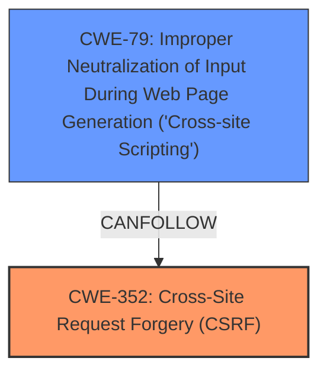

# Analysis Report for CVE-2024-53729

# Vulnerability Analysis Report: CVE-2024-53729

## Description

Cross-Site Request Forgery (CSRF) vulnerability in Plumeria Web Design Blizzard Quotes allows Stored **XSS**.This issue affects Blizzard Quotes from n/a through 1.3.

## Vulnerability Description Key Phrases

- **Rootcause:** lack of CSRF protection
- **Weakness:** ['XSS', 'cross-site scripting']
- **Product:** Plumeria Web Design Blizzard Quotes
- **Version:** n/a through 1.3

## Analysis (with Relationship Data)

# Summary
| CWE ID | CWE Name | Confidence | CWE Abstraction Level | CWE Vulnerability Mapping Label | CWE-Vulnerability Mapping Notes |
|---|---|---|---|---|---|
| CWE-352 | Cross-Site Request Forgery (CSRF) | 0.9 | Compound | Primary | Allowed |
| CWE-79 | Improper Neutralization of Input During Web Page Generation ('Cross-site Scripting') | 0.8 | Base | Secondary | Allowed |

## Evidence and Confidence

*   **Confidence Score:** 0.85
*   **Evidence Strength:** HIGH

## Relationship Analysis
The primary weakness is the **lack of CSRF protection**, which can allow an attacker to induce users into performing actions they did not intend, such as **XSS**. CWE-352, Cross-Site Request Forgery (CSRF), is a compound weakness that perfectly describes this **root cause**. The secondary weakness is CWE-79, Improper Neutralization of Input During Web Page Generation ('Cross-site Scripting'), which is the impact of the **lack of CSRF protection**. CWE-79 is a base-level CWE, providing a good level of specificity.



## Vulnerability Chain
The vulnerability chain starts with the **lack of CSRF protection** (CWE-352), which allows an attacker to inject malicious script. This script is then executed in the user's browser because of **improper neutralization of input** (CWE-79), leading to stored **XSS**.

*   **Root Cause:** CWE-352: Cross-Site Request Forgery (CSRF) - **lack of CSRF protection**
*   **Weakness:** CWE-79: Improper Neutralization of Input During Web Page Generation ('Cross-site Scripting') - leading to Stored **XSS**
*   **Impact:** Stored **XSS**

## Summary of Analysis
The analysis indicates that the primary **root cause** of this vulnerability is the **lack of CSRF protection**, which is accurately represented by CWE-352. The resulting stored **XSS** is a consequence of **improper neutralization of input**, which is best described by CWE-79.

The vulnerability description clearly states: "Cross-Site Request Forgery (CSRF) vulnerability in Plumeria Web Design Blizzard Quotes allows Stored **XSS**." This provides direct evidence for selecting both CWE-352 and CWE-79. The retriever also listed CWE-352, CWE-79, and CWE-80 as potential matches.

CWE-80, Improper Neutralization of Script-Related HTML Tags in a Web Page (Basic XSS), was considered but not selected as the primary CWE because the vulnerability description highlights the **lack of CSRF protection** as the **root cause**, which enables the stored **XSS**. Therefore, CWE-352 is the more appropriate primary CWE. The stored **XSS** itself is caused by CWE-79.

The final selection is based on the provided evidence, the relationship between the weaknesses, and the MITRE mapping guidance. The selected CWEs are at the optimal level of specificity, with CWE-352 being a compound weakness and CWE-79 being a base weakness.


## CWE Relationship Analysis

Current CWEs represent these abstraction levels: .


### Vulnerability Chain Analysis

**Chain starting from CWE-352:**
- 352 (Cross-Site Request Forgery (CSRF)) - ROOT


**Chain starting from CWE-79:**
- 79 (Improper Neutralization of Input During Web Page Generation ('Cross-site Scripting')) - ROOT


### CWE Relationship Diagram

```mermaid
graph TD
    classDef primary fill:#f96,stroke:#333,stroke-width:2px
    classDef secondary fill:#69f,stroke:#333
    classDef tertiary fill:#9e9,stroke:#333
```


*Report generated on 2025-07-13 22:09:00*
