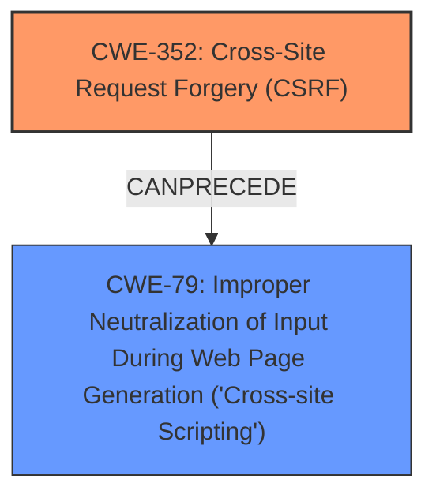

# Raw Analyzer Response for CVE-2024-53779

# Summary
| CWE ID | CWE Name | Confidence | CWE Abstraction Level | CWE Vulnerability Mapping Label | CWE-Vulnerability Mapping Notes |
|---|---|---|---|---|---|
| CWE-352 | Cross-Site Request Forgery (CSRF) | 0.9 | Compound | Primary | Allowed |
| CWE-79 | Improper Neutralization of Input During Web Page Generation ('Cross-site Scripting') | 0.8 | Base | Secondary | Allowed |

## Evidence and Confidence

*   **Confidence Score:** 0.85
*   **Evidence Strength:** HIGH

## Relationship Analysis
The primary weakness is **CWE-352 Cross-Site Request Forgery (CSRF)**, which allows an attacker to induce a user to perform actions without their consent. The exploitation of this **CSRF** vulnerability leads to stored **XSS** (**CWE-79 Improper Neutralization of Input During Web Page Generation ('Cross-site Scripting')**). **CWE-352** can lead to **CWE-79** if the attacker is able to inject malicious scripts via the **CSRF** vulnerability.

## Vulnerability Chain
The vulnerability chain starts with the **Cross-Site Request Forgery (CSRF)** vulnerability (**CWE-352**). A successful **CSRF** attack leads to Stored **XSS** (**CWE-79**), where the injected script is stored on the server and executed when other users visit the affected page.

## Summary of Analysis
The analysis is based on the vulnerability description, which explicitly states that a **Cross-Site Request Forgery (CSRF)** vulnerability exists in the Max Engel Yahoo! WebPlayer, leading to Stored **XSS**. The "CVE Reference Links Content Summary" section confirms the **root cause** as a **CSRF** vulnerability due to the **lack of proper protection against CSRF attacks**. The impact of exploiting this **CSRF** is the ability to force a higher-privileged user to execute unintended actions, potentially leading to unauthorized modifications. The "Vulnerability Description Key Phrases" section highlights the **rootcause** as **Cross-Site Request Forgery (CSRF)** and the **weakness** as **XSS**.

Based on the evidence and relationship analysis, the primary CWE is **CWE-352 Cross-Site Request Forgery (CSRF)**, and the secondary CWE is **CWE-79 Improper Neutralization of Input During Web Page Generation ('Cross-site Scripting')**. These CWEs are at the optimal level of specificity as **CWE-352** is a Compound weakness and **CWE-79** is a Base weakness.

Relevant CWE Information:

# Enhanced Context (25 CWEs)
The following CWEs were identified as potentially relevant to this vulnerability:

## CWE-352: Cross-Site Request Forgery (CSRF)
**Abstraction Level**: Compound
**Similarity Score**: 0.75
**Source**: dense

**Description**:
The web application does not, or can not, sufficiently verify whether a well-formed, valid, consistent request was intentionally provided by the user who submitted the request.

**Mapping Guidance**:
- Usage: Allowed
- Rationale: This is a well-known Composite of multiple weaknesses that must all occur simultaneously, although it is attack-oriented in nature.

**Explanation**: This CWE is highly relevant because the vulnerability description clearly states the presence of a **CSRF** vulnerability. The description of **CWE-352** aligns perfectly with the vulnerability where the application fails to verify the origin of the request.

## CWE-80: Improper Neutralization of Script-Related HTML Tags in a Web Page (Basic XSS)
**Abstraction Level**: Variant
**Similarity Score**: 0.73
**Source**: dense

**Description**:
The product receives input from an upstream component, but it does not neutralize or incorrectly neutralizes special characters such as "<", ">", and "&" that could be interpreted as web-scripting elements when they are sent to a downstream component that processes web pages.

**Mapping Guidance**:
- Usage: Allowed
- Rationale: This CWE entry is at the Variant level of abstraction, which is a preferred level of abstraction for mapping to the root causes of vulnerabilities.

**Explanation**: This CWE is related to the Stored **XSS** aspect of the vulnerability, where user input is not properly neutralized, leading to potential script injection.

## CWE-116: Improper Encoding or Escaping of Output
**Abstraction Level**: Class
**Similarity Score**: 0.73
**Source**: dense

**Description**:
The product prepares a structured message for communication with another component, but encoding or escaping of the data is either missing or done incorrectly. As a result, the intended structure of the message is not preserved.

**Mapping Guidance**:
- Usage: Allowed-with-Review
- Rationale: This CWE entry is a Class and might have Base-level children that would be more appropriate

**Explanation**: This CWE could be related to the Stored **XSS** as a result of **CSRF**, where the output is not properly encoded, leading to the execution of malicious scripts.

## CWE-472: External Control of Assumed-Immutable Web Parameter
**Abstraction Level**: Base
**Similarity Score**: 0.71
**Source**: dense

**Description**:
The web application does not sufficiently verify inputs that are assumed to be immutable but are actually externally controllable, such as hidden form fields.

**Mapping Guidance**:
- Usage: Allowed
- Rationale: This CWE entry is at the Base level of abstraction, which is a preferred level of abstraction for mapping to the root causes of vulnerabilities.

**Explanation**: This CWE is less relevant because it focuses on immutable parameters, while the main issue is the lack of **CSRF** protection leading to Stored **XSS**.

## CWE-425: Direct Request ('Forced Browsing')
**Abstraction Level**: Base
**Similarity Score**: 0.71
**Source**: dense

**Description**:
The web application does not adequately enforce appropriate authorization on all restricted URLs, scripts, or files.

**Mapping Guidance**:
- Usage: Allowed
- Rationale: This CWE entry is at the Base level of abstraction, which is a preferred level of abstraction for mapping to the root causes of vulnerabilities.

**Explanation**: This CWE is not the primary issue, but it could be related if the **CSRF** vulnerability allows bypassing authorization checks.

## CWE-79: Improper Neutralization of Input During Web Page Generation ('Cross-site Scripting')
**Abstraction Level**: Base
**Similarity Score**: 0.71
**Source**: dense

**Description**:
The product does not neutralize or incorrectly neutralizes user-controllable input before it is placed in output that is used as a web page that is served to other users.

**Mapping Guidance**:
- Usage: Allowed
- Rationale: This CWE entry is at the Base level of abstraction, which is a preferred level of abstraction for mapping to the root causes of vulnerabilities.

**Explanation**: This is relevant because the impact of the **CSRF** vulnerability is Stored **XSS**, which involves the injection of malicious scripts into the web page.

## CWE-918: Server-Side Request Forgery (SSRF)
**Abstraction Level**: Base
**Similarity Score**: 0.71
**Source**: dense

**Description**:
The web server receives a URL or similar request from an upstream component and retrieves the contents of this URL, but it does not sufficiently ensure that the request is being sent to the expected destination.

**Mapping Guidance**:
- Usage: Allowed
- Rationale: This CWE entry is at the Base level of abstraction, which is a preferred level of abstraction for mapping to the root causes of vulnerabilities.

**Explanation**: This CWE is not relevant as the vulnerability description focuses on **CSRF** and **XSS**, not server-side request forgery.

## CWE-346: Origin Validation Error
**Abstraction Level**: Class
**Similarity Score**: 0.70
**Source**: dense

**Description**:
The product does not properly verify that the source of data or communication is valid.

**Mapping Guidance**:
- Usage: Allowed-with-Review
- Rationale: This CWE entry is a Class and might have Base-level children that would be more appropriate

**Explanation**: This is related to the **CSRF** vulnerability because the application does not properly validate the origin of the request.

## CWE-502: Deserialization of Untrusted Data
**Abstraction Level**: Base
**Similarity Score**: 0.69
**Source**: dense

**Description**:
The product deserializes untrusted data without sufficiently ensuring that the resulting data will be valid.

**Mapping Guidance**:
- Usage: Allowed
- Rationale: This CWE entry is at the Base level of abstraction,