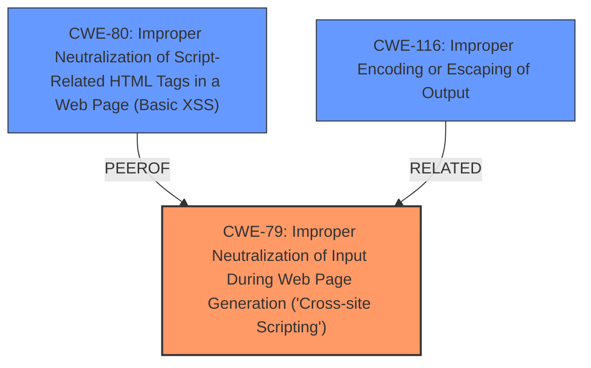

# Enhanced Analysis for CVE-2024-53787

# Summary
| CWE ID | CWE Name | Confidence | CWE Abstraction Level | CWE Vulnerability Mapping Label | CWE-Vulnerability Mapping Notes |
|---|---|---|---|---|---|
| CWE-79 | Improper Neutralization of Input During Web Page Generation ('Cross-site Scripting') | 1.0 | Base | Allowed | Primary CWE |

## Evidence and Confidence

*   **Confidence Score:** 1.0
*   **Evidence Strength:** HIGH

## Relationship Analysis
The primary relationship that influenced the decision was the direct match of the vulnerability description to the definition of CWE-79. While other CWEs like CWE-80 and CWE-116 are related to input handling and output encoding, CWE-79 specifically addresses the scenario where user-controllable input is not properly neutralized before being used in a web page, resulting in Cross-Site Scripting.



## Vulnerability Chain
The vulnerability chain consists of a single step: **Improper Neutralization of Input During Web Page Generation** leading directly to Stored **XSS**. The root cause is the lack of proper input sanitization, and the impact is the execution of malicious scripts in the user's browser.

## Summary of Analysis
The analysis is primarily based on the provided vulnerability description, which clearly states "**Improper Neutralization of Input During Web Page Generation** (Cross-site Scripting) vulnerability... allows Stored **XSS**." This statement strongly suggests CWE-79 as the primary weakness.

The graph relationships show that CWE-80 and CWE-116 are related, but CWE-79 is a more direct and specific match for the described vulnerability.

The selection of CWE-79 is at the optimal level of specificity, as it accurately reflects the root cause of the vulnerability and its direct impact.

Relevant CWE Information:

# Enhanced Context (25 CWEs)
The following CWEs were identified as potentially relevant to this vulnerability:

## CWE-79: Improper Neutralization of Input During Web Page Generation ('Cross-site Scripting')
**Abstraction Level**: Base
**Similarity Score**: 292.90
**Source**: keyphrase

**Description**:
The product does not neutralize or incorrectly neutralizes user-controllable input before it is placed in output that is used as a web page that is served to other users.

**Mapping Guidance**:
- Usage: Allowed
- Rationale: This CWE entry is at the Base level of abstraction, which is a preferred level of abstraction for mapping to the root causes of vulnerabilities.

## CWE-80: Improper Neutralization of Script-Related HTML Tags in a Web Page (Basic XSS)
**Abstraction Level**: Variant
**Similarity Score**: 280.00
**Source**: keyphrase

**Description**:
The product receives input from an upstream component, but it does not neutralize or incorrectly neutralizes special characters such as "<", ">", and "&" that could be interpreted as web-scripting elements when they are sent to a downstream component that processes web pages.

**Mapping Guidance**:
- Usage: Allowed
- Rationale: This CWE entry is at the Variant level of abstraction, which is a preferred level of abstraction for mapping to the root causes of vulnerabilities.

## CWE-116: Improper Encoding or Escaping of Output
**Abstraction Level**: Class
**Similarity Score**: 259.00
**Source**: keyphrase

**Description**:
The product prepares a structured message for communication with another component, but encoding or escaping of the data is either missing or done incorrectly. As a result, the intended structure of the message is not preserved.

**Mapping Guidance**:
- Usage: Allowed-with-Review
- Rationale: This CWE entry is a Class and might have Base-level children that would be more appropriate

## CWE-89: Improper Neutralization of Special Elements used in an SQL Command ('SQL Injection')
**Abstraction Level**: Base
**Similarity Score**: 240.45
**Source**: keyphrase

**Description**:
The product constructs all or part of an SQL command using externally-influenced input from an upstream component, but it does not neutralize or incorrectly neutralizes special elements that could modify the intended SQL command when it is sent to a downstream component. Without sufficient removal o...

**Mapping Guidance**:
- Usage: Allowed
- Rationale: This CWE entry is at the Base level of abstraction, which is a preferred level of abstraction for mapping to the root causes of vulnerabilities.

## CWE-352: Cross-Site Request Forgery (CSRF)
**Abstraction Level**: Compound
**Similarity Score**: 237.27
**Source**: keyphrase

**Description**:
The web application does not, or can not, sufficiently verify whether a well-formed, valid, consistent request was intentionally provided by the user who submitted the request.

**Mapping Guidance**:
- Usage: Allowed
- Rationale: This is a well-known Composite of multiple weaknesses that must all occur simultaneously, although it is attack-oriented in nature.

## CWE-434: Unrestricted Upload of File with Dangerous Type
**Abstraction Level**: Base
**Similarity Score**: 182.82
**Source**: keyphrase

**Description**:
The product allows the upload or transfer of dangerous file types that are automatically processed within its environment.

**Mapping Guidance**:
- Usage: Allowed
- Rationale: This CWE entry is at the Base level of abstraction, which is a preferred level of abstraction for mapping to the root causes of vulnerabilities.

I considered CWE-80, **Improper Neutralization of Script-Related HTML Tags in a Web Page (Basic XSS)**, and CWE-116, **Improper Encoding or Escaping of Output**. While these are related to **XSS**, CWE-79 is a more direct and encompassing classification for the given vulnerability description because the description indicates a general failure to neutralize input during web page generation. CWE-80 is more specific to HTML tags, and CWE-116 relates to encoding/escaping, which may or may not be the primary issue. CWE-89 and CWE-352 are not relevant because they refer to SQL Injection and CSRF respectively, which are not indicated in the vulnerability description. CWE-434 is not relevant because it refers to unrestricted file uploads, which is also not indicated in the vulnerability description.


## CWE Relationship Analysis

Current CWEs represent these abstraction levels: .


### Vulnerability Chain Analysis

**Chain starting from CWE-89:**
- 89 (Improper Neutralization of Special Elements used in an SQL Command ('SQL Injection')) - ROOT


**Chain starting from CWE-116:**
- 116 (Improper Encoding or Escaping of Output) - ROOT


### CWE Relationship Diagram

```mermaid
graph TD
    classDef primary fill:#f96,stroke:#333,stroke-width:2px
    classDef secondary fill:#69f,stroke:#333
    classDef tertiary fill:#9e9,stroke:#333
```