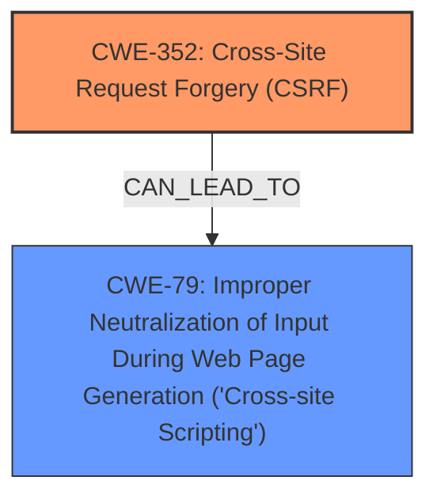

# Analysis Report for CVE-2024-53789

# Vulnerability Analysis Report: CVE-2024-53789

## Description

**Cross-Site Request Forgery** (CSRF) vulnerability in Ritesh Sanap Advanced What should we write next about allows **Stored XSS**.This issue affects Advanced What should we write next about from n/a through 1.0.3.

## Vulnerability Description Key Phrases

- **Rootcause:** Cross-Site Request Forgery
- **Weakness:** Stored XSS
- **Product:** Ritesh Sanap Advanced What should we write next about
- **Version:** n/a through 1.0.3

## Analysis (with Relationship Data)

# Summary
| CWE ID  | CWE Name                                                                    | Confidence | CWE Abstraction Level | CWE Vulnerability Mapping Label | CWE-Vulnerability Mapping Notes |
| :-------- | :-------------------------------------------------------------------------- | :--------- | :---------------------- | :------------------------------ | :-------------------------------- |
| CWE-352   | Cross-Site Request Forgery (CSRF)                                         | 0.9        | Compound                | Primary                         | Allowed                           |
| CWE-79    | Improper Neutralization of Input During Web Page Generation ('Cross-site Scripting') | 0.7        | Base                    | Secondary                       | Allowed                           |

## Evidence and Confidence

*   **Confidence Score:** 0.8
*   **Evidence Strength:** MEDIUM

## Relationship Analysis
The primary weakness is identified as CWE-352 [Cross-Site Request Forgery (CSRF)], which is a compound weakness. The vulnerability description also mentions **Stored XSS**, which maps to CWE-79 [Improper Neutralization of Input During Web Page Generation ('Cross-site Scripting')]. CWE-79 can be a consequence of a CSRF attack if an attacker uses CSRF to inject malicious scripts into the application's data. There is no direct parent-child relationship between these CWEs, but a CAN FOLLOW relationship exists, where a successful CSRF (CWE-352) attack can lead to XSS (CWE-79).



## Vulnerability Chain
The vulnerability chain starts with CWE-352 [Cross-Site Request Forgery (CSRF)], where an attacker tricks a user into performing unwanted actions. If the application doesn't properly validate requests, this can lead to the injection of malicious scripts, resulting in CWE-79 [Improper Neutralization of Input During Web Page Generation ('Cross-site Scripting')].

## Summary of Analysis
The vulnerability description clearly states that the plugin is vulnerable to **Cross-Site Request Forgery** (CSRF). The "CVE Reference Links Content Summary" section supports this by stating: "The WordPress Advanced What should we write next about Plugin <=1.0.3 is vulnerable to Cross Site Request Forgery (CSRF)." This confirms CWE-352 [Cross-Site Request Forgery (CSRF)] as the primary issue.

The description also mentions **Stored XSS**. This suggests that a successful CSRF attack could be used to inject malicious scripts into the application, leading to CWE-79 [Improper Neutralization of Input During Web Page Generation ('Cross-site Scripting')].

CWE-352 is a Compound type and represents the root cause. CWE-79 is a Base type and represents the resulting weakness of the root cause. Both are at appropriate levels of specificity.

CWE-918 [Server-Side Request Forgery (SSRF)], CWE-601 [URL Redirection to Untrusted Site ('Open Redirect')], CWE-89 [Improper Neutralization of Special Elements used in an SQL Command ('SQL Injection')], CWE-80 [Improper Neutralization of Script-Related HTML Tags in a Web Page (Basic XSS)], CWE-1004 [Sensitive Cookie Without 'HttpOnly' Flag], CWE-444 [Inconsistent Interpretation of HTTP Requests ('HTTP Request/Response Smuggling')], CWE-113 [Improper Neutralization of CRLF Sequences in HTTP Headers ('HTTP Request/Response Splitting')], CWE-184 [Incomplete List of Disallowed Inputs] were considered. However, they do not accurately represent the primary vulnerability described, which is CSRF leading to Stored XSS.


## CWE Relationship Analysis

Current CWEs represent these abstraction levels: .


### Vulnerability Chain Analysis

**Chain starting from CWE-89:**
- 89 (Improper Neutralization of Special Elements used in an SQL Command ('SQL Injection')) - ROOT


**Chain starting from CWE-80:**
- 80 (Improper Neutralization of Script-Related HTML Tags in a Web Page (Basic XSS)) - ROOT


### CWE Relationship Diagram

```mermaid
graph TD
    classDef primary fill:#f96,stroke:#333,stroke-width:2px
    classDef secondary fill:#69f,stroke:#333
    classDef tertiary fill:#9e9,stroke:#333
```


*Report generated on 2025-07-13 22:15:10*
