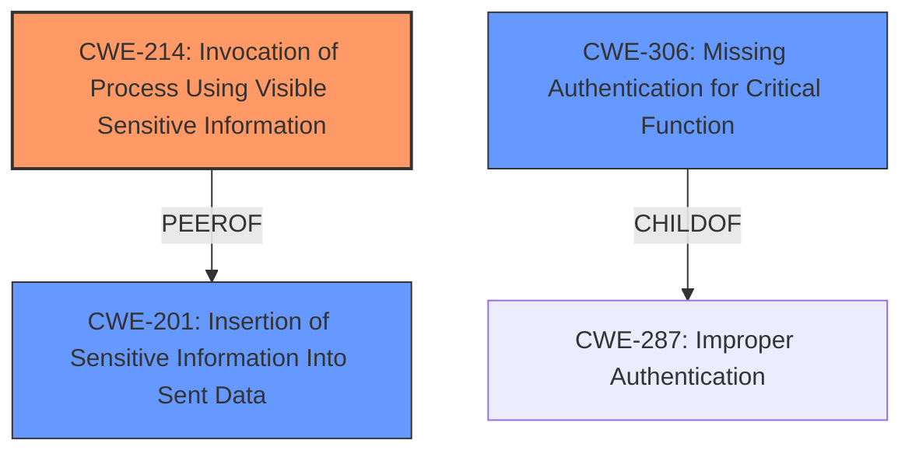

# Analysis for CVE-2024-53858

# Summary
| CWE ID | CWE Name | Confidence | CWE Abstraction Level | CWE Vulnerability Mapping Label | CWE-Vulnerability Mapping Notes |
|---|---|---|---|---|---|
| CWE-214 | Invocation of Process Using Visible Sensitive Information | 0.8 | Base | Primary | Allowed |
| CWE-306 | Missing Authentication for Critical Function | 0.7 | Base | Secondary Candidate | Allowed |
| CWE-201 | Insertion of Sensitive Information Into Sent Data | 0.6 | Base | Secondary Candidate | Allowed |

## Evidence and Confidence

*   **Confidence Score:** 0.8
*   **Evidence Strength:** HIGH

## Relationship Analysis
The primary CWE selected is CWE-214, which focuses on the exposure of sensitive information through process invocation. While other CWEs like CWE-306 (Missing Authentication) and CWE-201 (Data Leak) were considered, CWE-214 best captures the core issue of authentication tokens being visibly exposed to external processes. CWE-214 is a base level CWE, providing sufficient specificity. The weakness here is that the sensitive information is being passed to git, which will use it with submodules and potentially leak it to third parties.

## Vulnerability Chain
The vulnerability chain begins with the **improper access control** in the GitHub CLI, leading to the exposure of authentication tokens. The GitHub CLI invokes `git` and passes along the credentials, which are then potentially leaked.
1.  **Root Cause:** **Improper Access Control**: The GitHub CLI does not properly restrict which hosts are treated as GitHub Enterprise Server instances, leading to the inclusion of authentication tokens for external hosts.
2.  **Mid-Chain Weakness:** CWE-214 (Invocation of Process Using Visible Sensitive Information): The authentication tokens are passed visibly to the `git` process.
3.  **Impact:** Leak of Authentication Tokens: The authentication tokens are sent to external hosts, potentially leading to unauthorized access to resources.

## Summary of Analysis
The primary classification is CWE-214 (Invocation of Process Using Visible Sensitive Information). This is supported by the vulnerability description, which states that the `gh` command invokes `git` with instructions to retrieve authentication tokens. The vulnerability lies in how the CLI makes authentication tokens available to external processes, specifically `git`, without proper validation of the host.

The **rootcause** is **improper access control** related to how `gh` handles authentication tokens for non-GitHub hosts. This results in the tokens being made available to external processes (git), which can then transmit them to third-party servers when cloning submodules.

CWE-306 (Missing Authentication for Critical Function) was considered because the CLI **does not properly** authenticate the host before providing the tokens, but it is not a case of completely missing authentication. CWE-201 (Insertion of Sensitive Information Into Sent Data) was also considered, but CWE-214 better represents the specific scenario of invoking a process with visible sensitive information.

The evidence supporting CWE-214 is found in the "CVE Reference Links Content Summary": "The `gh` CLI commands invoke `git` with instructions to retrieve authentication tokens using the `credential.helper` configuration for any encountered host, including non-GitHub hosts."

The selection of CWE-214 is at the appropriate level of specificity, as it directly addresses the vulnerability's mechanism of action, which is the exposure of sensitive information through process invocation.

Relevant CWE Information:
# Enhanced Context (25 CWEs)
The following CWEs were identified as potentially relevant to this vulnerability:

## CWE-212: Improper Removal of Sensitive Information Before Storage or Transfer
**Abstraction Level**: Base
**Similarity Score**: 0.79
**Source**: dense

**Description**:
The product stores, transfers, or shares a resource that contains sensitive information, but it does not properly remove that information before the product makes the resource available to unauthorized actors.

**Mapping Guidance**:
- Usage: Allowed
- Rationale: This CWE entry is at the Base level of abstraction, which is a preferred level of abstraction for mapping to the root causes of vulnerabilities.

## CWE-88: Improper Neutralization of Argument Delimiters in a Command ('Argument Injection')
**Abstraction Level**: Base
**Similarity Score**: 0.77
**Source**: dense

**Description**:
The product constructs a string for a command to be executed by a separate component
in another control sphere, but it does not properly delimit the
intended arguments, options, or switches within that command string.

**Mapping Guidance**:
- Usage: Allowed
- Rationale: This CWE entry is at the Base level of abstraction, which is a preferred level of abstraction for mapping to the root causes of vulnerabilities.

## CWE-74: Improper Neutralization of Special Elements in Output Used by a Downstream Component ('Injection')
**Abstraction Level**: Class
**Similarity Score**: 0.76
**Source**: dense

**Description**:
The product constructs all or part of a command, data structure, or record using externally-influenced input from an upstream component, but it does not neutralize or incorrectly neutralizes special elements that could modify how it is parsed or interpreted when it is sent to a downstream component.

**Mapping Guidance**:
- Usage: Discouraged
- Rationale: CWE-74 is high-level and often misused when lower-level weaknesses are more appropriate.

## CWE-267: Privilege Defined With Unsafe Actions
**Abstraction Level**: Base
**Similarity Score**: 0.76
**Source**: dense

**Description**:
A particular privilege, role, capability, or right can be used to perform unsafe actions that were not intended, even when it is assigned to the correct entity.

**Mapping Guidance**:
- Usage: Allowed
- Rationale: This CWE entry is at the Base level of abstraction, which is a preferred level of abstraction for mapping to the root causes of vulnerabilities.

## CWE-538: Insertion of Sensitive Information into Externally-Accessible File or Directory
**Abstraction Level**: Base
**Similarity Score**: 0.76
**Source**: dense

**Description**:
The product places sensitive information into files or directories that are accessible to actors who are allowed to have access to the files, but not to the sensitive information.

**Mapping Guidance**:
- Usage: Allowed
- Rationale: This CWE entry is at the Base level of abstraction, which is a preferred level of abstraction for mapping to the root causes of vulnerabilities.

## CWE-639: Authorization Bypass Through User-Controlled Key
**Abstraction Level**: Base
**Similarity Score**: 0.76
**Source**: dense

**Description**:
The system's authorization functionality does not prevent one user from gaining access to another user's data or record by modifying the key value identifying the data.

**Mapping Guidance**:
- Usage: Allowed
- Rationale: This CWE entry is at the Base level of abstraction, which is a preferred level of abstraction for mapping to the root causes of vulnerabilities.

## CWE-1390: Weak Authentication
**Abstraction Level**: Class
**Similarity Score**: 0.76
**Source**: dense

**Description**:
The product uses an authentication mechanism to restrict access to specific users or identities, but the mechanism does not sufficiently prove that the claimed identity is correct.

**Mapping Guidance**:
- Usage: Allowed-with-Review
- Rationale: This CWE entry is a Class and might have Base-level children that would be more appropriate

## CWE-1286: Improper Validation of Syntactic Correctness of Input
**Abstraction Level**: Base
**Similarity Score**: 0.76
**Source**: dense

**Description**:
The product receives input that is expected to be well-formed - i.e., to comply with a certain syntax - but it does not validate or incorrectly validates that the input complies with the syntax.

**Mapping Guidance**:
- Usage: Allowed
- Rationale: This CWE entry is at the Base level of abstraction, which is a preferred level of abstraction for mapping to the root causes of vulnerabilities.

## CWE-668: Exposure of Resource to Wrong Sphere
**Abstraction Level**: Class
**Similarity Score**: 0.75
**Source**: dense

**Description**:
The product exposes a resource to the wrong control sphere, providing unintended actors with inappropriate access to the resource.

**Mapping Guidance**:
- Usage: Discouraged
- Rationale: CWE-668 is high-level and is often misused as a catch-all when lower-level CWE IDs might be applicable. It is sometimes used for low-information vulnerability reports [REF-1287]. It is a level-1 Class (i