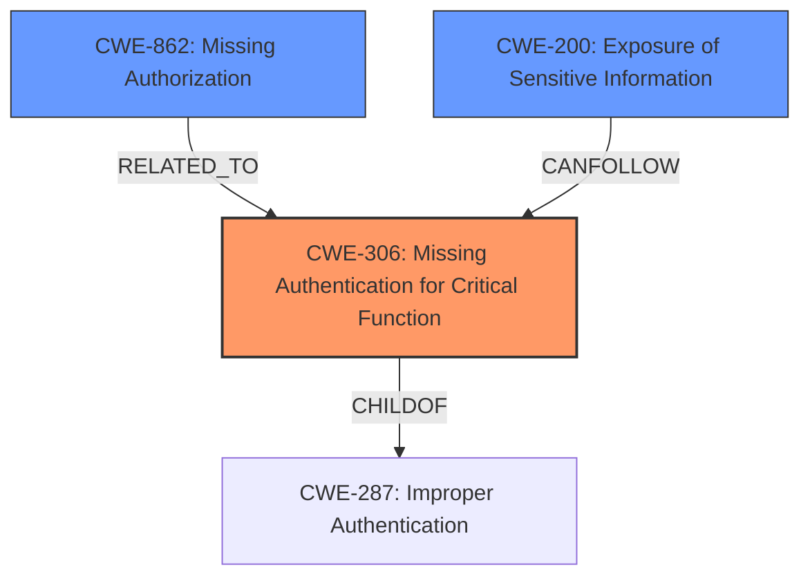

# Analysis Report for CVE-2024-53862

# Vulnerability Analysis Report: CVE-2024-53862

## Description

Argo Workflows is an open source container-native workflow engine for orchestrating parallel jobs on Kubernetes. When using `--auth-mode=client`, Archived Workflows can be retrieved with a fake or spoofed token via the GET Workflow endpoint `/api/v1/workflows/{namespace}/{name}` or when using `--auth-mode=sso`, all Archived Workflows can be retrieved with a valid token via the GET Workflow endpoint `/api/v1/workflows/{namespace}/{name}`. No authentication is performed by the Server itself on `client` tokens. Authentication & authorization is instead delegated to the k8s API server. However, the Workflow Archive does not interact with k8s, and so any token that looks valid will be considered authenticated, even if it is not a k8s token or even if the token has no RBAC for Argo. To handle the lack of pass-through k8s authN/authZ, the Workflow Archive specifically does the equivalent of a `kubectl auth can-i` check for respective methods. In 3.5.7 and 3.5.8, the **auth check was accidentally removed** on the GET Workflow endpoints fallback to archived workflows on these lines, allowing archived workflows to be retrieved with a fake token. This vulnerability is fixed in 3.6.2 and 3.5.13.

## Vulnerability Description Key Phrases

- **Rootcause:** auth check was accidentally removed
- **Impact:** retrieve archived workflows with fake token
- **Product:** Argo Workflows
- **Version:** 3.5.7 and 3.5.8
- **Component:** GET Workflow endpoints

## Analysis (with Relationship Data)

# Summary
| CWE ID | CWE Name | Confidence | CWE Abstraction Level | CWE Vulnerability Mapping Label | CWE-Vulnerability Mapping Notes |
|---|---|---|---|---|---|
| CWE-306 | Missing Authentication for Critical Function | 0.9 | Base | Allowed | Primary CWE: The **root cause** is the **missing authentication check**. |
| CWE-862 | Missing Authorization | 0.7 | Class | Allowed-with-Review | Secondary Candidate: There may be missing authorization checks for archived workflows after retrieval. |
| CWE-200 | Exposure of Sensitive Information Through Sent Data | 0.5 | Base | Allowed | Secondary Candidate: The impact is the exposure of sensitive workflow data. |

## Evidence and Confidence

*   **Confidence Score:** 0.8
*   **Evidence Strength:** HIGH

## Relationship Analysis
The primary weakness is CWE-306, Missing Authentication for Critical Function, because the **auth check was accidentally removed**. CWE-306 is a child of CWE-287 (Improper Authentication). CWE-862, Missing Authorization, is also considered, as there might be a lack of authorization checks after the missing authentication. CWE-200, Exposure of Sensitive Information, is a potential consequence of the missing authentication, where sensitive data is disclosed due to unauthorized access.



## Vulnerability Chain
The vulnerability chain starts with the **missing authentication check** (CWE-306). This leads to potential missing authorization checks (CWE-862) on archived workflows, ultimately resulting in the exposure of sensitive information (CWE-200). The root cause is the lack of authentication, which then bypasses authorization and leads to information disclosure.

## Summary of Analysis
The primary CWE is CWE-306, Missing Authentication for Critical Function. This is supported by the evidence that the **auth check was accidentally removed**, allowing retrieval of archived workflows with a fake token. The retriever results also list CWE-306 as a candidate.

The relationship graph shows that CWE-306 is a child of CWE-287 (Improper Authentication) and can lead to CWE-862 (Missing Authorization) and CWE-200 (Exposure of Sensitive Information).

The selection of CWE-306 is at the optimal level of specificity because the vulnerability description clearly indicates the absence of an authentication check, rather than an incorrect authentication or authorization implementation.

Relevant CWE Information:

# Enhanced Context (25 CWEs)
The following CWEs were identified as potentially relevant to this vulnerability:

## CWE-1390: Weak Authentication
**Abstraction Level**: Class
**Similarity Score**: 0.76
**Source**: dense

**Description**:
The product uses an authentication mechanism to restrict access to specific users or identities, but the mechanism does not sufficiently prove that the claimed identity is correct.

**Mapping Guidance**:
- Usage: Allowed-with-Review
- Rationale: This CWE entry is a Class and might have Base-level children that would be more appropriate

## CWE-639: Authorization Bypass Through User-Controlled Key
**Abstraction Level**: Base
**Similarity Score**: 0.75
**Source**: dense

**Description**:
The system's authorization functionality does not prevent one user from gaining access to another user's data or record by modifying the key value identifying the data.

**Mapping Guidance**:
- Usage: Allowed
- Rationale: This CWE entry is at the Base level of abstraction, which is a preferred level of abstraction for mapping to the root causes of vulnerabilities.

## CWE-212: Improper Removal of Sensitive Information Before Storage or Transfer
**Abstraction Level**: Base
**Similarity Score**: 0.75
**Source**: dense

**Description**:
The product stores, transfers, or shares a resource that contains sensitive information, but it does not properly remove that information before the product makes the resource available to unauthorized actors.

**Mapping Guidance**:
- Usage: Allowed
- Rationale: This CWE entry is at the Base level of abstraction, which is a preferred level of abstraction for mapping to the root causes of vulnerabilities.

## CWE-303: Incorrect Implementation of Authentication Algorithm
**Abstraction Level**: Base
**Similarity Score**: 0.75
**Source**: dense

**Description**:
The requirements for the product dictate the use of an established authentication algorithm, but the implementation of the algorithm is incorrect.

**Mapping Guidance**:
- Usage: Allowed
- Rationale: This CWE entry is at the Base level of abstraction, which is a preferred level of abstraction for mapping to the root causes of vulnerabilities.

## CWE-668: Exposure of Resource to Wrong Sphere
**Abstraction Level**: Class
**Similarity Score**: 0.74
**Source**: dense

**Description**:
The product exposes a resource to the wrong control sphere, providing unintended actors with inappropriate access to the resource.

**Mapping Guidance**:
- Usage: Discouraged
- Rationale: CWE-668 is high-level and is often misused as a catch-all when lower-level CWE IDs might be applicable. It is sometimes used for low-information vulnerability reports [REF-1287]. It is a level-1 Class (i.e., a child of a Pillar). It is not useful for trend analysis.

## CWE-267: Privilege Defined With Unsafe Actions
**Abstraction Level**: Base
**Similarity Score**: 0.74
**Source**: dense

**Description**:
A particular privilege, role, capability, or right can be used to perform unsafe actions that were not intended, even when it is assigned to the correct entity.

**Mapping Guidance**:
- Usage: Allowed
- Rationale: This CWE entry is at the Base level of abstraction, which is a preferred level of abstraction for mapping to the root causes of vulnerabilities.

## CWE-288: Authentication Bypass Using an Alternate Path or Channel
**Abstraction Level**: Base
**Similarity Score**: 0.73
**Source**: dense

**Description**:
The product requires authentication, but the product has an alternate path or channel that does not require authentication.

**Mapping Guidance**:
- Usage: Allowed
- Rationale: This CWE entry is at the Base level of abstraction, which is a preferred level of abstraction for mapping to the root causes of vulnerabilities.

## CWE-74: Improper Neutralization of Special Elements in Output Used by a Downstream Component ('Injection')
**Abstraction Level**: Class
**Similarity Score**: 0.73
**Source**: dense

**Description**:
The product constructs all or part of a command, data structure, or record using externally-influenced input from an upstream component, but it does not neutralize or incorrectly neutralizes special elements that could modify how it is parsed or interpreted when it is sent to a downstream component.

**Mapping Guidance**:
- Usage: Discouraged
- Rationale: CWE-74 is high-level and often misused when lower-level weaknesses are more appropriate.

## CWE-1391: Use of Weak Credentials
**Abstraction Level**: Class
**Similarity Score**: 0.73
**Source**: dense

**Description**:
The product uses weak credentials (such as a default key or hard-coded password) that can be calculated, derived, reused, or guessed by an attacker.

**Mapping Guidance**:
- Usage: Allowed-with-Review
- Rationale: This CWE entry is a Class and might have Base-level children that would be more appropriate

## CWE-923: Improper Restriction of Communication Channel to Intended Endpoints
**Abstraction Level**: Class
**Similarity Score**: 0.73
**Source**: dense

**Description**:
The product establishes a communication channel to (or from) an endpoint for privileged or protected operations, but it does not properly ensure that it is communicating with the correct endpoint.

**Mapping Guidance**:
- Usage: Allowed-with-Review
- Rationale: This CWE entry is a Class and might have Base-level children that would be more appropriate

## CWE-863: Incorrect Authorization
**Abstraction Level**: Class
**Similarity Score**: 2044.51
**Source**: sparse

**Description**:
The product performs an authorization check when an actor attempts to access a resource or perform an action, but it does not correctly perform the check.

**Mapping Guidance**:
- Usage: Allowed-with-Review
- Rationale: This CWE entry is a Class and might have Base-level children that would be more appropriate

## CWE-639: Authorization


## CWE Relationship Analysis

Current CWEs represent these abstraction levels: .


### Vulnerability Chain Analysis

**Chain starting from CWE-1390:**
- 1390 (Weak Authentication) - ROOT


**Chain starting from CWE-288:**
- 288 (Authentication Bypass Using an Alternate Path or Channel) - ROOT


### CWE Relationship Diagram

```mermaid
graph TD
    classDef primary fill:#f96,stroke:#333,stroke-width:2px
    classDef secondary fill:#69f,stroke:#333
    classDef tertiary fill:#9e9,stroke:#333
```


*Report generated on 2025-07-13 22:19:23*
