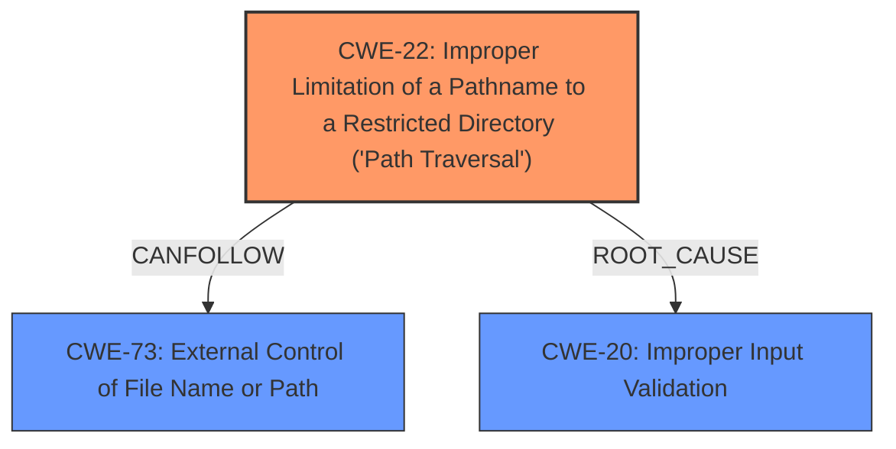

# Analysis for CVE-2024-53982

# Summary
| CWE ID | CWE Name | Confidence | CWE Abstraction Level | CWE Vulnerability Mapping Label | CWE-Vulnerability Mapping Notes |
|---|---|---|---|---|---|
| CWE-22 | Improper Limitation of a Pathname to a Restricted Directory ('Path Traversal') | 1.0 | Base | Allowed | Primary CWE. The vulnerability is due to **improper limitation of pathname** to restricted directory |
| CWE-73 | External Control of File Name or Path | 0.8 | Base | Allowed | Secondary CWE. The **external control of file name or path** can influence the path traversal.|
| CWE-20 | Improper Input Validation | 0.6 | Class | Discouraged | Secondary CWE. The **improper input validation** is the root cause which leads to path traversal.|

## Evidence and Confidence

*   **Confidence Score:** 0.9
*   **Evidence Strength:** HIGH

## Relationship Analysis
The primary CWE is CWE-22, which represents the core vulnerability of path traversal. CWE-73 is related as the external control of the filename or path enables the path traversal. CWE-20 is a more general weakness, representing the **improper input validation** that allows the path traversal to occur. The abstraction levels were considered to select the most specific CWE possible, with CWE-22 being the most descriptive at the Base level.

## Vulnerability Chain
The vulnerability chain starts with **improper input validation** (CWE-20), which allows external control of the file name or path (CWE-73). This leads to the primary vulnerability: improper limitation of a pathname to a restricted directory, also known as path traversal (CWE-22). The impact is the ability to control the file returned in the response, potentially leading to arbitrary file download and information disclosure.

## Summary of Analysis
The initial assessment identified the core vulnerability as a **path traversal** issue. The retriever results and the vulnerability description both strongly support this classification. The relationship analysis further clarified the connection between the **improper input validation**, the external control of the file path, and the resulting path traversal vulnerability. The decision to select CWE-22 as the primary CWE is based on its specific description aligning with the vulnerability details: "The product uses external input to construct a pathname that is intended to identify a file or directory that is located underneath a restricted parent directory, but the product does not properly neutralize special elements within the pathname that can cause the pathname to resolve to a location that is outside of the restricted directory." This is directly evidenced by the statement that "No input validation is performed in this parameter, which allows an attacker to fully control the file which is returned in the response." The selected CWEs are at the optimal level of specificity, providing a clear and accurate representation of the vulnerability.

Relevant CWE Information:

**CWE-22: Improper Limitation of a Pathname to a Restricted Directory ('Path Traversal')**
The product uses external input to construct a pathname that is intended to identify a file or directory that is located underneath a restricted parent directory, but the product does not properly neutralize special elements within the pathname that can cause the pathname to resolve to a location that is outside of the restricted directory.

**CWE-73: External Control of File Name or Path**
The product allows user input to control or influence paths or file names that are used in filesystem operations.

**CWE-20: Improper Input Validation**
The product receives input or data, but it does
        not validate or incorrectly validates that the input has the
        properties that are required to process the data safely and
        correctly.

CWE-434 (Unrestricted Upload of File with Dangerous Type) was mentioned in the CVE Reference Links Content Summary, but this does not appear to be an upload issue, but rather an improper path handling issue, therefore it was not included.