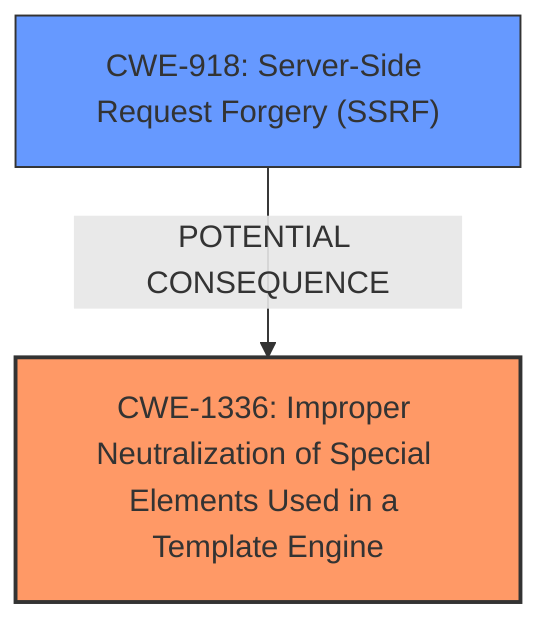

# Enhanced Analysis for CVE-2024-53983

# Summary

| CWE ID  | CWE Name                                                                                                | Confidence | CWE Abstraction Level | CWE Vulnerability Mapping Label | CWE-Vulnerability Mapping Notes |
| :-------- | :------------------------------------------------------------------------------------------------------ | :----------- | :---------------------- | :------------------------------ | :------------------------------ |
| CWE-1336 | Improper Neutralization of Special Elements Used in a Template Engine                                   | 1          | Base                    | Primary CWE                     | Allowed                       |
| CWE-918  | Server-Side Request Forgery (SSRF)                                                                    | 0.7          | Base                    | Secondary Candidate             | Allowed                       |

## Evidence and Confidence

*   **Confidence Score:** 0.9
*   **Evidence Strength:** HIGH

## Relationship Analysis

The primary relationship influencing the decision is that CWE-1336 [Improper Neutralization of Special Elements Used in a Template Engine] is a base level weakness that directly describes the **root cause** of the vulnerability: **Server-Side Template Injection**. CWE-918 [Server-Side Request Forgery (SSRF)] is considered a secondary candidate because the Git config injection can be seen as a type of SSRF, but is a consequence of the SSTI.



## Vulnerability Chain

The vulnerability chain starts with **Server-Side Template Injection** (**CWE-1336**), which allows an attacker to inject malicious Git configurations. This leads to the capture of privileged Git tokens and ultimately unauthorized access to sensitive resources in the Git repository (**CWE-918** - indirectly).

## Summary of Analysis

The primary assessment is based on the clear evidence of **Server-Side Template Injection** as the **root cause** of the vulnerability. The vulnerability description explicitly mentions "Server-Side Template Injection (SSTI) can be exploited to perform Git config injection." The "CVE Reference Links Content Summary" also reinforces this by stating "Root cause of vulnerability: Server-Side Template Injection (SSTI) in the Backstage Scaffolder plugin. This vulnerability allows for Git config injection."

The relationship analysis highlights that **CWE-1336** is the most accurate representation of the **root cause**, while **CWE-918** describes a potential consequence. The retriever results also support **CWE-1336** as the top candidate.

The selected CWEs are at the optimal level of specificity because **CWE-1336** is a Base level CWE that directly addresses the weakness.

Relevant CWE Information:

# Enhanced Context (25 CWEs)
The following CWEs were identified as potentially relevant to this vulnerability:

## CWE-1336: Improper Neutralization of Special Elements Used in a Template Engine
**Abstraction Level**: Base
**Similarity Score**: 0.77
**Source**: dense

**Description**:
The product uses a template engine to insert or process externally-influenced input, but it does not neutralize or incorrectly neutralizes special elements or syntax that can be interpreted as template expressions or other code directives when processed by the engine.

**Mapping Guidance**:
- Usage: Allowed
- Rationale: This CWE entry is at the Base level of abstraction, which is a preferred level of abstraction for mapping to the root causes of vulnerabilities.

## CWE-918: Server-Side Request Forgery (SSRF)
**Abstraction Level**: Base
**Similarity Score**: 0.73
**Source**: dense

**Description**:
The web server receives a URL or similar request from an upstream component and retrieves the contents of this URL, but it does not sufficiently ensure that the request is being sent to the expected destination.

**Mapping Guidance**:
- Usage: Allowed
- Rationale: This CWE entry is at the Base level of abstraction, which is a preferred level of abstraction for mapping to the root causes of vulnerabilities.

### CWE Details
*   **CWE-1336: Improper Neutralization of Special Elements Used in a Template Engine**

    *   **Explanation:** This CWE accurately describes the vulnerability where the Backstage Scaffolder plugin fails to properly neutralize special elements in the template engine, leading to SSTI.
    *   **Relevance:** The vulnerability description explicitly states "Server-Side Template Injection (SSTI) can be exploited to perform Git config injection," which aligns directly with the description of CWE-1336.
    *   **Mapping Guidance:** The usage is "Allowed" and the rationale states "This CWE entry is at the Base level of abstraction, which is a preferred level of abstraction for mapping to the root causes of vulnerabilities."
*   **CWE-918: Server-Side Request Forgery (SSRF)**

    *   **Explanation:** This CWE is relevant because the Git config injection, which is a consequence of the SSTI, can be viewed as a form of SSRF where the attacker is able to make the server perform requests to unintended destinations.
    *   **Relevance:** The vulnerability allows for the injection of Git configurations, which can potentially lead to the server making requests to attacker-controlled servers, thus fitting the description of SSRF.
    *   **Mapping Guidance:** The usage is "Allowed" and the rationale states "This CWE entry is at the Base level of abstraction, which is a preferred level of abstraction for mapping to the root causes of vulnerabilities."

### Other CWEs Considered but Not Used:

*   **CWE-74: Improper Neutralization of Special Elements in Output Used by a Downstream Component ('Injection')**: This CWE is too general. While SSTI is a form of injection, CWE-1336 is more specific to template engines.
*   **CWE-79: Improper Neutralization of Input During Web Page Generation ('Cross-site Scripting')**: This CWE is not relevant because the injection is happening server-side and not directly within a web page served to other users.
*   **CWE-94: Improper Control of Generation of Code ('Code Injection')**: This CWE is also too general. While code injection is possible, CWE-1336 more precisely captures the nature of the vulnerability as it relates to template engines.
*   **CWE-78: Improper Neutralization of Special Elements used in an OS Command ('OS Command Injection')**: This CWE is not relevant as it refers to OS commands, and the vulnerability here involves Git configurations.


## CWE Relationship Analysis

Current CWEs represent these abstraction levels: .


### Vulnerability Chain Analysis

**Chain starting from CWE-94:**
- 94 (Improper Control of Generation of Code ('Code Injection')) - ROOT


**Chain starting from CWE-79:**
- 79 (Improper Neutralization of Input During Web Page Generation ('Cross-site Scripting')) - ROOT


### CWE Relationship Diagram

```mermaid
graph TD
    classDef primary fill:#f96,stroke:#333,stroke-width:2px
    classDef secondary fill:#69f,stroke:#333
    classDef tertiary fill:#9e9,stroke:#333
```