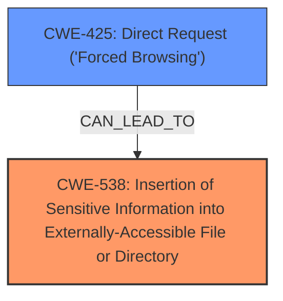

# Analysis Report for CVE-2024-53991

# Vulnerability Analysis Report: CVE-2024-53991

## Description

Discourse is an open source platform for community discussion. This vulnerability only impacts Discourse instances configured to use `FileStoreLocalStore` which means uploads and backups are stored locally on disk. If an attacker knows the name of the Discourse backup file, the attacker can trick nginx into sending the Discourse backup file with a well crafted request. This issue is patched in the latest stable, beta and tests-passed versions of Discourse. Users are advised to upgrade. Users unable to upgrade can either 1. Download all local backups on to another storage device, disable the `enable_backups` site setting and delete all backups until the site has been upgraded to pull in the fix. Or 2. Change the `backup_location` site setting to `s3` so that backups are stored and downloaded directly from S3.

## Vulnerability Description Key Phrases

- **Vector:** well crafted request
- **Attacker:** attacker
- **Product:** Discourse

## Analysis (with Relationship Data)

# Summary
| CWE ID | CWE Name | Confidence | CWE Abstraction Level | CWE Vulnerability Mapping Label | CWE-Vulnerability Mapping Notes |
|---|---|---|---|---|---|
| CWE-538 | Insertion of Sensitive Information into Externally-Accessible File or Directory | 0.9 | Base | Primary CWE | Allowed |
| CWE-425 | Direct Request ('Forced Browsing') | 0.6 | Base | Secondary Candidate | Allowed |

## Evidence and Confidence

*   **Confidence Score:** 0.8
*   **Evidence Strength:** MEDIUM

## Relationship Analysis
The primary relationship influencing the decision is that CWE-538 is a **Base** level CWE that directly describes the **insertion of sensitive information** (backups) into an externally accessible location. CWE-425 is considered as a secondary CWE, where the attacker uses a **direct request** to access the sensitive information. The relationship between these CWEs isn't explicitly defined in terms of parent-child or chaining, but they are related in the sense that CWE-425 could lead to CWE-538 if authorization is not properly handled.



## Vulnerability Chain
The vulnerability chain starts with a **misconfiguration** in Nginx which leads to **sensitive information (backups) being stored in an externally accessible directory**. An attacker then crafts a **direct request** to access these files, resulting in a **confidentiality breach**.

*   Root Cause: **Misconfiguration** in Nginx leading to backups in a public directory.
*   Weakness: CWE-538 Insertion of Sensitive Information into Externally-Accessible File or Directory.
*   Attack Vector: CWE-425 Direct Request ('Forced Browsing')
*   Impact: Confidentiality breach due to exposure of backup files.

## Summary of Analysis
The initial analysis focused on identifying the root cause and the resulting vulnerability. The primary CWE, CWE-538, directly aligns with the vulnerability description of backups containing sensitive information being accessible due to a misconfiguration.

The retriever results suggested several CWEs related to sensitive information exposure, improper authorization, and input validation. While some of these (e.g., CWE-201, CWE-79) have relevance, CWE-538 provides the most accurate and specific description of the vulnerability. CWE-425 Direct Request ('Forced Browsing') represents a secondary aspect of the attack.

The final decision is based on the following evidence:

*   "The vulnerability stems from a misconfiguration in Nginx that allows an attacker to potentially access Discourse backup files when using `FileStore::LocalStore`"
*   "Nginx can be tricked into serving these files due to a **lack of proper access control** or path validation."
*   "Successful exploitation can lead to a confidentiality breach by exposing backup files. These backup files likely contain sensitive information, including database content and application configurations."

CWE-538 aligns directly with these statements, as it describes the **insertion of sensitive information** (backup files) into an **externally-accessible file or directory**.

CWE-425 is also relevant, as the attacker uses a **direct request** to access these files.

The selected CWEs are at the optimal level of specificity (Base) to represent the vulnerability, as they accurately describe the root cause and the attack vector.

CWEs considered but not used:

*   CWE-201 (Insertion of Sensitive Information Into Sent Data): While sensitive information is exposed, it's not necessarily being *sent* but rather directly accessed from a file.
*   CWE-79 (Improper Neutralization of Input During Web Page Generation ('Cross-site Scripting')): This is not an XSS vulnerability.
*   CWE-285 (Improper Authorization): Although authorization is relevant, CWE-425 Direct Request ('Forced Browsing') is more precise.
*   CWE-256 (Plaintext Storage of a Password): Not specifically related to password storage, but more general sensitive data.
*   CWE-184 (Incomplete List of Disallowed Inputs): Not directly related to input validation.


## CWE Relationship Analysis

Current CWEs represent these abstraction levels: .


### Vulnerability Chain Analysis

**Chain starting from CWE-79:**
- 79 (Improper Neutralization of Input During Web Page Generation ('Cross-site Scripting')) - ROOT


**Chain starting from CWE-201:**
- 201 (Insertion of Sensitive Information Into Sent Data) - ROOT


### CWE Relationship Diagram

```mermaid
graph TD
    classDef primary fill:#f96,stroke:#333,stroke-width:2px
    classDef secondary fill:#69f,stroke:#333
    classDef tertiary fill:#9e9,stroke:#333
```


*Report generated on 2025-07-13 22:22:50*
