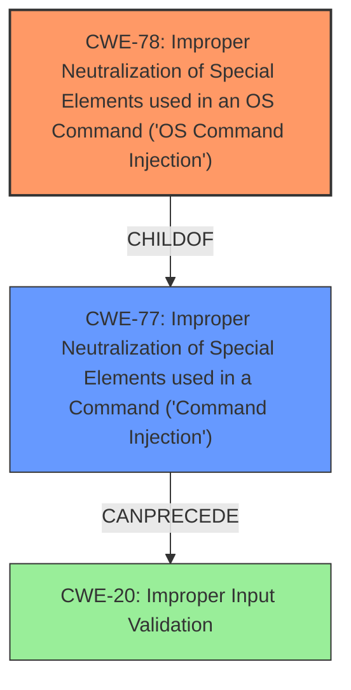

# Analysis Report for CVE-2024-54007

# Vulnerability Analysis Report: CVE-2024-54007

## Description

Multiple **command injection** vulnerabilities exist in the web interface of the 501 Wireless Client Bridge which could lead to authenticated remote command execution. Successful exploitation of these vulnerabilities result in the ability of an attacker to execute arbitrary commands as a privileged user on the underlying operating system. Exploitation requires administrative authentication credentials on the host system.

## Vulnerability Description Key Phrases

- **Weakness:** command injection
- **Impact:** ['execute arbitrary commands', 'command execution']
- **Attacker:** authenticated remote attacker
- **Product:** 501 Wireless Client Bridge
- **Component:** web interface

## Analysis (with Relationship Data)

# Summary
| CWE ID | CWE Name | Confidence | CWE Abstraction Level | CWE Vulnerability Mapping Label | CWE-Vulnerability Mapping Notes |
|---|---|---|---|---|---|
| CWE-78 | Improper Neutralization of Special Elements used in an OS Command ('OS Command Injection') | 0.9 | Base | Primary | Allowed |
| CWE-77 | Improper Neutralization of Special Elements used in a Command ('Command Injection') | 0.6 | Class | Secondary | Allowed-with-Review |

## Evidence and Confidence

*   **Confidence Score:** 0.9
*   **Evidence Strength:** HIGH

## Relationship Analysis
The primary relationship influencing the choice of CWE-78 [Improper Neutralization of Special Elements used in an OS Command ('OS Command Injection')] over CWE-77 [Improper Neutralization of Special Elements used in a Command ('Command Injection')] is the hierarchical parent-child relationship. CWE-78 is a more specific, base-level CWE that falls under the class-level CWE-77. Since the vulnerability explicitly involves OS commands, CWE-78 is a more accurate and granular classification.



## Vulnerability Chain
The vulnerability chain starts with **improper neutralization** of input, leading to **command injection**, and culminating in **arbitrary command execution**.
  - Root Cause: CWE-78 [Improper Neutralization of Special Elements used in an OS Command ('OS Command Injection')]
  - Impact: Arbitrary command execution as a privileged user.

## Summary of Analysis
The vulnerability description clearly states that the issue is related to **command injection**, specifically in the web interface of a product that allows authenticated remote command execution. The key phrase "**command injection**" strongly suggests CWE-77 [Improper Neutralization of Special Elements used in a Command ('Command Injection')] or its more specific child, CWE-78 [Improper Neutralization of Special Elements used in an OS Command ('OS Command Injection')]. The retriever results also list CWE-77 as the top combined result and CWE-78 as the second best result. Given the context of the vulnerability description mentioning the ability to execute arbitrary OS commands, CWE-78 is selected as the primary CWE because it is a more specific case of command injection related to the operating system.

CWE-20 [Improper Input Validation] was considered because **command injection** often stems from a lack of proper input validation. However, the description focuses on the **improper neutralization** of special elements, which is more directly addressed by CWE-78. Therefore, CWE-20 is not selected as the primary CWE, but could be considered a prerequisite. Other CWEs such as CWE-89 [Improper Neutralization of Special Elements used in an SQL Command ('SQL Injection')] and CWE-94 [Improper Control of Generation of Code ('Code Injection')] were deemed irrelevant as the vulnerability specifically involves OS commands rather than SQL or general code injection.

The final selection is based on the direct evidence of **command injection** in the vulnerability description, the retriever results, and the hierarchical relationship between CWE-77 and CWE-78, which favors the more specific base-level CWE-78.

Relevant CWE Information:
- Vulnerability Description Key Phrases
  - **weakness:** **command injection**
  - **impact:** execute arbitrary commands and command execution
  - **attacker:** authenticated remote attacker
  - **product:** 501 Wireless Client Bridge
  - **component:** web interface
- Retriever Results
  - CWE-77 [Improper Neutralization of Special Elements used in a Command ('Command Injection')] is the top combined result.
  - CWE-78 [Improper Neutralization of Special Elements used in an OS Command ('OS Command Injection')] is the second best result.


## CWE Relationship Analysis

Current CWEs represent these abstraction levels: .


### Vulnerability Chain Analysis

**Chain starting from CWE-89:**
- 89 (Improper Neutralization of Special Elements used in an SQL Command ('SQL Injection')) - ROOT


**Chain starting from CWE-94:**
- 94 (Improper Control of Generation of Code ('Code Injection')) - ROOT


### CWE Relationship Diagram

```mermaid
graph TD
    classDef primary fill:#f96,stroke:#333,stroke-width:2px
    classDef secondary fill:#69f,stroke:#333
    classDef tertiary fill:#9e9,stroke:#333
```


*Report generated on 2025-07-13 22:23:50*
