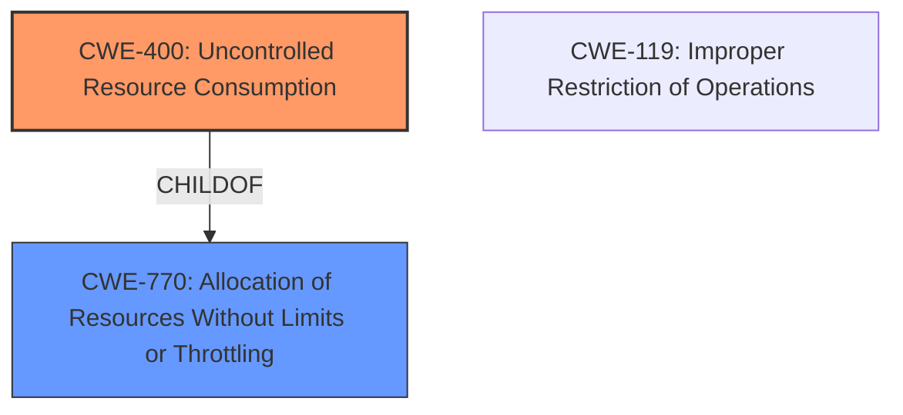

# Raw Analyzer Response for CVE-2024-54101

# Summary
| CWE ID | CWE Name | Confidence | CWE Abstraction Level | CWE Vulnerability Mapping Label | CWE-Vulnerability Mapping Notes |
|---|---|---|---|---|---|
| CWE-400 | Uncontrolled Resource Consumption | 0.9 | Class | Primary | Discouraged |

## Evidence and Confidence

*   **Confidence Score:** 0.9
*   **Evidence Strength:** MEDIUM

## Relationship Analysis
The primary CWE selected is CWE-400, which is a Class-level CWE. While it's generally preferred to use Base or Variant level CWEs, the information available doesn't allow for a more specific classification. CWE-400 is a child of CWE-770 (Allocation of Resources Without Limits or Throttling). The Retriever Results also suggested CWE-119 (Improper Restriction of Operations within the Bounds of a Memory Buffer), which can be related to buffer overflows, but the description doesn't specify the mechanism of the DoS.

## Vulnerability Chain
The vulnerability chain starts with a weakness in the installation module leading to a denial-of-service condition, ultimately affecting the system's availability.

Installation Module --&gt; **Uncontrolled Resource Consumption (CWE-400)** --&gt; Denial of Service (DoS) --&gt; Impact on Availability

## Summary of Analysis
The vulnerability is described as a Denial of Service (DoS) in the installation module. The primary weakness is the DoS vulnerability, which affects system availability. The best fit, based on the limited information, is CWE-400 (Uncontrolled Resource Consumption).

The selection is heavily based on the provided evidence. The "Vulnerability Description Key Phrases" highlight "Denial of service (DoS) and affect availability." The "CVE Reference Links Content Summary" specifies that "The vulnerability lies within the installation module, which is susceptible to a denial-of-service condition" and that "Successful exploitation of the vulnerability results in the affected system's unavailability."

CWE-400 is chosen because it directly addresses the uncontrolled consumption of resources leading to a DoS condition. While it's a Class-level CWE, more specific information about the nature of the resource consumption isn't available.

Other CWEs considered but not used:

*   CWE-770 (Allocation of Resources Without Limits or Throttling): While related, CWE-400 is a more direct representation of the observed impact.
*   CWE-119 (Improper Restriction of Operations within the Bounds of a Memory Buffer), CWE-120 (Buffer Copy without Checking Size of Input ('Classic Buffer Overflow')), CWE-122 (Heap-based Buffer Overflow): These relate to buffer overflows, but there is no evidence to suggest this is the root cause of the DoS.
*   CWE-20 (Improper Input Validation), CWE-1284 (Improper Validation of Specified Quantity in Input): These were considered, but there's no direct evidence of improper input validation being the root cause.
* CWE-NVD-noinfo: This is too generic.